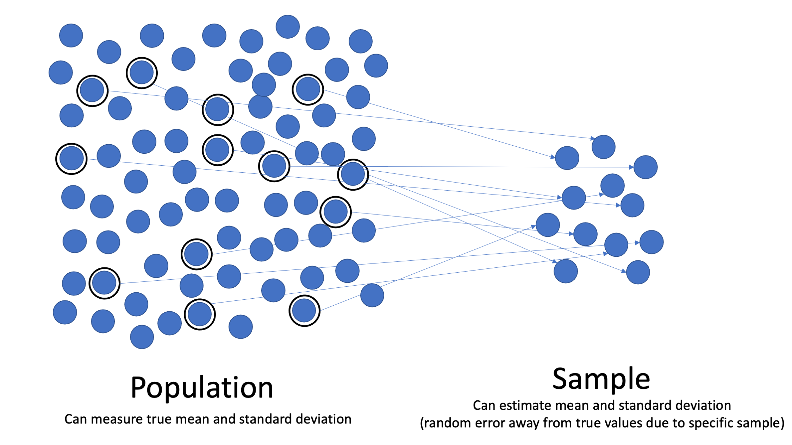
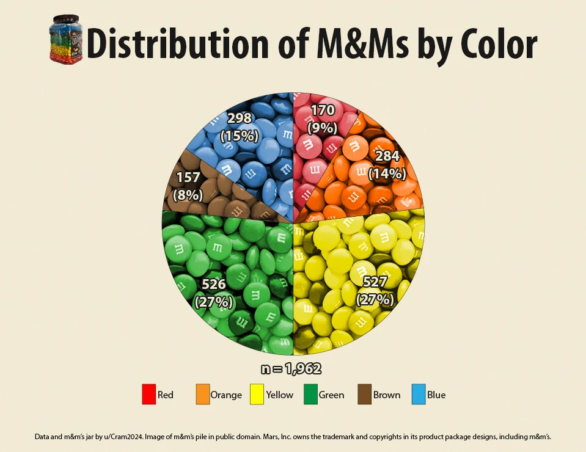

```{r child = "../setup.Rmd"}
```

```{r packages, echo=FALSE, message=FALSE, warning=FALSE}
library(tidyverse)
library(scales)
if (!require("emo")) devtools::install_github("hadley/emo")
library(emo)
knitr::opts_chunk$set(echo = FALSE,out.width = "90%", fig.align = "center")
# Consistent palette + theme for all visuals

base_cols <- c(
  Blue   = "#0072CE",
  Orange = "#FF7F00",
  Green  = "#3CB043",
  Red    = "#E41A1C",
  Yellow = "#FFD700",
  Brown  = "#7B3F00"
)

thm <- theme_minimal(base_size = 16) +
  theme(
    plot.title = element_text(face = "bold"),
    axis.title.x = element_text(margin = margin(t = 8)),
    axis.title.y = element_text(margin = margin(r = 8)),
    legend.position = "right"
  )


# Helper utilities for this deck
compute_percentages <- function(df) {
df %>%
mutate(across(c(Blue, Orange, Green, Red, Yellow, Brown), ~ suppressWarnings(as.numeric(.)))) %>%
mutate(Total = rowSums(across(Blue:Brown), na.rm = TRUE)) %>%
mutate(
Blue_perc = 100 * Blue / pmax(Total, 1),
Orange_perc = 100 * Orange / pmax(Total, 1),
Green_perc = 100 * Green / pmax(Total, 1),
Red_perc = 100 * Red / pmax(Total, 1),
Yellow_perc = 100 * Yellow / pmax(Total, 1),
Brown_perc = 100 * Brown / pmax(Total, 1)
)
}


perc_long <- function(df) {
df %>%
pivot_longer(cols = c(Blue_perc, Orange_perc, Green_perc, Red_perc, Yellow_perc, Brown_perc),
names_to = "Color", values_to = "Percentage") %>%
mutate(Color = gsub("_perc$", "", Color),
Color = factor(Color, levels = names(base_cols)))
}


sum_colors_long <- function(df_colors_only) {
df_colors_only %>%
summarise(across(everything(), ~ sum(suppressWarnings(as.numeric(.)), na.rm = TRUE))) %>%
pivot_longer(cols = everything(), names_to = "Color", values_to = "Count") %>%
mutate(Color = factor(Color, levels = names(base_cols)))
}
```

class: middle

# Sampling in Action: The M&M Challenge

---

## Roadmap

- Activity: count and enter M&M colors (15 min)
- Class analysis: live charts from your data (20 min)
- Concepts: why sample size and design matter (10 min)
- Wrap-up and takeaways (5 min)

---


# Quick refresher: what is sampling?

.pull-left[
- We study a part (sample) to learn about the whole (population).
- Samples differ from each other; that’s normal variability.
- Our goal today: estimate each color’s percentage in the wider “population” of candies.
- We’ll see that combining more bags leads to more stable class estimates.
]

.pull-right[
```{r, echo=FALSE, out.width="100%", error=FALSE}

```
]

---

## M&M Sampling Activity

- Objective: Demonstrate sampling principles using M&M's
  - Hands-on experience with data collection and analysis
--

- Materials:
  - Small packages of plain M&M's (one per student)
  - Napkins for sorting
--

- Outcome: start with your bag, then build to a class-wide estimate

---

## M&M Sampling Procedure

- Distribute M&M packages and materials
--

- Sort M&M's by color onto your napkin
--

- Count each color: Blue, Orange, Green, Red, Yellow, Brown.
--

- Enter your counts (raw numbers; 0 if a color is absent).
--

- Hypothesize population color distribution
--

- Compare with a partner: are your percentages similar?
--

- We’ll pool the entire class and visualize the results
  - using Google Sheets (and some R magic)
---


class: middle

# What to expect...

---

# Analysis in Action

- What we'll get from the class data

```{r ref.label = "nom",out.width = "65%", echo = FALSE, warning = FALSE}
```

---

# Source Code

.tiny[

```{r nom, fig.show = "hide", warning = FALSE,echo = TRUE,eval=TRUE}
library(gridExtra)
set.seed(123) # For reproducibility

# Define the number of students and colors
students <- c("Tukey", "Gauss", "Noether", "Fisher", 
              "Bayes", "Pearson", "Student", 
              "Fiducial", "Neyman", "Cochran")
base_cols <- c(
  Blue   = "#0072CE",
  Orange = "#FF7F00",
  Green  = "#3CB043",
  Red    = "#E41A1C",
  Yellow = "#FFD700",
  Brown  = "#7B3F00"
)
colors <- names(base_cols)

# Simulate the total number of M&Ms for each student
bag_sizes <- sample(15:20, length(students), replace = TRUE)


# Simulate the counts of each color for each student
color_counts <- replicate(length(colors), 
                          sample(1:bag_sizes, 
                                 length(students), replace = TRUE))

# Create the dataframe
df_syn <- data.frame(Name = students, 
                     color_counts)

colnames(df_syn)[-1] <- colors

# Calculate the percentages
df_syn <- df_syn %>%
  mutate(Total = Blue + Orange + Green + Red + Yellow + Brown)

df_long_syn <- df_syn %>%
  pivot_longer(Blue:Brown, names_to="Color", values_to="Count") %>%
  group_by(Name) %>% mutate(Prop = Count/sum(Count)) %>% ungroup()

# Plotting the data
p_syn_bags <- ggplot(df_long_syn, aes(Name, Prop, fill = Color)) +
  geom_col() +
  scale_fill_manual(values = base_cols) +
  scale_y_continuous(labels = scales::percent_format()) +
  labs(title = "Each bag’s color composition (synthetic)", x = NULL, y = "Share") +
  thm + theme(axis.text.x = element_text(angle = 45, hjust = 1))

# Overall distribution of M&Ms
overall_distribution <- df_syn %>%
  select(Blue, Orange, Green, Red, Yellow) %>%
  summarise(across(everything(), sum)) %>%
  pivot_longer(cols = everything(), names_to = "Color", values_to = "Count")

p_syn_total <- df_syn %>%
  summarise(across(Blue:Brown, sum)) %>%
  pivot_longer(everything(), names_to = "Color", values_to = "Total") %>%
  ggplot(aes(Color, Total, fill = Color)) +
  geom_col() +
  scale_fill_manual(values = base_cols, guide = "none") +
  labs(title = "Total M&Ms by color (synthetic)", x = NULL, y = "Total") +
  thm
p_syn_bags
#gridExtra::grid.arrange(p_syn_bags, p_syn_total, ncol = 2)

# Display both plots

#grid.arrange(stacked_plot, overall_plot, ncol = 2)
```

]


---

# Data Collection

.pull-left[
.center[
```{r, out.width="100%", warning = FALSE}
if (requireNamespace("qrcode", quietly = TRUE)) {
share_link <- "https://docs.google.com/spreadsheets/d/1D4i8e0pTrqwLk_FjMFtkimqhmtOrBf-X6OU9RT57m_Q"
code <- qrcode::qr_code(share_link)
plot(code)
} else {
plot.new(); text(0.5, 0.6, "QR code package not installed", cex = 1.2)
}
```

Scan to input your data!

.footnote[https://docs.google.com/spreadsheets/d/1D4i8e0pTrqwLk_FjMFtkimqhmtOrBf-X6OU9RT57m_Q]
]]

--

.pull-right[
Checklist:
- Each row = one bag (add your name/initials)
- Enter raw counts (not percentages)
- Include all six colors (use 0 if needed)
- Submit once (no duplicates)

Discussion prompts:
- Which colors have the widest ranges? What determines the width?
- How would doubling N change these intervals?
]


---

## Analysis in action

```{r, error=TRUE, warning=FALSE,message=FALSE,out.height = "65%"}
library(googlesheets4)
library(tidyverse)
share_link <- "https://docs.google.com/spreadsheets/d/1D4i8e0pTrqwLk_FjMFtkimqhmtOrBf-X6OU9RT57m_Q"

#Read google sheets data into R
raw <- tryCatch(read_sheet(share_link), error = function(e) tibble())
# If reading fails, create an empty tibble
df <- if (nrow(raw) == 0) {
  tibble(Name=character(), Blue=integer(), Orange=integer(), Green=integer(),
         Red=integer(), Yellow=integer(), Brown=integer())
} else {
  raw %>%
    select(Name, Blue, Orange, Green, Red, Yellow, Brown) %>%
    mutate(across(c(Blue, Orange, Green, Red, Yellow, Brown), ~ suppressWarnings(as.numeric(.)))) %>%
    filter(!is.na(Name)) %>%
    filter(rowSums(across(Blue:Brown), na.rm = TRUE) > 0) # Remove rows with all NAs or zeros
}


# Convert the data to long format
df_long <-if (nrow(df) > 0) {
  df %>%
    mutate(Total = Blue + Orange + Green + Red + Yellow + Brown) %>%
    pivot_longer(Blue:Brown, names_to = "Color", values_to = "Count") %>%
    group_by(Name) %>%
    mutate(Prop = Count / sum(Count)) %>%
    ungroup()
} else {
  tibble()
}
```

Discussion prompts:
- Which colors have the widest intervals? What determines the width?
- How would doubling N change these intervals?

---

# What do our samples look like?

```{r echo=FALSE, error=TRUE, message=FALSE, warning=FALSE, out.width = "65%"}
if (nrow(df_long) > 0) {
  ggplot(df_long, aes(Name, Prop, fill = Color)) +
    geom_col() +
    scale_fill_manual(values = base_cols) +
    scale_y_continuous(labels = percent_format()) +
    labs(title = "Each bag’s color composition (class data)", x = "Student", y = "Share of bag") +
    thm +
    theme(axis.text.x = element_text(angle = 45, hjust = 1))
} else {
  cat("Waiting for entries…")
}
```

---

# Class pooled counts


```{r, echo=FALSE,error=TRUE, warning=FALSE,message=FALSE,out.width = "55%"}

if (nrow(df_long) > 0) {
  pooled <- df_long %>% group_by(Color) %>% summarise(Total = sum(Count), .groups="drop")
  ggplot(pooled, aes(Color, Total, fill = Color)) +
    geom_col() +
    scale_fill_manual(values = base_cols, guide = "none") +
    labs(title = "Total M&Ms by color (entire class)", x = "Color", y = "Total across bags") +
    thm
}
```

---

# Sample Size Effects


.pull-left-narrow[
```{r sample_size_effects, echo=FALSE}
library(kableExtra)

sample_size_df <- data.frame(
  "Sample Size" = c("Individual", "Paired", "Class-wide"),
  "Estimate stability" = c("Low", "Medium", "High"),
  "Bag-to-bag variation" = c("High", "Medium", "Low")
)

kable(sample_size_df, format = "html") %>%
  kable_styling(bootstrap_options = c("striped", "hover", "condensed"), full_width = FALSE) %>%
  column_spec(1, bold = TRUE)
```
]
--

.pull-right[
- One bag can look quite different from another.
- Pooling more bags smooths out that variation.
- If we doubled the number of bags again, what would you expect to see in the pooled chart?
]


---


```{r, echo=FALSE,error=TRUE, warning=FALSE,message=FALSE, out.height = "65%"}
# Calculate overall distribution
if (exists("df") && nrow(df) > 0) {
  overall_distribution <- df %>%
    mutate(across(is.numeric, ~replace_na(., 0))) %>%
    select(Blue, Orange, Green, Red, Yellow, Brown) %>%
    summarise(across(everything(), sum)) %>%
    pivot_longer(cols = everything(), names_to = "Color", values_to = "Count")

  overall_pie <- overall_distribution %>%
    ggplot(aes(x = "", y = Count, fill = Color)) +
    geom_bar(stat = "identity", width = 1) +
    coord_polar("y") +
    labs(title = "Overall M&M Color Distribution (pie)",
         fill = "Color") +
    scale_fill_manual(values = base_cols) +
    theme_minimal()

  overall_bar <- overall_distribution %>%
    ggplot(aes(x = Color, y = Count, fill = Color)) +
    geom_col() +
    labs(title = "Overall M&M Color Distribution (bar)",
         x = "Color", y = "Total Count") +
    scale_fill_manual(values = base_cols, guide = "none") +
    theme_minimal()

  gridExtra::grid.arrange(overall_pie, overall_bar, ncol = 1)
} else {
  cat("Waiting for data…")
}
```


---

# How our estimate stabilizes

```{r, echo=FALSE,error=TRUE, warning=FALSE,message=FALSE, out.height = "65%"}
if (nrow(df) > 0) {
  run <- map_dfr(seq_len(nrow(df)), function(k){
    slice <- df[1:k, c("Blue","Orange","Green","Red","Yellow","Brown")]
    tibble(k = k, Color = names(base_cols), p = colSums(slice)/sum(slice))
  })
  ggplot(run, aes(k, p, color = Color)) +
    geom_line() +
    scale_color_manual(values = base_cols) +
    scale_y_continuous(labels = percent_format()) +
    labs(title = "Running class estimate vs. number of bags",
         x = "Bags included (k)", y = "Estimated share") +
    thm
}


```

---

class: middle

# Advanced Sampling Concepts

---

## Relating to Sampling Methods

.pull-left[
- Simple random sampling
    - Each M&M package as a random sample
- Stratified sampling
    - If we sorted M&M bags by production date,
    - Could this improve representativeness?
]
--

.pull-right[

- Cluster sampling
  - If we sampled entire boxes of M&M packages
  - Potential production batch effects?

- Systematic sampling
  - If we selected every nth M&M package from production line
  - Could introduce cyclical biases?
]

---

# Potential Biases in M&M Sampling

.pull-left[
- Production process biases
    - Color distribution variations between factories
    - Akin to sampling frame bias in surveys
    
- Selection bias
  - If students choose their favorite color of package
  - Akin to  non-random sample selection in research    
  ]
  
.pull-right[

- Measurement bias
  - Errors in counting or recording M&M colors
  - Akin to survey response errors

- Non-response bias
  - If some students don't participate or eat their M&M's
  - Akin to survey non-respondents
]

---

# Importance of Representative Samples

.pull-left[
- What if we only sampled from one factory?
- Implications for psychological research
    - Generalizing from sample to population
    - External validity of research findings
    ]
    
--

.pull-right[
- Strategies for improving representativeness
  - Increasing sample size (more M&M packages)
  - Diversifying sample sources (different stores, batches)
  - Random selection procedures
  - Weighting techniques for unequal probability samples
]
---

# Wrapping Up...

.pull-left[
## Key Takeaways
1. Sampling lets us learn about populations with manageable data.
2. More data (more bags) leads to more stable estimates.
3. How we sample matters: source, selection, and recording affect results.
4. We can make smarter designs to improve generalization.
]

.pull-right[

.center[.footnote[Source: https://www.reddit.com/r/dataisbeautiful/comments/10wxrh9/oc_distribution_of_mms_by_color_in_3lb_mms_jar/]
]
]
