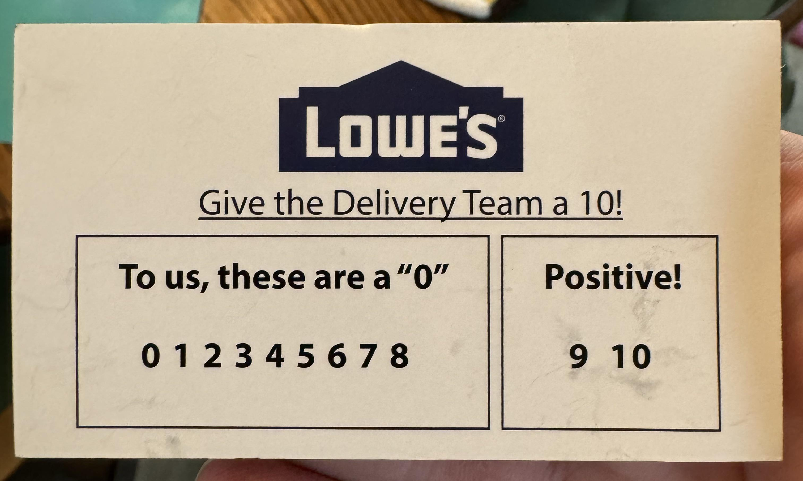
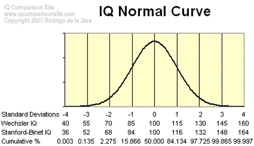
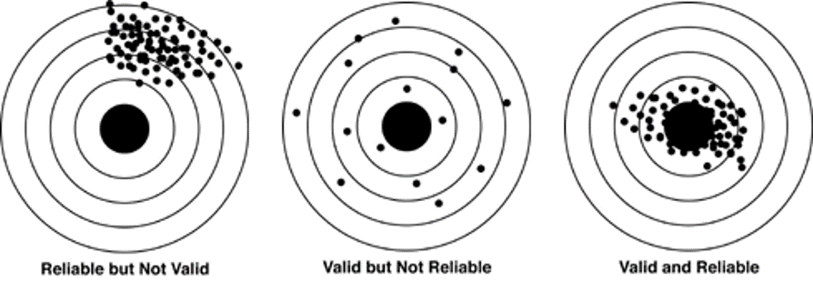

```{r child = "../setup.Rmd"}
```

```{r packages, echo=FALSE, message=FALSE, warning=FALSE}
# Remember to compile
#xaringan::inf_mr(cast_from = "..")
#       slideNumberFormat: ""  
library(tidyverse)
if (!require("emo")) devtools::install_github("hadley/emo")
# Installs library if missing
if (!require("HistData")) install.packages("HistData") 
library(emo)
knitr::opts_chunk$set(echo = FALSE,out.width = "90%", fig.align = "center")

```

class: middle

# Measurement: The Foundation of Scientific Research


---

## Roadmap

- Measurement
- Levels of measurement
- Goals of measurement


---

## Understanding Measurement

- Definition: Measurement is the assignment of numbers to characteristics of people or objects
  - 4th step in the research process
  - It's purpose is to describe and differentiate 
--

- Examples: measurement scales
    - Speed $\rightarrow$ miles-per-hour
    - Temperature $\rightarrow$ Kelvin (K)
    - Order of finishers in a race $\rightarrow$ 1st, 2nd, 3rd, etc.
    - Numbers on the back of basketball jerseys $\rightarrow$ `r round(runif(0,250,n=5),digits=0)`
    
---

## Variables: The Building Blocks of Measurement

- Variables contain the outcome of measurement processes
--

- Variables can be:
    - Qualitative: 
      - Numbers represent qualities (not quantities)
      - Example: Coding for eye color (1 = Blue, 2 = Brown, 3 = Green)
--
    - Quantitative: 
      - Numbers mean something in relation quantities in the real world
      - Example: Height in centimeters, Weight in kilograms
---

class: middle

# Levels of Measurement

---

## Stevens' Classification (1946): 
.pull-left[
- Characterizes each level of measurement   
    - Nominal
    - ordinal, 
    - interval, 
    - ratio
]
--

.pull-right[
- Key Properties:
  - Identity
  - Order
  - Equal Intervals
  - Absolute Zero
]
--

.footnote[Stevens, Stanley Smith (1946). On the theory of scales of measurement. Science, 103(2684), 677-680.]

```{r, out.width = "15%", fig.align = "left", echo=FALSE}
knitr::include_graphics("https://upload.wikimedia.org/wikipedia/en/2/2b/Headshot_of_Stanley_Smith_Stevens.png")
```

---

## Key Properties of Measurement

- Have absolute zero
  - 0 indicated absence (origin means zero)
- Equal intervals
  - An interval means the same value at any point on measurement scales
- Order
  - Number means order
- Identity
  - Different numbers mean different measurement outcomes $(1 \neq 2)$

---


## Which properties does this measure have?


```{r, out.width = "65%", fig.align = "center", echo=FALSE}

```
--

.footnote[Source: [/u/ZigeonVO](https://www.reddit.com/user/ZigeonVO) via [r/assholedesign](https://www.reddit.com/r/assholedesign/comments/1fc7cnt/this_card_i_was_given_today_from_a_delivery/)]
---


# Ratio (quantitative)


- All four properties
    - Have absolute zero
    - Equal intervals
    - Order
    - Identity
--
- Multiplication and division are permissible transformations
--

- Examples: 
    - Height, weight, age, income, time, etc.

---

# Example (Base R)


```{r, echo=TRUE,warning=FALSE}
# loads the HistData package
library(HistData)
# loads the Galton dataset
data("Galton")
# First 3n rows of data
head(Galton, n=3)
```


---

# Example (Base R)


.pull-left[
```{r ref.label = "hist1",out.width = "100%", echo = FALSE, warning = FALSE}
```

]
.pull-right[
```{r hist1, fig.show = "hide", warning = FALSE,echo = TRUE}
# Histogram
hist(Galton$child)
```
]

---

# Example (Base R)

.pull-left[
```{r ref.label = "hist2",out.width = "100%", echo = FALSE, warning = FALSE}
```
]
.pull-right[
```{r hist2, fig.show = "hide", warning = FALSE,echo = TRUE}
# Density Plot
plot(density(Galton$child))
```

]

---

<!-- should be cut-->
# Bandwidth Aside

[Bandwidth: Smoothing Method](https://stat.ethz.ch/R-manual/R-devel/library/stats/html/density.html)

```{r, echo=TRUE,warning=FALSE}
args(density.default)

#?density # Gives you documentation
```

---

# Bandwidth Aside
```{r, echo=FALSE,warning=FALSE}
knitr::include_graphics("../img/density.png")
```

---

# Bandwidth Aside

.pull-left[
```{r ref.label = "dens",out.width = "100%", echo = FALSE, warning = FALSE}
```
]
.pull-right[
```{r dens, fig.show = "hide", warning = FALSE,echo = TRUE}
set.seed(201010)
x <- rnorm(1000, 10, 2)
par(mfrow = c(2,2))

#A bit bumpy
plot(density(x))
#Very sooth
plot(density(x,adjust = 10))
 #Very bumpy
plot(density(x,adjust = .1))
```

]


---

# Interval (quantitative)

- Has order, identity, and equal intervals
   - (all but absolute zero)
- Addition is a permissible transformation
- Example: Temperature in Celsius or Fahrenheit

```{r, echo=TRUE}
# Interval Example
library(datasets)
data("nottem")
nottem[1:10] 			# First ten rows of data
```

---

## Interval (quantitative)

.pull-left[
```{r, echo=TRUE}
# Histogram
hist(nottem)
```
]
.pull-right[
```{r, echo=TRUE}
# Density Plot
plot(density(nottem))
```
]

---

# Ordinal (qualitative)

.pull-left-narrow[
-	Has order and identity
- Monotonic transformations are permissible
- These variables maintain the order of the values
- Example: Education levels (High School, Bachelor's, Master's, PhD)
]
--
.pull-right-wide[
```{r, echo=TRUE}
# Ordinal Example
library(ggplot2movies)
data(movies)
# First 4 rows of data, with a non-missing budget
head(movies[!is.na(movies$budget),], n = 14) 

```
]
---

# Ordinal (qualitative)

.pull-left[
```{r, echo=TRUE}
# Histogram
variable <- movies$rating
hist(variable) 
```
]
.pull-right[
```{r, echo=TRUE}
# Density Plot
plot(density(variable)) 
```
]

---

# Nominal

.pull-left-narrow[
- Only has identity
- Any identity-preserving transformation is permissible
- Example: Jersey numbers in sports
]


```{r, echo=TRUE}
# Nominal Example
library(vcd)
data(Arthritis)
head(Arthritis[, c("ID", "Treatment")], 8)

```

---

# Basic Barplot
.pull-left[
```{r ref.label = "nom",out.width = "100%", echo = FALSE, warning = FALSE}
```
]
.pull-right[
```{r nom, fig.show = "hide", warning = FALSE,echo = TRUE}
variable<-Arthritis$Treatment
#hist(variable) # error

barplot_fix <-
     prop.table(table(variable))
# Sometimes, R is silly
barplot(barplot_fix)
```
]
---

# More complex measurement level taxomony

- Missing (considered nominal under the Stevens)
- Binary (considered nominal under the Stevens)
- Nominal (considered nominal under the Stevens)
- Partially ordered (considered ordinal under Stevens)
- Fully ordered (considered ordinal under Stevens)
- Interval
- Ratio
- Absolute measurement (has no permissible transformation)
    - $6.02$ x $10^{23}$
    - $\pi$
    
---

## Could measurement level be itself on a continuum?

.pull-left[
- Example: IQ
    - Falls between interval and ratio?
    - Or falls between ordinal and interval?

]

--
.pull-right[
 
]

---

class: center, middle

# Goals of Measurement

---

# Goals of Measurement

- Reliability
  - "…the degree to which a test or measure produces the same scores when applied in the same circumstances…" (Thomas and Nelson 1996)
  - In other words, if you take the measure again, will you get the same result?

--
- (Internal) Validity
  - "Degree to which a test or instrument measures what it purports to measure"  (Thomas and Nelson 1996)
  - In other words, does your measure measure what is it supposed to measure?

---

## Types of Validity (More on this later...)

- Two Major Areas within Validity
  - **Internal Validity**
      - Is this evidence supportive of our claim, within this study?
  - **External Validity**
      - Is this evidence supportive of our claim beyond this study?
      - Does this finding generalize to outside this study?

---

## Practical Applications

- Psychology: Measuring personality traits
- Education: Assessing student performance
- Medicine: Tracking patient vital signs
- Business: Evaluating customer satisfaction
- Sports: Analyzing athletic performance

---

# Challenges in Measurement

- Measurement Error
  - Random errors vs. Systematic errors
- Bias in Measurement
  - Observer bias, response bias, selection bias
- Cultural and Linguistic Considerations
  - Ensuring measures are valid across different cultures and languages
- Ethical Considerations
  - Privacy, consent, and responsible use of data

---

## The Importance of Good Measurement

<br><br>


---

# Lingering Questions
- How might the level of measurement affect the statistical analyses we can perform?
- Can you think of examples where improper measurement could lead to incorrect conclusions?
- How can we improve the reliability and validity of our measurements in real-world research?


---
class: middle
# Wrapping Up...
