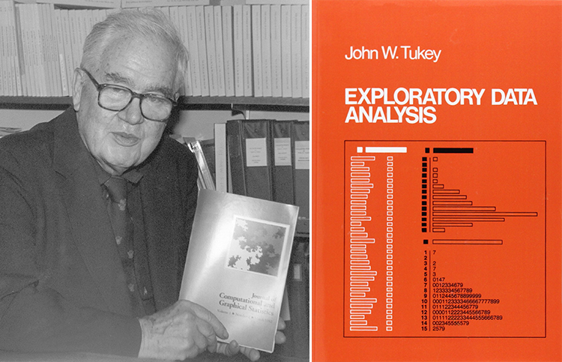
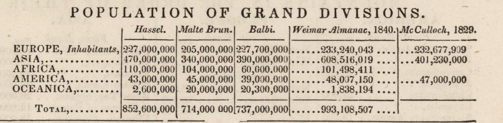
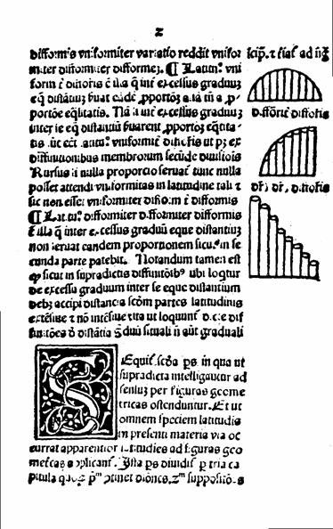
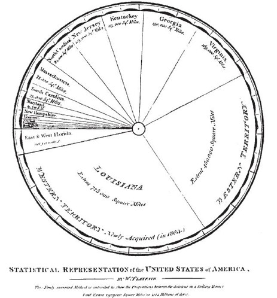

```{r child = "../setup.Rmd"}
```

```{r packages, echo=FALSE, message=FALSE, warning=FALSE}
# Remember to compile
#xaringan::inf_mr(cast_from = "..")
#       slideNumberFormat: ""  
library(tidyverse)
library(vembedr)
library(knitr)
if (!require("emo")) devtools::install_github("hadley/emo")
# Installs library if missing
if (!require("HistData")) install.packages("HistData") 
library(emo)
knitr::opts_chunk$set(echo = FALSE,out.width = "90%", fig.align = "center")

```

class: middle

# Describing Data

---

## Hans Rosling

```{r, echo=FALSE}
"https://www.youtube.com/watch?v=jbkSRLYSojo" %>%
embed_url() %>%
  use_align("center")
```


---

# Summarize

.pull-left[

- Transform a pile of numbers into a summary
- Descriptive Statistics
    - Distribution of a variable is a table/graph showing the categories/values of outcomes and their frequency/percentage of occurrence
    - Exploratory Data Analysis (Tukey, 1977)
]
.pull-right[


]

---

# Exploratory Data Analysis
.pull-left[
- Tukey (1977)
    - EDA
    - Graphical Data Analysis
    - Numbers as summaries
    - Emphasized Robust Statistics
]
--
.pull-right[

]

---

# Descriptive Statistics
- Examples
    - Tables
    - Graphs
    - Summary Statistics

---

# Tables

- Woodbridge (1845)
    
```{r, echo=FALSE, out.width="100%", warning = FALSE}

```  

---

# Graphs

  -  Minard (1869)
    
```{r, echo=FALSE, out.width="70%", warning = FALSE}
knitr::include_graphics("../img/minard.png")
```  


---

# Examples

- Summary Statistics
    - Measures of Central Tendency
    - Measures of Spread
    
```{r, echo=FALSE, out.width="30%", warning = FALSE}
knitr::include_graphics("../img/centralbears.jpg")
``` 

     
---

# Categorical Variable Displays (Nominal, Ordinal)

- Frequency Distribution Graphs
  - Bar Chart  (appropriate for nominal and ordinal data)
  - Pie Chart (best for nominal data with few categories)
--

- Quantitative Variables
  - Histograms
  - Stem plots
--

- Time Plots
  - (can be used for any level, often interval or ratio)

---

# Frequency distribution graph

.pull-left[
- Bar Chart
    - Graphs of variables with categories of outcomes on the x axis; and the frequency or percent of each category on the Y axis.
    - Appropriate for nominal and ordinal data
 
]
.pull-right[

```{r, echo=FALSE, out.width="35%", warning = FALSE,caption="Nicole Oresme (Bishop of Lisieus) circa 1350"}

``` 
.footnote[Nicole Oresme (Bishop of Lisieus) circa 1350]
]

---

# Bar Graph/Chart

.pull-left.small[
```{r, echo=TRUE}
# Bar chart
library(HistData)
Minard_troops_demo <- Minard.troops

Minard_troops_demo$group <- paste("Group",Minard_troops_demo$group)

counts <- table(Minard_troops_demo$group)
```
]

--
.pull-right.small[
```{r, echo=TRUE}
barplot(counts, main="Bar Chart of Troops",
        xlab="Group", ylab="Observations",
        col="lightblue")
```
]

--

- Note: This example uses nominal data (Troop Group) and how many data points we have for each group.
- Bar charts are suitable for nominal and ordinal data as they show frequency for discrete categories.
---

# Stacked Bar Chart (Total Troops)

```{r,echo=FALSE}
descriptives <- Minard_troops_demo %>% group_by(group) %>%
summarize(n = n(),
          max = max(survivors,na.rm=TRUE),
          min= min(survivors,na.rm=TRUE)) 

```

.pull-left.small[
```{r, echo=TRUE}
df <- data.frame(
  group = c("Group 1", 
            "Group 2", 
            "Group 3"),
  max = c(340000,60000,22000),
  min = c(4000,28000,6000))

head(df)
```
]
.pull-right.small[
```{r, echo=TRUE}
library(ggplot2)
bp <- ggplot(df, aes(x="",
                     y=max/1000, # to rescale
                     fill = group))+ 
  geom_bar(width = 1,stat = "identity")
bp
```
]

- Stacked bar charts can show the relationship between two categorical variables.

---

# Pie Chart
.pull-left[
- Graphs of variables with categories of outcomes as frequency or percent of each category in the pie.
- Best for nominal data with few categories
]

.pull-right[
```{r, echo=FALSE, out.height="40%", warning = FALSE}

```
.footnote["A pie chart showing each state in the United States, part of Playfair's translation of A Statistical Account of the United States of America by D. F. Donnant."
]]

---

# Pie chart

.pull-left-narrow[
```{r, echo=TRUE}
slices <- c(10,12,
            4,16, 8)
lbls <- c("US", "UK",
          "Australia",
          "Germany",
          "France")
```
]
.pull-right-wide[
```{r, echo=TRUE}
pie(slices, labels = lbls,
    main="Pie Chart of Countries")
```
]
---

# Example 2

.small.pull-left[
```{r example2, echo=TRUE, fig.show=FALSE}
mytable <- table(iris$Species)
lbls <- paste(names(mytable), "\n", mytable, sep="")
pie(mytable, labels = lbls,
		main="Pie Chart of Species\n (with sample sizes)")

```
]

.pull-right[
```{r ref.label = "example2",out.width = "65%", echo = FALSE, warning = FALSE}
```
]

- Pie charts are best for nominal data with few categories, showing part-to-whole relationships.

---


# Convert Bar Chart into Pie Chart

.small.pull-left[
```{r, polar, echo=TRUE}
pie <- bp + coord_polar("y", start=0)
pie
pie + scale_fill_manual(values=c("#999999", "#E69F00", "#56B4E9"))
```
]
.pull-right[
```{r ref.label = "polar",out.width = "65%", echo = FALSE, warning = FALSE}
```
]

[Additional Resources](http://www.sthda.com/english/wiki/ggplot2-pie-chart-quick-start-guide-r-software-and-data-visualization) 

---

# Quantitative Variables 

- Interval or Ratio Scales
    - Histograms
    - Stem plots
    - Time plots

---


# Histogram 
- A histogram is a graphical representation of the distribution of numerical data.
    - Approximates a probability distribution
    - First described by  Pearson in 1895.
    
---

# Histogram

.pull-left[
```{r echo=TRUE}
library(MASS) # load library
variable<-cats$Bwt
hist(variable)
```
]

.pull-right[
```{r echo=TRUE}
 #Convert to Imperial
variable<-variable*2.2  

hist(variable)
```
]

- Histograms are appropriate for interval and ratio data, showing the distribution of continuous variables.

---

# Boxplot (Ordinal predictor, Ratio outcome)

.pull-left[
- Boxplots can show the distribution of a ratio variable across categories of an ordinal variable.
]
.pull-right.small[
```{r, echo=TRUE}
boxplot(mpg ~ cyl, data=mtcars,
        main="MPG by Number of Cylinders",
        xlab="Number of Cylinders (Ordinal)",
        ylab="Miles Per Gallon (Ratio)")
```
]


---


# Stemplot 

.pull-left-narrow[
- Sometimes called a stem and leaf diagram
- A way to display data that splits the data into a stem and leaf.
- The stem is the first digit of the number and the leaf is the second digit
- Stem and leaf plots are useful for displaying the distribution of interval or ratio data, especially for smaller datasets.
]
--
.pull-right-wide.small[
- Eruption duration is a ratio variable
- Each leaf represents the ones digit
- Each stem represents the tens digit

```{r, echo=TRUE}
# Stem and Leaf plot
stem(faithful$eruptions,scale=1)
```
]


---


# Time Plots

```{r, echo=FALSE, out.width="30%", warning = FALSE}
knitr::include_graphics("../img/minard.png")
```  
--


- Edward Tufte has said that Minard's plot: 
    > "may well be the best statistical graphic ever drawn"
    
- It packs a ton of information into one dense figure. 

---


# Time Plots

```{r}
knitr::include_graphics("../img/minard.png")
```  

---

- The plot contains seven variables, each mapped to a different aesthetic:


| Information                           | Aesthetic       | Level of Measurement |
|---------------------------------------|----------------------------------------|
| Size of Napoleon's Grande Armée       | Width of path   | Ratio             |
| Longitude of the army's position      | x-axis          | Ratio             |
| Latitude of the army's position       | y-axis          | Ratio             |
| Direction of the army's movement      | Color of path   | Nominal           |
| Date of points along retreat path     | Text below plot | ???????  (What do you think?)         |
| Temperature during the army's retreat | Line below plot | ??????? (What do you think?)  |
| Geographic features                   | Map background  | ???????  (What do you think?)            |

---

# Recreation in R

- This plot has been recreated in R by:
    - [Andrew Heiss](https://www.andrewheiss.com/blog/2017/08/10/exploring-minards-1812-plot-with-ggplot2/)
    - [Michael Friendly](http://www.datavis.ca/gallery/re-minard.php)
    - [Hadley Wickham](https://www.tandfonline.com/doi/suppl/10.1198/jcgs.2009.07098?scroll=top)

---

# Side by Side

```{r load-libraries-data,echo=FALSE, warning=FALSE, include=FALSE}

library(tidyverse)
library(lubridate)
library(ggplot2)
library(ggmap)
library(ggrepel)
library(gridExtra)
library(psych)
#Download Directly
download=FALSE # set to true to download
if(download){
 cities <- read.table("https://raw.githubusercontent.com/andrewheiss/fancy-minard/master/input/minard/cities.txt",
                      header = TRUE, stringsAsFactors = FALSE)
 
 troops <- read.table("https://raw.githubusercontent.com/andrewheiss/fancy-minard/master/input/minard/troops.txt",
                      header = TRUE, stringsAsFactors = FALSE)
 temps <- read.table("https://raw.githubusercontent.com/andrewheiss/fancy-minard/master/input/minard/temps.txt",
                     header = TRUE, stringsAsFactors = FALSE)
}else{

#Load from local
cities <- read.table("dat/cities.txt",
                     header = TRUE, stringsAsFactors = FALSE)
troops <- read.table("dat/troops.txt",
                     header = TRUE, stringsAsFactors = FALSE)
temps <- read.table("dat/temps.txt",
                    header = TRUE, stringsAsFactors = FALSE)
}

describe(cities)
describe(troops)
describe(temps)

temps$date <- as.Date(strptime(temps$date,"%d%b%Y"))
temps.nice <- temps %>%
  mutate(nice.label = paste0(temp, "°, ", month, ". ", day))


march.1812.plot.simple <- ggplot() +
  geom_path(data = troops, aes(x = long, y = lat, group = group, 
                               color = direction, size = survivors),
            lineend = "round") +
  geom_point(data = cities, aes(x = long, y = lat),
             color = "#DC5B44") +
  geom_text_repel(data = cities, aes(x = long, y = lat, label = city),
                  color = "#DC5B44") +
  scale_size(range = c(0.5, 10)) + 
  scale_colour_manual(values = c("#DFC17E", "#252523")) +
  guides(color = FALSE, size = FALSE) +
  theme_nothing()

march.1812.plot.simple

# Change the x-axis limits to match the simple map
temps.1812.plot <- ggplot(data = temps.nice, aes(x = long, y = temp)) +
  geom_line() +
  geom_label(aes(label = nice.label),
             size = 2.5) + 
  labs(x = NULL, y = "° Celsius") +
  scale_x_continuous(limits = ggplot_build(march.1812.plot.simple)$layout$panel_ranges[[1]]$x.range) +
  scale_y_continuous(position = "right") +
  coord_cartesian(ylim = c(-35, 5)) +  # Add some space above/below
  theme_bw() +
  theme(panel.grid.major.x = element_blank(),
        panel.grid.minor.x = element_blank(),
        panel.grid.minor.y = element_blank(),
        axis.text.x = element_blank(), axis.ticks = element_blank(),
        panel.border = element_blank())

temps.1812.plot

# Combine the two plots
both.1812.plot.simple <- gtable_rbind(ggplotGrob(march.1812.plot.simple),
                               ggplotGrob(temps.1812.plot))

both.1812.plot.simple

# Adjust panels
panels <- both.1812.plot.simple$layout$t[grep("panel", both.1812.plot.simple$layout$name)]

# Because this plot doesn't use coord_equal, 
# since it's not a map, we can use whatever relative numbers we want, like a 3:1 ratio
both.1812.plot.simple$heights[panels] <- unit(c(3, 1), "null")

grid::grid.newpage()
grid::grid.draw(both.1812.plot.simple)
```


.pull-left[
```{r}
knitr::include_graphics("../img/minard.png")
```
]

.pull-right[
```{r fig.width=10, fig.height=4.75,echo=FALSE}
grid::grid.newpage()
grid::grid.draw(both.1812.plot.simple)
```  
]

---

.tiny[
```{r, ref.label='load-libraries-data',echo=TRUE}

```
]
---

# More Accessible Resources

- [R Graph Gallery](https://r-graph-gallery.com/)
- [Learning Statistics with R](https://learningstatisticswithr.com/)
- .hand-pink[[Data Science for Psychologists](https://datascience4psych.github.io/DataScience4Psych/)]

---

class: center, middle

# Wrapping Up...


