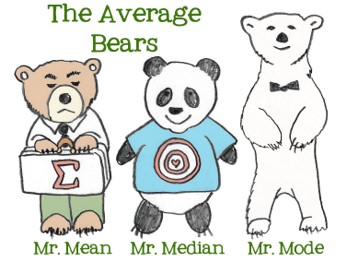

```{r child = "../setup.Rmd"}
```

```{r packages, echo=FALSE, message=FALSE, warning=FALSE}
# Remember to compile
#xaringan::inf_mr(cast_from = "..")
#       slideNumberFormat: ""  
library(tidyverse)
library(vembedr)
library(knitr)
if (!require("emo")) devtools::install_github("hadley/emo")
# Installs library if missing
if (!require("HistData")) install.packages("HistData") 
library(emo)
knitr::opts_chunk$set(echo = FALSE,out.width = "90%", fig.align = "center")

```

class: middle

# Describing Data

---

## Hans Rosling

```{r, echo=FALSE}
"https://www.youtube.com/watch?v=jbkSRLYSojo" %>%
embed_url() %>%
  use_align("center")
```


---

# Summarize

.pull-left[

- Transform a pile of numbers into a summary
- Descriptive Statistics
    - Distribution of a variable is a table/graph showing the categories/values of outcomes and their frequency/percentage of occurrence
    - Exploratory Data Analysis (Tukey, 1977)
]
.pull-right[


]

---

# Exploratory Data Analysis
.pull-left[
- Tukey (1977)
    -	EDA
    - Graphical Data Analysis
    - Numbers as summaries
    - Emphasized Robust Statistics
]
--
.pull-right[

]

---

# Descriptive Statistics
- Examples
    - Tables
    - Graphs
    - Summary Statistics

---

# Tables

- Woodbridge (1845)
    


     
---

# Graphs
  -  Minard (1869)
    


---

# Examples

- Summary Statistics
    - Measures of Central Tendency
    - Measures of Spread
    


     

---

# Categorical Variable Displays (Nominal, Ordinal)

- Frequency Distribution Graphs
    - Bar Chart
    - Pie Chart
- Quantitative Variables
    - Histograms
    - Stem plots
- Time Plots  

---

# Frequency distribution graph

.pull-left[
- Bar Chart
    - Graphs of variables with categories of outcomes on the x axis; and the frequency or percent of each category on the Y axis.
 
]
.pull-right[


]

---

# Bar Graph/Chart
.pull-left[
```{r, echo=TRUE}
# Bar chart
library(car)
counts <- table(mtcars$gear)
```
]
.pull-right[
```{r, echo=TRUE}
barplot(counts, main="Car Distribution",
  	xlab="Number of Gears")
```
]
---

# Stacked Bar Chart
.pull-left[
```{r, echo=TRUE}
df <- data.frame(
  group = c("Male", 
            "Female", 
            "Child"),
  value = c(25, 25, 50)
  )
head(df)
```
]
.pull-right[
```{r, echo=TRUE}
library(ggplot2)
(bp=ggplot(df, aes(x="",y=value, fill=group))+
geom_bar(width = 1, stat = "identity"))

```
]
---

# Pie Chart
.pull-left[
- Graphs of variables with categories of outcomes as frequency or percent of each category in the pie.
]

.pull-right[


]

---

# Pie chart

.pull-left[
```{r, echo=TRUE}
slices <- c(10, 12,4, 16, 8)
lbls <- c("US", "UK", "Australia", "Germany", "France")
```
]
.pull-right[
```{r, echo=TRUE}
pie(slices, labels = lbls, main="Pie Chart of Countries")
```
]
---

# Example 2
.small[
```{r, echo=TRUE}
mytable <- table(iris$Species)
lbls <- paste(names(mytable), "\n", mytable, sep="")
pie(mytable, labels = lbls,
		main="Pie Chart of Species\n (with sample sizes)")

```
]
---


# Convert Bar Chart into Pie Chart
.small[
```{r, echo=TRUE}
pie <- bp + coord_polar("y", start=0)
pie
pie + scale_fill_manual(values=c("#999999", "#E69F00", "#56B4E9"))
```
]
[Additional Resources](http://www.sthda.com/english/wiki/ggplot2-pie-chart-quick-start-guide-r-software-and-data-visualization) 

---

# Quantitative Variables 

- Interval or Ratio Scales
    - Histograms
    - Stem plots
    - Time plots

---


# Histogram 
- A histogram is a graphical representation of the distribution of numerical data.
    - Approximates a probability distribution
    - First described in @Pearson1895.
    
---
# Histogram
.pull-left[
```{r echo=TRUE}
library(MASS)
variable<-cats$Bwt
hist(variable)
```
]

.pull-right[
```{r echo=TRUE}
variable<-variable*2.2   #Convert to Imperial
hist(variable)
```
]
---


# Stemplot 

- Sometimes called a stem and leaf diagram

```{r, echo=TRUE}
# Stem and Leaf plot
stem(faithful$eruptions,scale=1)
```

---


# Time Plots

```{r}
knitr::include_graphics("../img/minard.png")
```  

- Edward Tufte has said that Minard's plot: 

    > "may well be the best statistical graphic ever drawn" 

- It packs a ton of information into one dense figure. 

---


# Time Plots

```{r}
knitr::include_graphics("../img/minard.png")
```  

---

- The plot contains six variables, each mapped to a different aesthetic:


| Information                           | Aesthetic       |
|---------------------------------------|-----------------|
| Size of Napoleon's Grande Armée       | Width of path   |
| Longitude of the army's position      | x-axis          |
| Latitude of the army's position       | y-axis          |
| Direction of the army's movement      | Color of path   |
| Date of points along retreat path     | Text below plot |
| Temperature during the army's retreat | Line below plot |

---

# Recreation in R
- This plot has been recreated in R by:
    - [Andrew Heiss](https://www.andrewheiss.com/blog/2017/08/10/exploring-minards-1812-plot-with-ggplot2/)
    - [Michael Friendly](http://www.datavis.ca/gallery/re-minard.php)
    - @Wickham2010 [link](https://www.tandfonline.com/doi/suppl/10.1198/jcgs.2009.07098?scroll=top)

---

# Side by Side

```{r load-libraries-data,echo=FALSE, warning=FALSE, include=FALSE}

library(tidyverse)
library(lubridate)
library(ggplot2)
library(ggmap)
library(ggrepel)
library(gridExtra)
library(psych)
#Download Directly
download=FALSE # set to true to download
if(download){
 cities <- read.table("https://raw.githubusercontent.com/andrewheiss/fancy-minard/master/input/minard/cities.txt",
                      header = TRUE, stringsAsFactors = FALSE)
 
 troops <- read.table("https://raw.githubusercontent.com/andrewheiss/fancy-minard/master/input/minard/troops.txt",
                      header = TRUE, stringsAsFactors = FALSE)
 temps <- read.table("https://raw.githubusercontent.com/andrewheiss/fancy-minard/master/input/minard/temps.txt",
                     header = TRUE, stringsAsFactors = FALSE)
}else{


cities <- read.table("dat/cities.txt",
                     header = TRUE, stringsAsFactors = FALSE)
troops <- read.table("dat/troops.txt",
                     header = TRUE, stringsAsFactors = FALSE)
temps <- read.table("dat/temps.txt",
                    header = TRUE, stringsAsFactors = FALSE)
}

describe(cities)
describe(troops)
describe(temps)

temps$date <- as.Date(strptime(temps$date,"%d%b%Y"))
temps.nice <- temps %>%
  mutate(nice.label = paste0(temp, "°, ", month, ". ", day))


march.1812.plot.simple <- ggplot() +
  geom_path(data = troops, aes(x = long, y = lat, group = group, 
                               color = direction, size = survivors),
            lineend = "round") +
  geom_point(data = cities, aes(x = long, y = lat),
             color = "#DC5B44") +
  geom_text_repel(data = cities, aes(x = long, y = lat, label = city),
                  color = "#DC5B44") +
  scale_size(range = c(0.5, 10)) + 
  scale_colour_manual(values = c("#DFC17E", "#252523")) +
  guides(color = FALSE, size = FALSE) +
  theme_nothing()

march.1812.plot.simple

# Change the x-axis limits to match the simple map
temps.1812.plot <- ggplot(data = temps.nice, aes(x = long, y = temp)) +
  geom_line() +
  geom_label(aes(label = nice.label),
             size = 2.5) + 
  labs(x = NULL, y = "° Celsius") +
  scale_x_continuous(limits = ggplot_build(march.1812.plot.simple)$layout$panel_ranges[[1]]$x.range) +
  scale_y_continuous(position = "right") +
  coord_cartesian(ylim = c(-35, 5)) +  # Add some space above/below
  theme_bw() +
  theme(panel.grid.major.x = element_blank(),
        panel.grid.minor.x = element_blank(),
        panel.grid.minor.y = element_blank(),
        axis.text.x = element_blank(), axis.ticks = element_blank(),
        panel.border = element_blank())

temps.1812.plot

# Combine the two plots
both.1812.plot.simple <- gtable_rbind(ggplotGrob(march.1812.plot.simple),
                               ggplotGrob(temps.1812.plot))

both.1812.plot.simple

# Adjust panels
panels <- both.1812.plot.simple$layout$t[grep("panel", both.1812.plot.simple$layout$name)]

# Because this plot doesn't use coord_equal, 
# since it's not a map, we can use whatever relative numbers we want, like a 3:1 ratio
both.1812.plot.simple$heights[panels] <- unit(c(3, 1), "null")

grid::grid.newpage()
grid::grid.draw(both.1812.plot.simple)
```


```{r}
knitr::include_graphics("../img/minard.png")
```


```{r fig.width=10, fig.height=4.75,echo=FALSE}
grid::grid.newpage()
grid::grid.draw(both.1812.plot.simple)
```  

---

# More Accessible Resources

- [R Graph Catalog](http://shinyapps.stat.ubc.ca/r-graph-catalog/)

- [intRo](http://www.intro-stats.com/)

---

# R Basics

- Installation
  - R can be downloaded from one of the mirror sites in http://cran.r-project.org/mirrors.html. You should pick your nearest location.

- Using External Data
  - R offers plenty of options for loading external data, including Excel, Minitab and SPSS files.

- R Session
  - After R is started, there is a console awaiting for input. At the prompt (>), you can enter numbers and perform calculations.

> 1 + 2 
[1] 3

---

# Variable Assignment

We assign values to variables with the assignment operator "=". Just typing the variable by itself at the prompt will print out the value. We should note that another form of assignment operator "<-" is also in use.

```{r}
x = 1 
x 
```

# Functions

R functions are invoked by its name, then followed by the parenthesis, and zero or more arguments. The following apply the function c to combine three numeric values into a vector.

```{r}
c(1, 2, 3) 

```
---

# Comments

All text after the pound sign "#" within the same line is considered a comment.

> 1 + 1      # this is a comment 
[1] 2

---

# Extension Package

Sometimes we need additional functionality beyond those offered by the core R library. In order to install an extension package, you should invoke the install.packages function at the prompt and follow the instruction.

---

#
> install.packages()
Getting Help
R provides extensive documentation. For example, entering ?c or help(c) at the prompt gives documentation of the function c in R. Please give it a try.

---

#
> help(c)
If you are not sure about the name of the function you are looking for, you can perform a fuzzy search with the apropos function.

> apropos("nova") 
[1] "anova"                "anova.glm" 
   ....


# References

---

# Wrapping Up...

<br><br>


