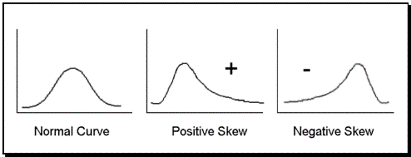
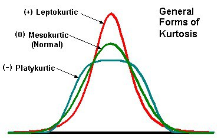
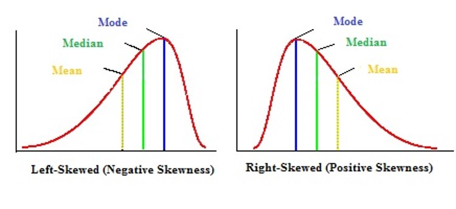
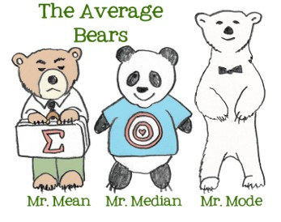

```{r child = "../setup.Rmd"}
```

```{r packages, echo=FALSE, message=FALSE, warning=FALSE}
# Remember to compile
#xaringan::inf_mr(cast_from = "..")
#       slideNumberFormat: ""  
library(tidyverse)
library(vembedr)
library(knitr)
if (!require("emo")) devtools::install_github("hadley/emo")
# Installs library if missing
if (!require("HistData")) install.packages("HistData") 
library(emo)
knitr::opts_chunk$set(echo = TRUE,out.width = "90%", fig.align = "center")

```

class: middle

# Characteristics of distributions

---

## Describing distributions with numbers 
.pull-left[
- Hundreds of descriptive statistics exist
- Goal: Describe the data with a single number that represents an entire distribution
- Taxonomy of descriptive statistics (a.k.a. Key characteristics)
  - Shape
  - Center
  - Spread
  - Unusual observations
] .pull-right[

```{r, echo=FALSE}
library(ggplot2)
set.seed(123)
data <- data.frame(x = c(rnorm(1000), rnorm(1000, mean = 3, sd = 0.5)))
ggplot(data, aes(x)) +
  geom_density(fill = "lightblue", alpha = 0.7) +
  theme_minimal() +
  labs(title = "Example: Two Overlapping Distributions",
       x = "Value", y = "Density")
```

]

---

# Taxonomy

- shape:
  - skewness: right-skewed, left-skewed, symmetric (skew is to the side of the longer tail)
  - modality: unimodal, bimodal, multimodal, uniform
- center: mean (`mean`), median (`median`), mode (not always useful)
- spread: range (`range`), standard deviation (`sd`), inter-quartile range (`IQR`)
- unusual observations: outliers, extreme values

---

# Center

- Center (or Central tendency or Location) aims to capture the center of the distribution.
- Display the normal distributions with various means

.small[
```{r cent, echo=FALSE,out.width = "55%"}
x <- seq(-80, 80, length=1000)
hx <- dnorm(x)
colors <- c("red", "blue",
            "green", "purple", "black")


plot(x, hx, type="l", lty=2, xlab="x value",
		 ylab="Density", main="Distributions with Different Means",xlim=c(-7, 7))
location<-c(2,4,-2,-4)
labels=paste0("Mean = ",location)
labels[length(labels)+1]="Mean = 0"

for (i in 1:length(location)){
	lines(x, dnorm(x,mean=location[i]), lwd=1, col=colors[i])
}

legend("topright", inset=.05, title="Distributions",
  labels, lwd=2, lty=c(1, 1, 1, 1, 2), col=colors)
```
]
---

.small[
```{r ref.label = "cent", echo = TRUE, warning = FALSE,,out.width = "30%"}
```
]

---

# Spread

- Spread (a.k.a. Variability ) describes how spread out the data are from that center
    - Low variance has a less wide distribution, with the bulk of the mass in the center
    - High variance has a very wide distribution, bulk of distribution is spread out

---

# Normal distributions with various standard deviations

.small[
```{r spread, echo=FALSE,out.width = "80%"}
plot(x, hx, type="l", lty=2, xlab="x value",
		 ylab="Density", main="Distributions with Different Standard Deviations",xlim=c(-7, 7))
spread=c(.5,2,4)
labels=paste0("SD = ",spread)
labels[length(labels)+1]="SD = 1"
for (i in 1:length(spread)){
	lines(x, dnorm(x,sd=spread[i]), lwd=1, col=colors[i])
} 
legend("topright", inset=.05, title="Distributions",
  labels, lwd=2, lty=c(1, 1, 1, 1, 2), col=colors[c(1:3,5)])

```
]

---

.small[
```{r ref.label = "spread", echo = TRUE, warning = FALSE,out.width = "30%"}
```
]

---


# Skew / Asymetry
.pull-left[
- Skewness is a measure of symmetry, or more precisely, the lack of symmetry. 
- A distribution, or data set, is symmetric 
  - if it looks the same to the left and right of the center point.
- Refers to the tail of the distribution
]
.pull-right[
- Positively skewed (right skewed)
    - Bulk of the mass is on the left
-	Negatively skewed (left skewed)
    - Bulk of the mass is on the right
]
```{r echo=FALSE, out.width = "40%"}

```


---

# Kurtosis – peakedness

- Kurtosis is a measure of whether the data are 
    - heavy-tailed or light-tailed relative to a normal distribution. 
- Data sets with high kurtosis tend to have heavy tails, or outliers. 
- Data sets with low kurtosis tend to have light tails, or lack of outliers. 
    - A uniform (flat) distribution  would be the extreme case.
    
---

# Kurtosis – peakedness
.pull-left[
- Low k
    - Leptokurtic
- Normal
    - Mesokurtic
- High k
    - Platykurtic
]
<br>
.pull-right[
```{r,echo=FALSE}

```
]

---

# Specific Measures

- Measures of Central Tendency
    - Mean
    - Median
    - Mode

---

# Central tendency: Mean

- Mean 
  $(\mu; \bar{X})$
    - arithmetic average
    - $\bar{X}$ is used for samples
    - Mu ($\mu$) is used for population

    $\bar{X}= \frac{1}{n}  \sum^{n}_{i=1}x_{i}$

---

# Central tendency: Mean
- Properties
    - Is the balance point of the distribution (in terms of center of mass)
--
    $\sum^{n}_{i=1}(x_{i}-\bar{x})=0$
--
    - Least squares property
      - The sum of squared deviations about the mean is small
--    
      - highly sensitive to outliers (extreme scores)
      - (weakness; it means that the mean is not so good as a measure of central tendency in highly skewed distributions)
      - Is not a robust statistic (low robust = sensitive to outliers; high robust = not sensitive to outliers)
        
---

# Central tendency: Mean
- Very good with quantitative data (interval and ratio data, 
    - especially bell shaped distributions)
    - Very popular statistic

---

# Horse kick Data
.pull-left[
```{r mean,echo=TRUE}
library(pscl)
data(prussian)

#horse kick fatalities by year
prussian$y 

variable<-prussian$y 
```
]
.pull-right[
```{r mean2,echo=TRUE}
# Mean
mean(variable)
```
]
---

# Central Tendency: Median
- Median (Md)
- Def: central score in a distribution
    - If *n is odd* then 
        - Md = value of the $\frac{n+1}{2}$ item term.
    - If *n is even* then 
        - Md = average of the $\frac{n+}{2}$  and $\frac{n+1}{2}$ item terms.
        
---

# Central Tendency: Median
- Properties
    - Balance point of scores
    - Highly robust to outliers (less sensitive than the mean to outliers)
    - Sum of absolute deviations is smaller than any other constant (c)
--
<br>
  $\sum^{n}_{i=1}(\left|X-c\right|)$
- Often used for ordinal data

```{r,echo=TRUE}
median(variable)
```

---

# Calculating by "hand"

.pull-left.small[
- Sample Size?
```{r}
(sample.size <- length(variable))
```

- Even or Odd?
  - Test if number is divisible by 2.
  - If yes, then even
  - Else, is odd

```{r}
sample.size %% 2 == 0 
```
]
.pull-right.small[
- Sort our values
```{r}
variable <- sort(variable)
```

- if odd, grab the midpoint value sample size / 2
```{r}
variable[sample.size/2]
```

- if even, grab the average of the midpoint values sample size / 2 and sample size + 1 / 2
```{r}
(variable[sample.size/2] + variable[1+sample.size/2])/2
```
]

---

# Central Tendency: Mode
.pull-left.small[
- Mode: most common score
- Local modes are the highest point with a subset of the distribution, there can be multiple ones

```{r mode,echo=TRUE}
#Mode
mode(variable) # That's not mode!
```
]
.pull-right[
```{r mode2,echo=TRUE}
# Function to examine mode
Mode <- function(x) {
	ux <- unique(x)   #finds all unique values
	ux[which.max(tabulate(match(x, ux)))] #returns the value which is most frequent
}
Mode(variable)
```
]

---

# Relationship between mean, median, and mode
.pull-left[
- When we have a symmetric unimodal distribution
    - Mean=median=mode
    ]
--
.pull-left[
- positively skewed
    - mode < median < mean
- negatively skewed
    - mean < median < mode
]
.pull-right[
```{r,echo=FALSE}

```
]
---

.pull-left-narrow[
```{r hist, echo=TRUE}
hist(variable)
```
]
.pull-right-wide[
```{r hist2, echo=TRUE}
library(Hmisc)
describe(variable)
```
]
---
# Measures of Spread around the Median

- Range
    - maximum value - minimum value
    - $max(x_{i})-min(x_{i})$
    - Non-robust to outliers
--
- Quartiles
    - Lower quartile (Q1), 25th percentile
    - Second quartile (Q2), 50th percentile / median
    - Upper quartile (Q3), 75th percentile
--
- Interquartile Range (IQR)
    - Q3-Q1
    - Sometimes called h-spread; h = hinges
    
---

# R Examples
.medium[
```{r,echo=TRUE}
# Range
range(variable)
max(variable) -min(variable)

summary(variable)# 5 Number Summary / Quartiles
```
]
---

# Spread around the Mean

- Variance 
($\sigma^{2}; s^{2}$)
    - Measure of spread around the mean
    - Goal of the measure to use every score

    $\sigma^{2}$ = $\frac{\sum^{n}_{i=1}(x_{i}-\mu)^{2}}{N}$
    $s^{2}$ = $\frac{\sum^{n}_{i=1}(x_{i}-\bar{x})^{2}}{n-1}$
- Standard Deviation 
($\sigma$;s)
    - $\sigma$ = $\sqrt{\sigma^{2}}$
    - s = $\sqrt{s^{2}}$
    
---

# Bessel's Correction
- $s^{2}$ is nearly the average squared deviation
- $s^{2}$ uses n-1 instead of N
    - Otherwise we get biased estimates
    - This adjustment is called Bessel's correction
- In our formula, we are using the sample mean (x) instead of the true mean ($\mu$)
    - this results in underestimating each $x_{i} − \mu$ by $x − \mu$. 
---
# Properties
    - Std is in raw score units
    - Both the variance and standard deviation are highly NOT robust
   
---

# R Examples

```{r,echo=TRUE}
# Variance
var(variable)

# Standard Deviation
sqrt(var(variable))
sd(variable)
```

---

# Wrapping Up...

<br><br>



