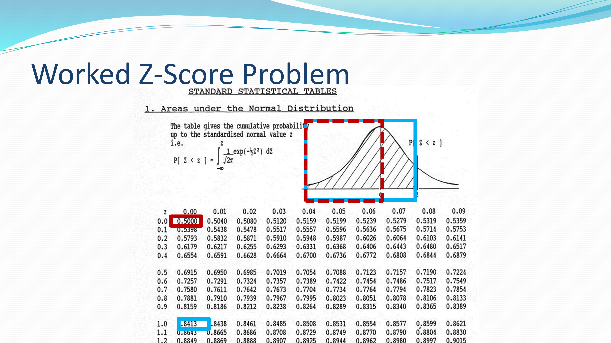
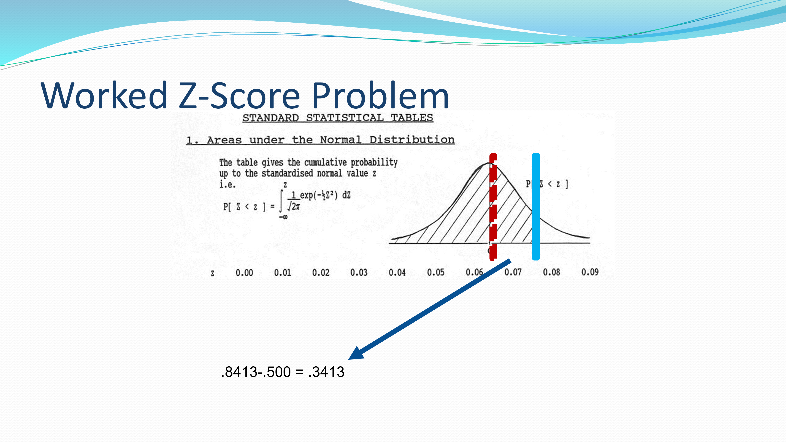
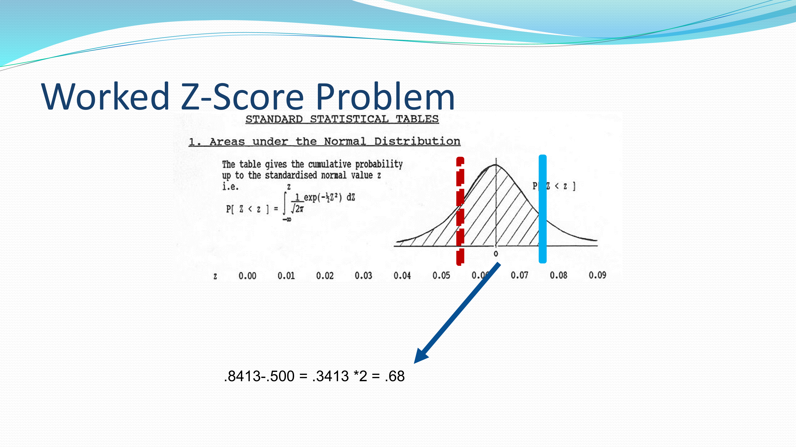
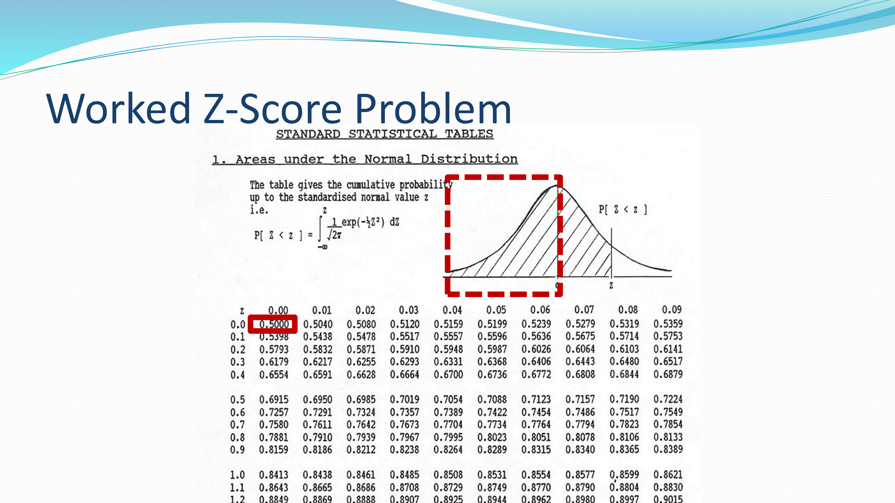
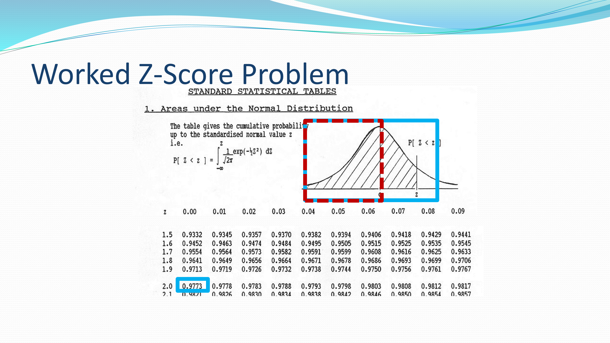
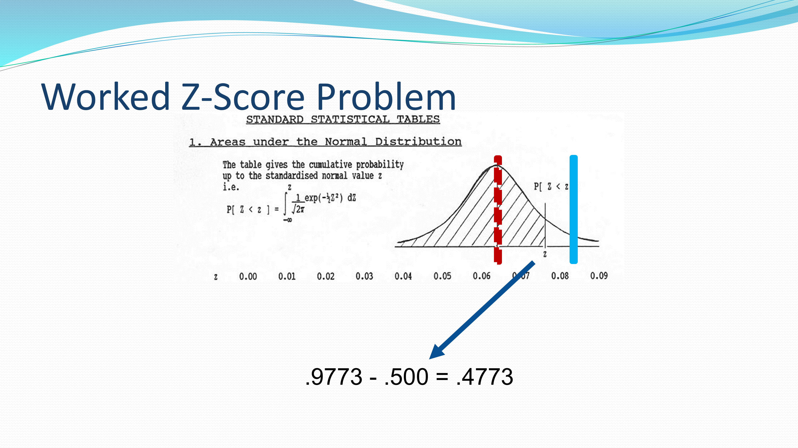
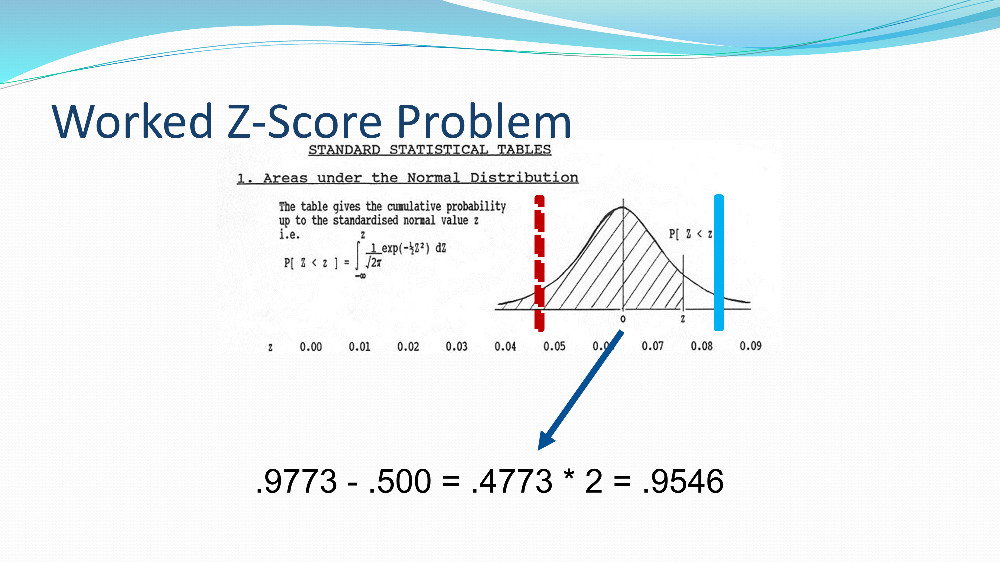
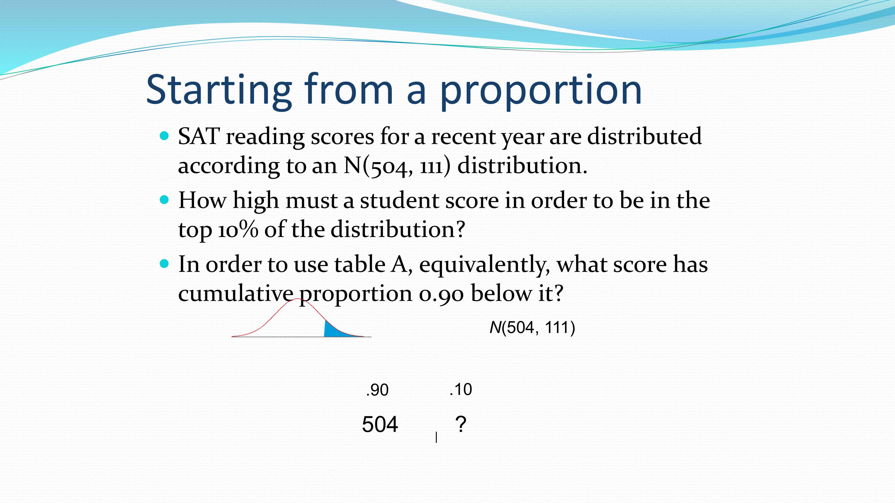

```{r child = "../setup.Rmd"}
```

```{r packages, echo=FALSE, message=FALSE, warning=FALSE}
# Remember to compile
#xaringan::inf_mr(cast_from = "..")
#       slideNumberFormat: ""  

library(knitr)
if (!require("emo")) devtools::install_github("hadley/emo")
# Installs library if missing
if (!require("HistData")) install.packages("HistData") 


suppressPackageStartupMessages({
library(tidyverse)
library(vembedr)
library(knitr)
library(HistData)
library(emo)
library(ggplot2movies)
library(datasets)
library(ggplot2)
library(magick)
})

knitr::opts_chunk$set(echo = TRUE,out.width = "90%", fig.align = "center")

set.seed(123)


# Common helpers
norm_colors <- c("#d62728", "#1f77b4", "#2ca02c", "#9467bd", "#8c564b", "#7f7f7f")
X <- seq(-8, 8, length.out = 2000)
HX <- dnorm(X)
```

class: middle

# Normal Distribution

---

## Normal Distribution


- A Normal distribution is a bell-shaped curve that models many natural and social phenomena. 
- It is defined mathematically by the formula:


$f(x)= \frac{1}{\sigma\sqrt{2\pi}}e^{-\frac{1}{2}(\frac{x-\mu}{\sigma})^{2}}$

- Formula has two parameters
    - $\mu$: the mean, locating the center of the distribution.
    - $\sigma$: the standard deviation, determining the spread.
- The *standard normal* is a special case with $\mu = 0$ and $\sigma = 1$.
- It simplifies the equation

---

## Visualizing the Standard Normal


- The mean $\mu$ is located at the center of the symmetric curve and is the same as the median. 
- Changing $\mu$ (without changing $\sigma$) moves the Normal curve along the horizontal axis without changing its variability.

.small[
```{r norm, echo=FALSE,out.width = "55%"}

#### Normal Distribution
locations<-c(2,4,-2)
# Display the normal distributions with various means

plot(X, HX, type="l", lty=2, xlab="x value",
		 ylab="Density", 
		 main = "Normal Distributions with Different Means", 
		 xlim=c(-5, 7))

for (i in seq_along(locations)) {
lines(X, dnorm(X, mean = locations[i]), 
      lwd = 2, 
      col = norm_colors[i])
}
legend("topright", 
       legend = paste("mu =", locations), 
       col = norm_colors[seq_along(locations)], lwd = 2, bty = "n")
```
]

---

.small[
```{r ref.label = "norm", echo = TRUE, warning = FALSE,,out.width = "40%"}
```
]


---

# Standard Normal with multiple standard deviations


.pull-left[
- The standard deviation $\sigma$ controls the variability of a Normal curve. 
- When the standard deviation is larger, the area under the normal curve is less concentrated about the mean.
- The standard deviation is the distance from the center to the change-of-curvature points on either side.
- The change-of-curvature points lie $\sigma$ units from $\mu$.
]
.pull-right.small[
```{r zsd, echo=FALSE}
# Display the normal distributions with various standard deviations
plot(X, HX, type="l", lty=2, xlab="x value",
		 ylab = "Density", main="Comparison of Normal Distributions",xlim=c(-10, 10))

for (i in c(.5,2,4,6)){
	lines(X, dnorm(X,sd=i), lwd=1, col=norm_colors[i])
}

```
]
---

.small[
```{r ref.label = "zsd", echo = TRUE, warning = FALSE,out.width = "40%"}
```
]
---

# Empirical rule (68–95–99.7)


.pull-left[
- In the Normal distribution, with mean $\mu$  and standard deviation $\sigma$:
    - approximately $68\%$ of the observations fall within 1 $\sigma$ of $\mu$
    - approximately $95\%$ of the observations fall within 2 $\sigma$ of $\mu$
    - approximately $99.7\%$ of the observations fall within 3 $\sigma$ of $\mu$
- This property is sometimes called: The `68-95-99.7 Rule`
]
.pull-right[
```{r,echo=FALSE,out.width = "95%"}

```
]

---

```{r,echo=FALSE,out.width = "70%"}

```

---

# Worked Example (ITBS)

.pull-left[
- The Iowa Test of Basic Skills (ITBS) is a standardized test used in many U.S. schools to assess students' academic skills.
- We will use the vocabulary subtest scores for seventh-grade students in Gary, Indiana.
- Vocabulary scores are approximately Normal: `N(6.84, 1.55)`.
- In this distribution, $\mu = 6.84$ and $\sigma = 1.55$
]

--

.pull-right[
.question[
- Sketch the Normal density curve for this distribution.
  ]
]

---


# Worked Example (ITBS)

.pull-left[
- Sketch the Normal density curve for this distribution.
  - Q. What percent of ITBS scores is between 3.74 and 9.94?
  - Q. What percent of scores are below 3.74?
]
--

.pull-right[

```{r,echo=FALSE,out.width = "55%"}

```
]


---
# Worked Example (ITBS)

## Check your understanding
.question[What percent of the scores is above 5.29?]


<br>
```{r,echo=FALSE,out.width = "100%"}

```

---
# Standard Normal in practice

The Normal is an approximation model—useful but not exact.
- Often reasonable for:
    - Physical features
    - Psychological features
    - Performance measures
- Not appropriate for:
    - Skewed variables (e.g. income)
    - Any count variable (number of kids, mistakes on an exam)

---

# Real Data Overlays

.pull-left[
- Many, but not all, variables are approximately Normal.
- Below are histograms from datasets we've used, with Normal overlays using sample mean and SD.
]

--
.small.pull-right[
```{r example,echo=FALSE, warning=FALSE, message=FALSE}
library(HistData)
library(ggplot2)
library(tidyverse)
Galton %>%
ggplot(aes(x = child)) + 
	geom_histogram(fill = "#e41a1c", bins = 30, color = "white") +
  stat_function(
    fun = function(x, mean, sd, n) n * dnorm(x, mean, sd),
    args = with(Galton, c(mean = mean(child), sd = sd(child), n = length(child)))) +
  labs(x = "Heights of children", y = "Count", 
     title = "Galton children's heights with Normal overlay") +
  theme_minimal()

```
]
---

# Height of children (Galton)
.small[
```{r ref.label = "example", echo = TRUE, warning = FALSE, out.width = "45%"}
```
]

---

# IMBd movie ratings (movies dataset)
.pull-left.midi[
```{r movies,echo=TRUE, warning=FALSE}
library(ggplot2movies)
data(movies)

ggmovie <- ggplot(movies,
                  aes(x = rating)) +
  geom_histogram(fill = "blue") +
  geom_freqpoly(aes(
    x = rnorm(length(rating))*sd(rating) + mean(rating)),
    fill = "black") +
  scale_x_continuous("IMBd Movie Ratings") +
  theme_minimal()

```
]
.pull-right[
```{r,echo=FALSE}
ggmovie
```
]
---

# Temperature in Nottingham (nottem)

```{r nottem,echo=FALSE, warning=FALSE,out.width = "70%"}
library(datasets)
library(ggplot2)

plotted_dataset <- data.frame(temp = as.numeric(nottem))


ggplot(plotted_dataset, aes(x = temp)) +
geom_histogram(fill = "#4daf4a", bins = 30, color = "white") +
stat_function(
fun = function(x, mean, sd, n) n * dnorm(x, mean, sd),
args = with(plotted_dataset, c(mean = mean(temp), sd = sd(temp), n = length(temp)))
) +
scale_x_continuous("Temperature in Nottingham") +
labs(y = "Count", title = "Monthly temperatures with Normal overlay") +
theme_minimal()

```

---

# Standard Normal quick facts

- Normal distribution tricks
    - Symmetric about the mean
        - Mean = Median = Mode
    - 50% of area above zero 
    - Total proportion is 1.0 (or 100%)
    
---

# Area under the Normal curve

```{r, echo=FALSE,out.width = "60%"}

```

---

class: middle

# Wrapping Up...

---

class: middle

# Rescaling

---

# Rescaling

- All Normal distributions are the same 
  - if we measure in units of size $\sigma$ from the mean $\mu$ as center.
- We can convert any variable into the same metric as the standard normal
- Changing to these units is called standardizing or rescaling.


---


# Z-Score

- Z-score describes the location of the raw score in terms of distance from the mean, measured in standard deviations

.pull-left[
- Statistics Sample
- $z_{i}$ = $\frac{x_{i}-\bar{x}}{s}$
]

--
.pull-right[
- Population
- $z_{i}$ = $\frac{x_{i}-\mu}{\sigma}$
]


---


# Advantages of standardization
.pull-left[
- Allows us to compare scores on a common metric 
- Origin is 0. The mean
      - The units are 1, the standard deviation
      - '+' values above the mean
      - '-' values below the mean
]

--

.pull-right[
- We can compare across measurement scales
    - Shape of the distribution does NOT CHANGE
- We can go from z-scores to raw scores
]

---

# Demonstration

.pull-left[
.small[
```{r,echo=TRUE}
library(ggplot2movies)

# Raw vs scaled
data(movies)
variable <- movies$rating
# Raw data
head(variable, 10)

# Rescaling
head(scale(variable), 10)

```
]

- Mean = `r round(mean(variable,na.rm = TRUE),digits=2)` (SD  = `r round(sd(variable,na.rm = TRUE),digits=2)`)
]

--

.pull-right[

.midi[
```{r,echo=FALSE}
library(knitr)
# Table of first 10 raw & z
knitr::kable(data.frame(
Raw = head(variable, 10),
Z_Score = round(as.numeric(scale(variable))[1:10], 2)
))

```
]
]

---

# Density: raw vs scaled

.pull-left[
```{r,echo=TRUE}
plot(density(variable)) # no scaling
```
]

.pull-right[
```{r,echo=TRUE}
plot(density(scale(variable))) # with scaling
```
]


---

# Z-Score
- A z-score is a type of standard score
- Gives us information about the location of that score relative to the "average" deviation of all scores
- A z-score is the number of standard deviations a score is above or below the mean of the scores in a distribution
- A raw score is a regular score before it has been converted into a Z score
- Raw scores on very different variables can be converted into Z scores and directly compared

---


# Worked Z-Score Problem (IQ)

- IQ test scores of 31 7th-grade girls in a Midwest school district. 
<br>

```{r, echo=FALSE,out.width = "70%"}

```

---

# Check approximate Normality

A) We expect IQ scores to be approximately Normal.

--

- Make a stem plot to check that there are no major departures from normality.

--

```{r, echo=FALSE,out.width = "65%"}

```

---

# Mean and SD

B) Find the mean and standard deviation
--

- Mean =105.84 = $\sum \frac{X_{i}}{n}$ = 3281/31
- SD = 14.27 =  $s^{2}$ = $\frac{\sum^{n}_{i=1}(x_{i}-\bar{x})^{2}}{n-1}$ =  $s^{2}$ = $\frac{\sum^{n}_{i=1}(x_{i}-105.84)^{2}}{30}$

---

# Within one SD

C) What proportion of scores are within one standard deviation of the mean?
- One SD above mean = 105.84 + 14.27 = 120.11
- One SD below mean = 105.84 - 14.27 = 91.57
- 23/31 = `r round(23/31,digits=2)`
--

```{r, echo=FALSE,out.width = "65%"}

```

---

# Within two SD

B) What proportion of scores are within TWO standard deviations of the mean?
- TWO SD above mean = 105.84 + 2*(14.27) = 134.38
- TWO SD below mean = 105.84 - 2*(14.27) = 77.3
- 29/31 = `r round(29/31,digits=3)`

---


# Compare to exact Normal

B) What would these proportions be in an exactly Normal distribution?

-  +/- One SD?

```{r}
area_within_one_sd <- 0.8413 - 0.500
print(paste("Area within one SD:", area_within_one_sd))

total_area <- area_within_one_sd * 2
print(paste("Total area within ±1 SD:", total_area))
```
---

```{r, echo=FALSE, fig.width=10, fig.height=6}
library(ggplot2)

ggplot(data.frame(x = c(-3, 3)), aes(x)) +
  stat_function(fun = dnorm, n = 101, args = list(mean = 0, sd = 1)) +
  geom_area(stat = "function", fun = dnorm, args = list(mean = 0, sd = 1), 
            xlim = c(-1, 1), fill = "lightblue", alpha = 0.5) +
  geom_vline(xintercept = c(-1, 1), linetype = "dashed", color = "red") +
  labs(x = "Z-score", y = "Density") +
  ggtitle("Area within 1 Standard Deviation") +
  theme_minimal() +
  annotate("text", x = 0, y = 0.2, label = "68%", size = 6)

```

---

## Cumulative Proportions

- The table below gives cumulative proportions for the standard Normal distribution.
- The cumulative proportion for value $x$ equals $P(Z \le z)$ under the standard Normal.
- In other words, value $x$ in a distribution is the proportion of observations in the distribution that are less than or equal to $Z$.

```{r, echo=FALSE}

```

---

```{r, echo=FALSE}

```

---

```{r echo=FALSE, fig.align='center', out.width="95%"}
knitr::include_graphics("../img/08C_ZScore_Examples/Slide3.PNG")
```

---


```{r echo=FALSE, fig.align='center', out.width="95%"}

```


---

```{r echo=FALSE, fig.align='center', out.width="95%"}

```


---

```{r echo=FALSE, fig.align='center', out.width="95%"}

```

---

```{r echo=FALSE, fig.align='center', out.width="95%"}
knitr::include_graphics("../img/08C_ZScore_Examples/Slide7.PNG")
```

---

The area between -2 and +2 standard deviations from the mean in a Normal distribution:

```{r}
area_within_two_sd <- 0.9773 - 0.500
print(paste("Area within two SD:", area_within_two_sd))

total_area_two_sd <- area_within_two_sd * 2
print(paste("Total area within ±2 SD:", total_area_two_sd))
```

---

```{r, echo=FALSE, fig.width=10, fig.height=6}
library(ggplot2)
  
ggplot(data.frame(x = c(-3, 3)), aes(x)) +
  stat_function(fun = dnorm, n = 101, args = list(mean = 0, sd = 1)) +
  geom_area(stat = "function", fun = dnorm, args = list(mean = 0, sd = 1), 
            xlim = c(-2, 2), fill = "lightgreen", alpha = 0.5) +
  geom_vline(xintercept = c(-2, 2), linetype = "dashed", color = "red") +
  labs(x = "Z-score", y = "Density") +
  ggtitle("Area within 2 Standard Deviations") +
  theme_minimal() +
  annotate("text", x = 0, y = 0.1, label = "95%", size = 6)
```

---


```{r echo=FALSE, fig.align='center', out.width="95%"}
knitr::include_graphics("../img/08C_ZScore_Examples/Slide7.PNG")
```

---


```{r echo=FALSE, fig.align='center', out.width="95%"}

```

---


```{r echo=FALSE, fig.align='center', out.width="95%"}

```


---


```{r echo=FALSE, fig.align='center', out.width="95%"}

```


---


```{r echo=FALSE, fig.align='center', out.width="95%"}

```


---

## Starting from a proportion (SAT example)

- SAT reading scores for a recent year are distributed according to an N(504, 111) distribution. 

- How high must a student score to be in the top 10% of the distribution?

- In other words, what score corresponds to the cumulative proportion 0.90 below it?


----

```{r echo=FALSE, fig.align='center', out.width="95%"}

```

---

### Normal Calculations

- How high must a student score in order to be in the top 10% of the distribution?
  - Look up the closest probability (closest to 0.10) in the table.
  - Find the corresponding standardized score.
  - The value you seek is that many standard deviations from the mean.
  
--

```{r echo=FALSE}
# Create a data frame to represent the table from the image
z_table <- data.frame(
  z = c(1.1, 1.2, 1.3),
  `0.07` = c(0.8790, 0.8980, 0.9147),
  `0.08` = c(0.8810, 0.8997, 0.9162),
  `0.09` = c(0.8830, 0.9015, 0.9177)
)

print(z_table)

# Find z-score for top 10%
z_score <- qnorm(0.90)
print(paste("z-score for top 10%:", round(z_score, 2)))
```

---

- We need to “unstandardize” the z-score to find the observed value (x):

```{r echo=TRUE}
# Calculate the actual score
mean_score <- 504
sd_score <- 111

required_score <- mean_score + z_score * sd_score

print(paste("Required score for top 10%:", round(required_score, 2)))
```

- A student would have to score at least 646.08 to be in the top 10% of the distribution of SAT reading scores for this particular year.

---

## "Backward" Normal Calculations

Steps for using Table given a Normal proportion:

1. State the problem in terms of the given proportion. Draw a picture that shows the Normal value, $x$, that you want in relation to the cumulative proportion.
2. Use the table, the fact that the total area under the curve is 1, and the given area under the standard Normal curve to find the corresponding $z$-value.
3. Unstandardize $z$ to solve the problem in terms of a non-standard Normal variable $x$.

---

## Functions in R for Normal Distribution

- `dnorm()`: gives the density
- `pnorm()`: gives the cumulative density function
  - Computes the probability that a normally distributed random number will be less than that number
- `qnorm()`: gives the quantile function
  - Is the inverse of pnorm, give it a probability, it produces the number whose cumulative distribution matches the probability
- `rnorm()`: generates random deviates


---

## Illustrations with R

Let's demonstrate these functions:

```{r}
# Density at the mean of a standard normal distribution
print(paste("Density at mean of standard normal:", dnorm(0)))

# Cumulative probability at 1 SD above the mean
print(paste("Cumulative probability at 1 SD above mean:", pnorm(1)))

# Value at the 90th percentile of a standard normal
print(paste("90th percentile of standard normal:", qnorm(0.9)))

# Generate 5 random numbers from N(0,1)
print("5 random numbers from standard normal:")
print(rnorm(5))
```

---

# Wrapping Up...
