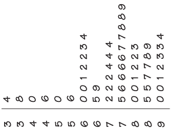

```{r child = "../setup.Rmd"}
```

```{r packages, echo=FALSE, message=FALSE, warning=FALSE}
# Remember to compile
#xaringan::inf_mr(cast_from = "..")
#       slideNumberFormat: ""  

library(knitr)
if (!require("emo")) devtools::install_github("hadley/emo")
# Installs library if missing
if (!require("HistData")) install.packages("HistData") 


suppressPackageStartupMessages({
library(tidyverse)
library(vembedr)
library(knitr)
library(HistData)
library(emo)
library(ggplot2movies)
library(datasets)
library(ggplot2)
library(magick)
})

knitr::opts_chunk$set(echo = TRUE,out.width = "90%", fig.align = "center")

set.seed(123)


# Common helpers
norm_colors <- c("#d62728", "#1f77b4", "#2ca02c", "#9467bd", "#8c564b", "#7f7f7f")
X <- seq(-8, 8, length.out = 2000)
HX <- dnorm(X)
```

class: middle

# Revisiting the Normal Distribution & Z-Scores


---

# Recap Z-Scores

- z-score describes the location of the raw score 
  - in terms of distance from the mean, measured in standard deviations
- Gives us information about the location of that score relative to the “average” deviation of all scores
- A z-score is the number of standard deviations a score is above or below the mean of the scores in a distribution.
- A raw score is a regular score before it has been converted into a Z score
- Raw scores on very different variables can be converted into Z scores and directly compared

---

# Z-Scores

- Raw scores on very different variables can be converted into Z scores and directly compared
- What does a z-score tell us
  - Mean of zero
  - Zero distance from the mean
  - Standard deviation of 1
  - The z-score has two parts
      -  The number
      -  The sign
    
---

# Converting Scores into Z scores and Back

- To convert a raw score into a z-score
  - Subtract the mean from the raw score
  - Divide the difference by the standard deviation

---

# Examples

- Now we will consider several examples that illustrate the use of the z-score formula. 
- Suppose that we know about a population of a particular breed of cats having weights that are normally distributed. Furthermore, suppose we know that the mean of distribution is 10 pounds and the standard deviation is 2 pounds. Consider the following questions:
  - What is the z-score for 13 pounds?
  - What is the z-score for 6 pounds?
  - How many pounds corresponds to a z-score of 1.25?

---

# Example Solution

What is the z-score for 13 pounds?
- $z = \frac{X - \mu}{\sigma} = \frac{13 - 10}{2} = 1.5$
- A weight of 13 pounds is 1.5 standard deviations above the mean.

What is the z-score for 6 pounds?
- $z = \frac{X - \mu}{\sigma} = \frac{6 - 10}{2} = -2$
- A weight of 6 pounds is 2 standard deviations below the mean.

How many pounds corresponds to a z-score of 1.25?
- $X = \mu + z\sigma = 10 + (1.25)(2) = 12.5$
- A z-score of 1.25 corresponds to a weight of 12.5 pounds
---

# Converting Across Measures

- We can convert from one metric to another.
- National results for the SAT test show that for college-bound seniors the average combined SAT Writing, Math and Verbal score is 1500 and the standard deviation is 250. 
- National results for the ACT test show that for college-bound seniors the average composite ACT score is 20.8 and the standard deviation is 4.8. 
  - Your SAT score: 1860. 
  - Your neighbor's ACT: 29. 
- Who did better on their respective test, and how would each have done on the other test?

---
# Example Solution
- Your SAT z-score: $z = \frac{1860 - 1500}{250} = 1.44$
- Your neighbor's ACT z-score: $z = \frac{29 - 20.8}{4.8} = 1.708$
- Your neighbor did better on their respective
- Your SAT score on the ACT metric: $X = 20.8 + (1.44)(4.8) = 27.7$
- Your neighbor's ACT score on the SAT metric: $X = 1500 + (1.708)(250) = 1927$
- Your neighbor would have done better on the SAT as well.

---

# Comments on Standardization

- Standardization of variables
- Transformation – ratio variable
  - Features of measurement scales
  - Some have built in properties
      - Percentiles (not equal interval!)
      - Standardized scale (z score scale)
---

# Percentiles
- Percentiles are a type of standard score
- Also percentile rank
- Score value that cuts off a certain %  of scores below it (cumulative percentile)
- Special percentile ranks
  - M: 50%
  - Q1: 25%
  - Q3: 75%
- Don’t have equal intervals
  - Weak statistically

---


# Skewness Revisted

---


```{r echo=FALSE, fig.align='center', out.width="100%"}
knitr::include_graphics("../img/09_Robustness/Slide13.PNG")
```

---

# Positive Skew

- The distribution is said to be right-skewed, right-tailed, or skewed to the right,
  - despite the fact that the curve itself appears to be skewed or leaning to the left; 
- The right tail is longer; 
  - the mass of the distribution is concentrated on the left 
- right instead refers to the right tail being drawn out and, often, 
- A right-skewed distribution usually appears as a left-leaning curve.

---

# Negative Skew

- Also called: left-skewed, left-tailed, or skewed to the left 
- The left tail is longer; 
  - the mass of the distribution is concentrated on the right of the figure. 
- left instead refers to the left tail being drawn out
- A left-skewed distribution usually appears as a right-leaning curve. 

---

# Worked Example

.pull-left[
- Where do students go to school? 
- Although 80.4% of first-time first-year students attended college in the state in which they lived, this percent varied considerably over the states. 
- Here is a stemplot of the percent of first-year students in each of the 50 states who were from the state where they enrolled. 
- The stems are 10s and the leaves are 1s. 
- The stems have been split in the plot.
]

.pull-right[
```{r echo=FALSE, fig.align='center', out.width="70%"}

```
]
---

# Worked Example

.pull-left[
- Where do students go to school? 
- Although 80.4% of first-time first-year students attended college in the state in which they lived, this percent varied considerably over the states. 
- Here is a stemplot of the percent of first-year students in each of the 50 states who were from the state where they enrolled. 
- The stems are 10s and the leaves are 1s. 
- The stems have been split in the plot.
]

.pull-right[
```{r echo=FALSE, fig.align='center', out.width="90%"}

```
]
---

# Questions

.pull-left[
- Where is the median?
- The shape of the distribution is ____ skewed
- The state with the smallest percent of first-year students enrolled in the state has what %
- The state with the largest percent has %?
]

.pull-right[
```{r echo=FALSE, fig.align='center', out.width="90%"}

```
]
---

---

# Solutions

.pull-left[
- Where is the median?
  - 76
- The shape of the distribution is *left* skewed
- The state with the smallest percent of first-year students enrolled in the state has what %
  - 34%
- The state with the largest percent has %?
  - 94%
]

.pull-right[
```{r echo=FALSE, fig.align='center', out.width="90%"}

```
]

---

# Wrapping Up...
