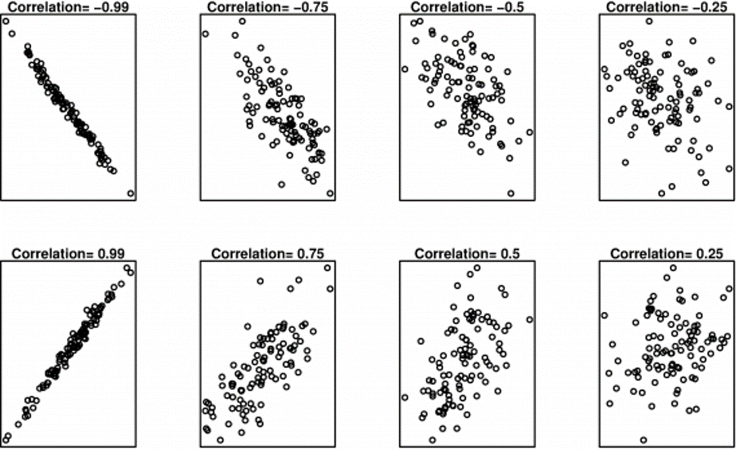
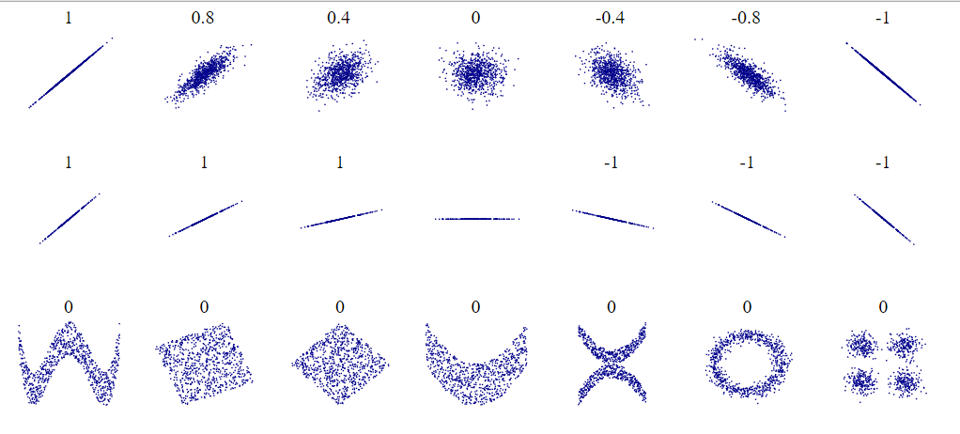

```{r setup, include=FALSE}
knitr::opts_chunk$set(echo = FALSE,out.width="75%", fig.align = "center",fig.retina = 2,
                      tidy.opts=list(width.cutoff = 120),  # For code
                      options(width = 120), # For output)
                       message=FALSE, warning=FALSE)  

```
# Bivariate 
- So far, we have been analyzing summary statistics that describe aspects of a single list of numbers
- Frequently, however, we are interested in how variables behave together
    - Measuring the relationship (correlation)
    - Modeling the relationship (regression)

# Motivating Example
- Smoking and Lung Capacity
    - Suppose, for example, we wanted to investigate the relationship between cigarette smoking and lung capacity
    - We might ask a group of people about their smoking habits, and measure their lung capacities

# Smoking and Lung Capacity
```{r smoking_table}
library(knitr);library(kableExtra);library(dplyr)
# Create Data Frame
smoking=data.frame(cigarettes=c(0,5,10,15,20),lung_capacity=c(45,42,33,31,29))

kable(smoking)%>%
  kable_styling(bootstrap_options = c("striped", "hover"))
```

# Visualizing

- With R or any other statistics software, we can produce a scatterplot, like this one.

```{r,echo=T}
plot(smoking)
```

# Or this one

- A scatterplot shows the relationship between two quantitative variables that are measured on the same individuals. 
    - The values of one variable appear on the horizontal axis, 
    - and the values of the other variable appear on the vertical axis. 
    - Each individual in the data appears as the point in the plot fixed by the values of both variables for that individual.

```{r,echo=T}
library(car)
scatterplot(lung_capacity~cigarettes,data=smoking)
```

# Or this one

- Always plot the explanatory variable, if there is one, on the horizontal axis (the x-axis) of a scatterplot
    - if there is no explanatory-response distinction, either variable can go on the horizontal axis.

```{r,echo=T}
library(ggplot2)
library(ggExtra)

# classic plot :
p=ggplot(smoking, aes(x=cigarettes, y=lung_capacity, color=cigarettes, size=cigarettes)) +
      geom_point() +
      theme(legend.position="none")
p
```

# Or this one
- We can see from the graph that as smoking goes up, lung capacity tends to go down.
```{r hist,echo=T}

# with marginal histogram
ggMarginal(p, type="histogram")
```

# Or this one

- Here, the two variables covary in opposite directions. 
- This is a negative relationship
```{r density,echo=T} 
# marginal density
ggMarginal(p, type="density")
```


# Scatter Plots

- In any graph of data, look for the overall pattern and for striking deviations from that pattern.
- You can describe the overall pattern of a scatterplot by the 
    - direction (positive or negative), 
    - form, and 
    - strength of the relationship.

```{r boxplot,echo=T} 
# marginal boxplot
ggMarginal(p, type="boxplot")
```

- More examples  https://www.statmethods.net/graphs/scatterplot.html


# Direction of Association
- Two variables are *positively associated* when above-average values of one tend to accompany above-average values of the other, and below-average values also tend to occur together.

- Two variables are *negatively associated* when above-average values of one tend to accompany below-average values of the other, and vice versa.


# Strength of the Relationship

- We now examine two statistics: 
  - covariance and 
  - correlation, for quantifying how variables covary.


# Covariance
- Covariance is a measure of how much two random variables vary together.
- When two variables covary in opposite directions, as smoking and lung capacity do, 
    - values tend to be on opposite sides of the group mean.  
    - That is, when smoking is above its group mean, 
    - lung capacity tends to be below its group mean.
- Consequently, by averaging the product of deviation scores, we can obtain a measure of how the variables vary together.


# Sample Covariance

- Sample covariance between X and Y is an estimate of that average (cross-) product of deviation scores in the population

$s_{x,y}=\frac{1}{n-1}\sum\limits^{n}_{i=1}(x_{i}-\bar{x})(y_{i}-\bar{y})$

- A more computationally convenient formula:

$s_{x,y}=\frac{1}{n-1}(\sum\limits^{n}_{i=1}x_{i}y_{i}-\frac{\sum^{n}_{i=1}x_{i}\sum^{n}_{i=1}y_{i}}{n})$

- Useful fact: the variance of a variable is its covariance with itself. 

$s^{2}=s_{x,x}=\frac{1}{n-1}\sum\limits^{n}_{i=1}((x_{i}-\bar{x})(x_{i}-\bar{x}))$

# Computing Covariance
- If we wanted to compute the covariance for smoking and lung capacity, we can save ourselves some heartache.
- Rather than finding each deviation from the mean for x and y

```{r,echo=T}
covariance_calc=data.frame(X=smoking$cigarettes,Y=smoking$lung_capacity)

# find x_i-x_bar
covariance_calc$dx=covariance_calc$X-mean(covariance_calc$X)

# find y_i-y_bar
covariance_calc$dy=covariance_calc$Y-mean(covariance_calc$Y)
```

- and then finding their product

```{r,echo=T}
#cross multiply x deviations and y deviations
covariance_calc$dxdy=covariance_calc$dy*covariance_calc$dx

# cross multi X and Y
covariance_calc$xy=covariance_calc$Y*covariance_calc$X

```

- Giving these values

```{r}
kable(covariance_calc)
```

- We'd then sum the dXdY column and get `r sum(covariance_calc$dxdy)`, and we then compute the covariance as: 


$s_{x,y}=\frac{1}{n-1}\sum\limits^{n}_{i=1}(x_{i}-\bar{x})(y_{i}-\bar{y})= \frac{-215}{5-1}=-53.75$

# Alternative Computation

- We can compute $\sum x=50$, $\sum y=180$, $\sum xy=1585$, and n, and use that easier equation

$s_{x,y}=\frac{1}{n-1}(\sum x_{i}y_{i}-\frac{\sum x_{i}\sum y_{i}}{n})$

$=\frac{1}{5-1}(1585-\frac{50\times180}{5})$

$=\frac{1}{4}(1585-\frac{9000}{5})$

$=\frac{1}{4}(1585-1800)$

$=\frac{1}{4}(-215)$

$=-53.75$

# Covariance in R

```{r,echo=T}
cov(smoking)

cov(smoking)[1,2]

var(smoking$cigarettes)
```

# Covariance

- Although covariance is an extremely important concept and is the cornerstone of many advanced methods (ANOVA, ANCOVA, SEM, regression, etc)
- it has interpretation problems just like variance
- it isn't in a meaningful scale
- it tells us whether a relationship is positive or negative
    - but not much more than that.
    
# Covariance Scaling
- is `r cov(smoking)[1,2]` a strong relationship? 
    - it depends on the scale
- If we convert cigarettes into packs, the relationship hasn't changed.
- but the covariance has...

```{r,echo=T}

smoking$packs=smoking$cigarettes/20

cov(smoking$packs,smoking$lung_capacity)
```

- The value is, in a sense, "polluted by the metric of the numbers."
- Depending on the scale of the data, the absolute value of the covariance can be very large or very small

# Standardizing Covariance
- We can take the scale out of the covariance.
- What happens if we use z-scores instead of raw deviations?
- Remember, that z-scores are also a measure of deviations
- This is called the (Pearson) Correlation Coefficient


# Correlation Coefficient
- The sample correlation is the sum of cross-products of z-scores divided by n-1:

$r_{x,y}=\frac{1}{n-1}\sum\limits^{n}_{i=1}(Z_{x_{i}}\times Z_{y_{i}})$

- The sample correlation is the sum of cross-products of z-scores divided by n:

$\rho_{x,y}=\frac{1}{n}\sum\limits^{n}_{i=1}(Z_{x_{i}}\times Z_{y_{i}})$

# Formulae for Correlation

- We can think of a correlation coefficient as a covariance with
the standard deviations factored out:

$r_{x,y}=\frac{s_{x,y}}{s_{x}\times s_{y}}$

- we can think of covariance as a correlation with the standard deviations put back in.

$s_{x,y}=r_{x,y}s_{x}s_{y}$

# Properties of r
- Notation
    - Sample Statistic r
    - Population Parameter $\rho$
        - pronounced row, but spelt rho
- Transformation
    - r is the same regardless of how the values are measured. 
    - Height in inches and centemeters lead to the same r


```{r plot,echo=T}
if (!require("HistData")) install.packages("HistData") ## Installs library if missing
library(ggplot2)
library(grid)
library(gridExtra)
# in inches
summary(Galton)
attach(Galton)			# attaches the dataset
plotin=ggplot(Galton, aes(x=parent, y=child)) + geom_point(size=2, pch=21,fill='red')
cor(child,parent)
detach(Galton)			# Remember to detach you dataset!

# in centimeters
Galton_cm=Galton*2.54
summary(Galton_cm)
attach(Galton_cm)			# attaches the dataset
plotcm=ggplot(Galton_cm, aes(x=parent, y=child)) + geom_point(size=2, pch=21,fill='red') 

cor(child,parent)
detach(Galton_cm)			# Remember to detach you dataset!

grid.arrange(plotin, plotcm, top='Correlation between Parent and Child Heights in inches and centimeters')

```
    
# Properties of r
- r ranges from -1 to 1 [-1,1]
    - |r| indicates the size of the relationship
    - r>0 indicates positive relationship (0,1]
    - r<0 indicates negative relationship [-1,0)
    - r is symmetric
        - $r_{x,y}=r_{y,x}$

# Correlation Magnitude

```{r}

```


# Correlation Interpretation

- Perfect
    - Exactly –1. A perfect downhill (negative) linear relationship
    - Exactly +1. A perfect uphill (positive) linear relationship
- Strong
    - -0.70. A strong downhill (negative) linear relationship
    - +0.70. A strong uphill (positive) linear relationship
- Moderate
    - –0.50. A moderate downhill (negative) relationship
    - +0.50. A moderate uphill (positive) relationship
- Small
    - –0.30. A small downhill (negative) linear relationship
    - +0.30. A small uphill (positive) linear relationship

- Develop your correlation intuition [http://guessthecorrelation.com/](http://guessthecorrelation.com/)

# Linear Relationship 

- The correlation quantifies the linear association. 

- If your data aren't linear, then the correlation can be misleading.

- If your data have outliers, then the correlation can be misleading.

# Anscombe's Quartet

```{r aq}

cor1 <- format(cor(anscombe$x1, anscombe$y1), digits=4)
cor2 <- format(cor(anscombe$x2, anscombe$y2), digits=4)
cor3 <- format(cor(anscombe$x3, anscombe$y3), digits=4)
cor4 <- format(cor(anscombe$x4, anscombe$y4), digits=4)
 
#define the OLS regression
line1 <- lm(y1 ~ x1, data=anscombe)
line2 <- lm(y2 ~ x2, data=anscombe)
line3 <- lm(y3 ~ x3, data=anscombe)
line4 <- lm(y4 ~ x4, data=anscombe)
 
circle.size = 5
colors = list('red', '#0066CC', '#4BB14B', '#FCE638')
 
#plot1
plot1 <- ggplot(anscombe, aes(x=x1, y=y1)) + geom_point(size=circle.size, pch=21, fill=colors[[1]]) +
  geom_abline(intercept=line1$coefficients[1], slope=line1$coefficients[2]) +
  annotate("text", x = 12, y = 5, label = paste("correlation = ", cor1))
 
#plot2
plot2 <- ggplot(anscombe, aes(x=x2, y=y2)) + geom_point(size=circle.size, pch=21, fill=colors[[2]]) +
  geom_abline(intercept=line2$coefficients[1], slope=line2$coefficients[2]) +
  annotate("text", x = 12, y = 3, label = paste("correlation = ", cor2))
 
#plot3
plot3 <- ggplot(anscombe, aes(x=x3, y=y3)) + geom_point(size=circle.size, pch=21, fill=colors[[3]]) +
  geom_abline(intercept=line3$coefficients[1], slope=line3$coefficients[2]) +
  annotate("text", x = 12, y = 6, label = paste("correlation = ", cor3))
 
#plot4
plot4 <- ggplot(anscombe, aes(x=x4, y=y4)) + geom_point(size=circle.size, pch=21, fill=colors[[4]]) +
  geom_abline(intercept=line4$coefficients[1], slope=line4$coefficients[2]) +
  annotate("text", x = 15, y = 6, label = paste("correlation = ", cor4))
 
grid.arrange(plot1, plot2, plot3, plot4, top='Anscombe Quadrant -- Correlation Demostration')
```


- Anscombe's Quartet comprises four datasets that have nearly identical simple descriptive statistics, yet appear very different when graphed. 

- These data were constructed in 1973 by the statistician Francis @Anscombe1973 . 

- Demonstrates the importance of graphing data before analyzing it and the effect of outliers on statistical properties. 

- It's intended to counter the impression among statisticians that "numerical calculations are exact, but graphs are rough."

# Anscombe's Code
```{r aqc,echo=TRUE}

cor1 <- format(cor(anscombe$x1, anscombe$y1), digits=4)
cor2 <- format(cor(anscombe$x2, anscombe$y2), digits=4)
cor3 <- format(cor(anscombe$x3, anscombe$y3), digits=4)
cor4 <- format(cor(anscombe$x4, anscombe$y4), digits=4)
 
#define the OLS regression
line1 <- lm(y1 ~ x1, data=anscombe)
line2 <- lm(y2 ~ x2, data=anscombe)
line3 <- lm(y3 ~ x3, data=anscombe)
line4 <- lm(y4 ~ x4, data=anscombe)
 
circle.size = 5
colors = list('red', '#0066CC', '#4BB14B', '#FCE638')
 
#plot1
plot1 <- ggplot(anscombe, aes(x=x1, y=y1)) + geom_point(size=circle.size, pch=21, fill=colors[[1]]) +
  geom_abline(intercept=line1$coefficients[1], slope=line1$coefficients[2]) +
  annotate("text", x = 12, y = 5, label = paste("correlation = ", cor1))
 
#plot2
plot2 <- ggplot(anscombe, aes(x=x2, y=y2)) + geom_point(size=circle.size, pch=21, fill=colors[[2]]) +
  geom_abline(intercept=line2$coefficients[1], slope=line2$coefficients[2]) +
  annotate("text", x = 12, y = 3, label = paste("correlation = ", cor2))
 
#plot3
plot3 <- ggplot(anscombe, aes(x=x3, y=y3)) + geom_point(size=circle.size, pch=21, fill=colors[[3]]) +
  geom_abline(intercept=line3$coefficients[1], slope=line3$coefficients[2]) +
  annotate("text", x = 12, y = 6, label = paste("correlation = ", cor3))
 
#plot4
plot4 <- ggplot(anscombe, aes(x=x4, y=y4)) + geom_point(size=circle.size, pch=21, fill=colors[[4]]) +
  geom_abline(intercept=line4$coefficients[1], slope=line4$coefficients[2]) +
  annotate("text", x = 15, y = 6, label = paste("correlation = ", cor4))
 
grid.arrange(plot1, plot2, plot3, plot4, top='Anscombe Quadrant -- Correlation Demostration')
```

# Correlation Cautions

- Correlation requires that both variables be quantitative, so it makes sense to do the arithmetic indicated by the formula for r𝑟.
- Correlation does not describe curved relationships between variables, no matter how strong the relationship is between them.
- Correlation is strongly affected by a few outlying observations.

- Correlation is not a complete summary of two-variable data.


# More Correlation Cautions

- Restriction of Range.
- Results in r to go down artificially
    - r -> $\rho$
- Combined groups can hid the relationships, when groups have different relationships
    - Simpson’s Paradox
    
# Simposon's Paradox
 Illustrated
```{r}
library(dplyr)
library(ggplot2)
library(scales)
set.seed(123)
n = 1000

Extraversion = rnorm(n)
Performance = rnorm(n) + Extraversion * 0.1

Performance = rescale(Performance, to = c(0, 100))
# summary(Performance)
Extraversion = rescale(Extraversion, to = c(0, 7))

data <- data.frame(
  Performance,
  Extraversion
)
alpha=.5
optionz = c("Sales","Technical")

salez = 
  (data$Performance > mean(data$Performance) & 
     data$Extraversion > mean(data$Extraversion)) |
  (data$Performance < mean(data$Performance) & 
     data$Extraversion < mean(data$Extraversion))

data$Job=NA
data$Job[salez] <- sample(optionz, sum(salez), T, c(0.6, 0.2))
data$Job[is.na(data$Job)] <- sample(optionz, sum(is.na(data$Job)), T, c(0.2, 0.8))

p <- ggplot(data,aes(Extraversion, Performance)) 
p + geom_point(alpha = alpha) + geom_smooth(method = 'lm')

p +
geom_point(aes(col = Job), alpha = alpha) + 
  geom_smooth(aes(col = Job), method = 'lm') +
  theme(legend.background = element_rect(fill = "transparent"),
        legend.justification = c(0, 1),
        legend.position = c(0, 1))

set.seed(123)
n = 1000

Education = rbinom(n, 2, 0.5)
Extraversion = rnorm(n) + Education
Salary = Education * 2 + rnorm(n) - Extraversion * 0.3

Salary = sample(10000:11000,1) + rescale(Salary, to = c(0, 100000))
# summary(Salary)
Extraversion = rescale(Extraversion, to = c(0, 7))
# summary(Extraversion)
Education = factor(Education, labels = c("Low", "Medium", "High"))

data <- data.frame(
  Salary,
  Extraversion,
  Education
)

p <- data %>% ggplot(aes(Extraversion, Salary)) 
p + geom_point(alpha = alpha) + geom_smooth(method = 'lm')

p + 
  geom_point(aes(col = Education), alpha = alpha) + 
  geom_smooth(aes(col = Education), method = 'lm') +
  theme(legend.background = element_rect(fill = "transparent"),
        legend.justification = c(0, 1),
        legend.position = c(0, 1))


library(scatterplot3d) 
attach(data) 
s3d1 <-scatterplot3d(Salary,
  Education,Extraversion,
pch=16, highlight.3d=TRUE,
  type="h", main="3D Scatterplot")

s3d2 <-scatterplot3d(Salary,
  Extraversion,Education,
pch=16, highlight.3d=TRUE,
  type="h", main="3D Scatterplot")

detach(data) 
```

# code
```{r,echo=TRUE}
library(dplyr)
library(ggplot2)
library(scales)
set.seed(123)
n = 1000

Extraversion = rnorm(n)
Performance = rnorm(n) + Extraversion * 0.1

Performance = rescale(Performance, to = c(0, 100))
# summary(Performance)
Extraversion = rescale(Extraversion, to = c(0, 7))

data <- data.frame(
  Performance,
  Extraversion
)
alpha=.5
optionz = c("Sales","Technical")

salez = 
  (data$Performance > mean(data$Performance) & 
     data$Extraversion > mean(data$Extraversion)) |
  (data$Performance < mean(data$Performance) & 
     data$Extraversion < mean(data$Extraversion))

data$Job=NA
data$Job[salez] <- sample(optionz, sum(salez), T, c(0.6, 0.2))
data$Job[is.na(data$Job)] <- sample(optionz, sum(is.na(data$Job)), T, c(0.2, 0.8))

p <- ggplot(data,aes(Extraversion, Performance)) 
p + geom_point(alpha = alpha) + geom_smooth(method = 'lm')

p +
geom_point(aes(col = Job), alpha = alpha) + 
  geom_smooth(aes(col = Job), method = 'lm') +
  theme(legend.background = element_rect(fill = "transparent"),
        legend.justification = c(0, 1),
        legend.position = c(0, 1))

set.seed(123)
n = 1000

Education = rbinom(n, 2, 0.5)
Extraversion = rnorm(n) + Education
Salary = Education * 2 + rnorm(n) - Extraversion * 0.3

Salary = sample(10000:11000,1) + rescale(Salary, to = c(0, 100000))
# summary(Salary)
Extraversion = rescale(Extraversion, to = c(0, 7))
# summary(Extraversion)
Education = factor(Education, labels = c("Low", "Medium", "High"))

data <- data.frame(
  Salary,
  Extraversion,
  Education
)

p <- data %>% ggplot(aes(Extraversion, Salary)) 
p + geom_point(alpha = alpha) + geom_smooth(method = 'lm')

p + 
  geom_point(aes(col = Education), alpha = alpha) + 
  geom_smooth(aes(col = Education), method = 'lm') +
  theme(legend.background = element_rect(fill = "transparent"),
        legend.justification = c(0, 1),
        legend.position = c(0, 1))

library(scatterplot3d) 
attach(data) 
s3d1 <-scatterplot3d(Salary,
  Education,Extraversion,
pch=16, highlight.3d=TRUE,
  type="h", main="3D Scatterplot")

s3d2 <-scatterplot3d(Salary,
  Extraversion,Education,
pch=16, highlight.3d=TRUE,
  type="h", main="3D Scatterplot")


library(rgl)

plot3d(Salary,
  Extraversion,Education, col="red", size=3)

detach(data) 
```


# Final Comments

- The correlation Coefficient is neither robust nor resistant.
    - Not robust because strong nonlinear relationships between the two variables may not be recognized.
    - Not resistant because it is sensitive to outlying points.
    - It is the most sensitive summary stat we have seen thus far

```{r}

```

# Shared Variance: $R^{2}$
- How much do those correlated variables have in common?
[http://rpsychologist.com/d3/correlation/](http://rpsychologist.com/d3/correlation/)
- Common variance
    - i.e. Shared Variance
- Coefficient of Determination
    - % variability between the two variables that has been accounted for 
    - the remaining 1-$R^{2}$ of the variability is still unaccounted for

# References
