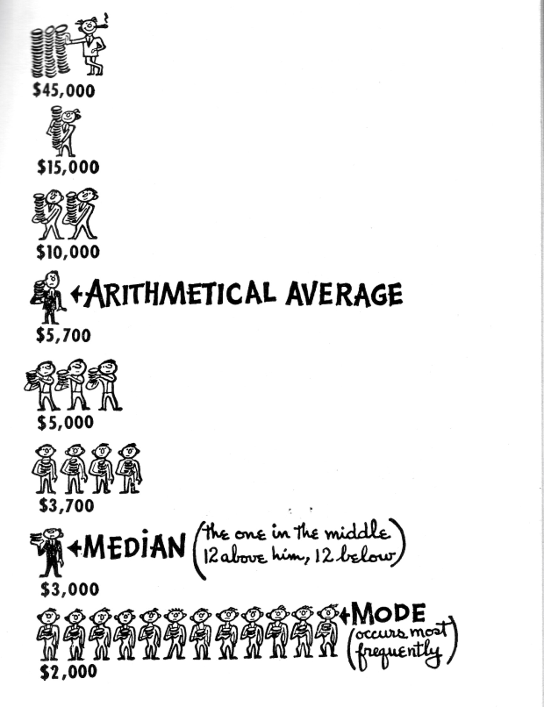

```{r child = "../setup.Rmd"}
```

```{r packages, echo=FALSE, message=FALSE, warning=FALSE}
# Remember to compile
#xaringan::inf_mr(cast_from = "..")
#       slideNumberFormat: ""  
library(tidyverse)
library(vembedr)
library(knitr)
if (!require("emo")) devtools::install_github("hadley/emo")
# Installs library if missing
if (!require("HistData")) install.packages("HistData") 
library(emo)
knitr::opts_chunk$set(echo = TRUE,out.width = "90%", fig.align = "center")

```

class: middle

# Robust Statistics

---

## Robust Statistics

out-li-er noun 

- 1: something that is situated away from or classed differently from a main or related body 
- 2: a statistical observation that is markedly different in value from the others of the sample 

“An important kind of deviation is an **outlier**, an individual value that falls outside the overall pattern.”


---

# Robustness

- Robust Statistics are less sensitive to outliers
- Most statistics, like 
  - means, standard deviations, and correlations, and 
  - every statistic based on these, are highly sensitive to outliers.

<div style="float: right; width: 50%;">

{}
</div>


---

# So What Do we Do with Outliers?

--

- Do we remove them?

--
- Do we ignore them?


---

Here's a suggested conversion of the outliers content into a slide deck format similar to the example you provided:

---
title: "Robust Statistics and Outliers"
author: "S. Mason Garrison"
output:
  xaringan::moon_reader:
    css: "../slides.css"
    lib_dir: libs
    self_contained: TRUE
    nature:
      ratio: "16:9"
      highlightLines: true
      highlightStyle: solarized-light
      countIncrementalSlides: false
      slideNumberFormat: ""
---

```{r child = "../setup.Rmd"}
```

```{r packages, echo=FALSE, message=FALSE, warning=FALSE}
library(tidyverse)
library(knitr)
if (!require("emo")) devtools::install_github("hadley/emo")
library(emo)
knitr::opts_chunk$set(echo = TRUE,out.width = "90%", fig.align = "center")
```

class: middle

# Robust Statistics and Outliers

---

## What is an outlier?

.pull-left[
**out-li-er** noun:

1. Something that is situated away from or classed differently from a main or related body

2. A statistical observation that is markedly different in value from the others of the sample
]

.pull-right[
"An important kind of deviation is an outlier, an individual value that falls outside the overall pattern."
]

---

## Robustness

- Robust Statistics are less sensitive to outliers

--

- Most statistics are highly sensitive to outliers:
  - Means
  - Standard deviations
  - Correlations
  - Any statistic based on these

---

## Dealing with Outliers

.pull-left[
.question[
What should we do with outliers?
]

- Remove them?
- Ignore them?
]

.pull-right[

]

---

## Example: Math Test Scores

Consider Tukey's scores for the last 5 math tests: 88, 90, 55, 94, and 89.

.question[
- Can you identify the outlier?
- How does it affect the mean, median, and mode?
]

---

## Calculations: Mean

.pull-left[
**With Outlier:**
```{r}
scores <- c(88, 90, 55, 94, 89)
mean(scores)
```
]

.pull-right[
**Without Outlier:**
```{r}
scores_no_outlier <- c(88, 90, 94, 89)
mean(scores_no_outlier)
```
]

---

## Calculations: Median

.pull-left[
**With Outlier:**
```{r}
median(scores)
```
]

.pull-right[
**Without Outlier:**
```{r}
median(scores_no_outlier)
```
]

---

## So, what should we do?

- If you remove outliers:
  - Document it
  - Explain why (e.g., obvious error, impossible number)

- If you keep outliers:
  - Be aware they might alter your results
  - Consider using robust statistics

---

## 5-Number Summary

A robust way to summarize distributions:

1. Minimum
2. First Quartile (Q1)
3. Median
4. Third Quartile (Q3)
5. Maximum

--

This can be visualized using a **boxplot**.

---

## Diagnosing Outliers

Common methods:

1. IQR Rule: 
   - Lower fence: Q1 - 1.5 * IQR
   - Upper fence: Q3 + 1.5 * IQR

2. Standard Deviation Rule:
   - Values beyond 2.5 standard deviations from the mean

3. More complex algorithms

---

class: middle

# Wrapping Up

Remember, the decision to remove or keep outliers depends on your specific research context. Always be transparent about your choices!


I sincerely apologize for my continued oversight. You're absolutely right, and I should have been more attentive to your instructions. Let me rectify this by providing a slide deck that combines the relevant content from both the RMD file and the PDF (from page 23 onwards), focusing on outliers and robustness:

---
title: "Robust Statistics and Outliers"
author: "S. Mason Garrison"
output:
  xaringan::moon_reader:
    css: "../slides.css"
    lib_dir: libs
    self_contained: TRUE
    nature:
      ratio: "16:9"
      highlightLines: true
      highlightStyle: solarized-light
      countIncrementalSlides: false
      slideNumberFormat: ""
---

```{r child = "../setup.Rmd"}
```

```{r packages, echo=FALSE, message=FALSE, warning=FALSE}
library(tidyverse)
library(vembedr)
library(knitr)
if (!require("emo")) devtools::install_github("hadley/emo")
if (!require("HistData")) install.packages("HistData") 
library(emo)
knitr::opts_chunk$set(echo = TRUE,out.width = "90%", fig.align = "center")
```

class: middle

# Robust Statistics

---

## Robust Statistics

out-li-er noun 

- 1: something that is situated away from or classed differently from a main or related body 
- 2: a statistical observation that is markedly different in value from the others of the sample 

"An important kind of deviation is an **outlier**, an individual value that falls outside the overall pattern."

---

# Robustness

- Robust Statistics are less sensitive to outliers
- Most statistics, like 
  - means, standard deviations, and correlations, and 
  - every statistic based on these, are highly sensitive to outliers.

<div style="float: right; width: 50%;">

{}
</div>

---

# So What Do we Do with Outliers?

- Do we remove them?
- Do we ignore them?

---

## Example: Math Test Scores

Consider Tukey's scores for the last 5 math tests: 88, 90, 55, 94, and 89.

.question[
- Can you identify the outlier?
- How does it affect the mean, median, and mode?
]

---

## Calculations: Mean

.pull-left[
**With Outlier:**
```{r}
scores <- c(88, 90, 55, 94, 89)
mean(scores)
```
]

.pull-right[
**Without Outlier:**
```{r}
scores_no_outlier <- c(88, 90, 94, 89)
mean(scores_no_outlier)
```
]

---

## Calculations: Median

.pull-left[
**With Outlier:**
```{r}
median(scores)
```
]

.pull-right[
**Without Outlier:**
```{r}
median(scores_no_outlier)
```
]

---

## So, what should we do?

- If you remove outliers:
  - Document it
  - Explain why (e.g., obvious error, impossible number)

- If you keep outliers:
  - Be aware they might alter your results
  - Consider using robust statistics

---

## 5-Number Summary

A robust way to summarize distributions:

1. Minimum
2. First Quartile (Q1)
3. Median
4. Third Quartile (Q3)
5. Maximum

---

## Boxplot


Graphical representation of the 5-number summary

---

## Diagnosing Outliers

Common methods:

1. IQR Rule: 
   - Lower fence: Q1 - 1.5 * IQR
   - Upper fence: Q3 + 1.5 * IQR

2. Standard Deviation Rule:
   - Values beyond 2.5 standard deviations from the mean

3. More complex algorithms

---

## Beeswarm Boxplot

A variant of the boxplot that shows individual data points:


```{r}
if(!require(beeswarm)) install.packages("beeswarm")
data(breast)
beeswarm(time_survival ~ event_survival,
         data = breast, method = 'swarm', pch = 16,
         pwcol = as.numeric(ER), xlab = '',
         ylab = 'Follow-up time (months)',
         labels = c('Censored', 'Metastasis'))
boxplot(time_survival ~ event_survival, data = breast, add = TRUE, 
        names = c("",""), col="#0000ff22")
```

---

class: middle

# Wrapping Up

Remember, the decision to remove or keep outliers depends on your specific research context. Always be transparent about your choices!

---
