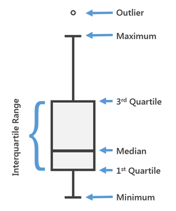

```{r child = "../setup.Rmd"}
```

```{r packages, echo=FALSE, message=FALSE, warning=FALSE}
library(tidyverse)
if (!require("emo")) devtools::install_github("hadley/emo")
library(emo)
knitr::opts_chunk$set(echo = FALSE,out.width = "90%", fig.align = "center")
```

class: middle

# Understanding Outliers and Robust Statistics

---

## Course Outline

1. Introduction to Outliers
2. Impact of Outliers on Statistics
3. Identifying Outliers
4. Robust Statistics
5. Handling Outliers
6. Visualizing Data and Outliers
7. Real-world Examples
8. Wrap-up and Discussion

---

## What is an Outlier?

class: middle

# Robust Statistics and Outliers

---

## What is an outlier?

.pull-left[
**out-li-er** noun:

1. Something that is situated away from or classed differently from a main or related body

2. A statistical observation that is markedly different in value from the others of the sample
]

.pull-right[
"An important kind of deviation is an outlier, an individual value that falls outside the overall pattern."
]

---


## Types of Outliers

1. Error outliers
   - Due to measurement or recording mistakes
   - Example: Typing 1000 instead of 100

2. Natural outliers
   - Unusual but valid data points
   - Example: A 7-foot-tall person in a height study

3. Influential outliers
   - Significantly affect statistical analyses
   - Example: A billionaire in an income study

---

## Why Do Outliers Matter?

- They can significantly affect our statistical calculations
- Might represent errors in data collection
- Could be interesting cases worth studying
- Can lead to incorrect conclusions if not handled properly

---

# Robustness

- Robust Statistics are less sensitive to outliers
- Most common statistics are highly sensitive to outliers:
  - Mean
  - Standard deviation
  - Correlation

<div style="float: right; width: 50%;">

{}
</div>

---

## Example: Impact of Outliers on Mean

Consider these exam scores: 70, 75, 80, 85, 90

What happens if we add one very high score: 200?

.pull-left[
Without 200:
```{r,echo=TRUE}
scores1 <- c(70, 75, 80, 85, 90)
mean(scores1)
```
]

.pull-right[
With 200:
```{r, echo =TRUE}
scores2 <- c(scores1, 200)
mean(scores2)
```
]

---

## Impact on Other Statistics

Let's look at how the outlier affects other measures:

.pull-left[
Without 200:
```{r,echo=TRUE}
median(scores1)
sd(scores1)
```
]

.pull-right[
With 200:
```{r, echo =TRUE}
median(scores2)
sd(scores2)
```
]

Which measures changed more dramatically?

---

## Class Activity: Creating Outliers

In pairs, create a dataset of 5 numbers between 1 and 10. Then:

1. Calculate the mean and median
2. Add an "outlier" of 100 to your dataset
3. Recalculate the mean and median
4. Discuss which measure changed more and why

<!-- (5 minutes for activity, 5 minutes for class discussion) -->

---

# What Should We Do with Outliers?

- Remove them?
- Keep them?
- Use different statistical methods?

---

## Handling Outliers: Considerations

- If you remove them:
  - Document why you removed them
  - Was it a clear error? An impossible value?
- If you keep them:
  - Be aware they might change your results
  - Consider using robust statistical methods

---

## 5-Number Summary

A robust way to summarize data:

1. Minimum
2. First Quartile (Q1)
3. Median
4. Third Quartile (Q3)
5. Maximum

This summary is less affected by extreme values!

---

## 5-Number Summary Table

- Summarizes a distribution
- Old way: mean, standard deviation
- Tukey's way: lower extreme, lower hinge, median, upper hinge, upper extreme
- Commonly referred to as: min, q1, median, q3, max


---

## Calculating 5-Number Summary in R

Let's use our exam scores example:

```{r}
summary(scores2)
```

Notice how the median and quartiles are less affected by the outlier than the mean.

---

## Visualizing Data: Boxplot

- Graphical representation of the 5-number summary
- Helps identify potential outliers



---

## Understanding Boxplots

- The "box" represents the middle 50% of the data
- The line in the box is the median
- "Whiskers" usually extend to the minimum and maximum (excluding outliers)
- Points beyond the whiskers are potential outliers

---

## Creating a Boxplot in R

Let's visualize our exam scores:

```{r, fig.height=5}
boxplot(scores2, main="Exam Scores Boxplot", ylab="Score")
```

---

## Identifying Outliers: IQR Method

IQR = Interquartile Range = Q3 - Q1

Potential outliers are:
- Below: Q1 - 1.5 * IQR
- Above: Q3 + 1.5 * IQR

This creates "fences" beyond which values are considered potential outliers.

---

## Example: Applying the IQR Method

Let's apply this to our exam scores:

```{r}
Q1 <- quantile(scores2, 0.25)
Q3 <- quantile(scores2, 0.75)
IQR <- Q3 - Q1

lower_fence <- Q1 - 1.5 * IQR
upper_fence <- Q3 + 1.5 * IQR

cat("Lower fence:", lower_fence, "\n")
cat("Upper fence:", upper_fence, "\n")
```

Is 200 an outlier according to this method?

---

## Beeswarm Boxplot

A fun variant of the boxplot that shows individual data points:


---

## Creating a Beeswarm Boxplot in R

```{r, fig.height=5}
if(!require(beeswarm)) install.packages("beeswarm")
library(beeswarm)

beeswarm(scores2, pch=16, col="blue", 
         main="Exam Scores Beeswarm Plot")
boxplot(scores2, add=TRUE, outline=FALSE)
```

---

## Why Use Robust Methods?

1. They're less affected by outliers
2. They give a more typical picture of your data
3. They can help prevent incorrect conclusions

Remember: The goal is to understand your data, not just calculate numbers!

---

## Robust vs. Non-Robust Methods

| What we want to know | Non-Robust | Robust |
|----------------------|------------|--------|
| Typical value        | Mean       | Median |
| Spread of data       | Standard Deviation | Interquartile Range |
| Relationship between variables | Pearson Correlation | Spearman Correlation |

---

## Real-World Example: Movie Ratings

Imagine you're analyzing movie ratings (1-10 scale):

Movie A: 7, 8, 8, 9, 10
Movie B: 1, 8, 8, 9, 10

.pull-left[
Mean ratings:
```{r}
cat("Movie A:", mean(c(7,8,8,9,10)), "\n")
cat("Movie B:", mean(c(1,8,8,9,10)))
```
]

.pull-right[
Median ratings:
```{r}
cat("Movie A:", median(c(7,8,8,9,10)), "\n")
cat("Movie B:", median(c(1,8,8,9,10)))
```
]

Which method gives a better picture of typical ratings?

---

## Class Discussion: Outliers in Different Fields

In small groups, discuss:

1. In your major, what kinds of outliers might you encounter?
2. How might outliers affect conclusions in your field of study?
3. Can you think of situations where outliers might be the most interesting part of the data?


---

## Wrapping Up: Key Points

1. Outliers can meaningfully impact our analyses
2. Always visualize your data to spot potential outliers
3. Consider why outliers might occur in your data
4. Be transparent about how you handle outliers
5. Robust methods can provide valuable insights, especially with messy real-world data


