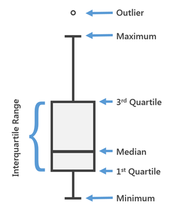
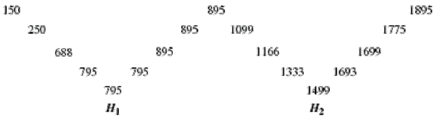

layout: true
  
<div class="my-footer">
<span>
<a href="https://psychmethods.github.io/coursenotes/" target="_blank">Methods in Psychological Research</a>
</span>
</div> 

---


class: middle

# Robust Statistics  

--- 

## What is an Outlier?

.pull-left[  
**out-li-er** noun:

1. Something that is situated away from or classed differently from a main or related body  

2. A statistical observation that is markedly different in value from the others of the sample  
]

.pull-right[  
*"An important kind of deviation is an outlier, an individual value that falls outside the overall pattern."*  
]  

---

## Robustness

- Robust statistics are less sensitive to outliers
- Most common statistics 
  - (means, standard deviations, correlations) 
  - are highly sensitive to outliers

---

## Dealing with Outliers

.pull-left[  
What should we do with outliers?
- Remove them?
- Ignore them?
]

.pull-right[  
  
]

---

## Example: Math Test Scores

Consider Tukey's scores for the last 5 math tests: 88, 90, 55, 94, and 89.

.question[  
- Can you identify the outlier?  
- How does it affect the mean, median, and mode?  
]

---

## Calculations: Mean

.pull-left[
**With Outlier:**  

``` r
scores <- c(88, 90, 55, 94, 89)  
mean(scores)  
```

```
## [1] 83.2
```


55+88+89+90+94 = 416

416 / 5 = 83.2 

The mean is 83.2

]
.pull-right[  
**Without Outlier:**  

``` r
nooutlier <- c(88, 90, 94, 89)  
mean(nooutlier)  
```

```
## [1] 90.25
```

88+89+90+94 = 361

361 / 4 = 90.25 

The mean is 90.25

]

---

## Calculations: Median

.pull-left[  
**With Outlier:**  

``` r
median(scores)  
```

```
## [1] 89
```

Median: 55,88,_89_,90,94

The median is 89

]

.pull-right[  
**Without Outlier:**  

``` r
median(nooutlier)  
```

```
## [1] 89.5
```

Median: 88,_89,90_,94

(89+90) / 2

The median is 89.5


]

---

## Handling Outliers

- Do we remove them?
  - If you remove them, you need to document it
- Why did you remove them?
  - Obvious error? Impossible number?
  
- .question[What if it's a valid data point?]

- If you keep outliers:
  - Be aware they might skew your results
  - Consider using robust statistics like median or trimmed mean

---

## 5- number summary table

A robust method for summarizing distributions:

- Summarize a distribution

- Old (mean, standard deviation)
- Tukey’s (lower extreme, lower hinge, median, upper hinge, upper extreme)
- Commonly referred to (min, q1, m, q3, max)



---

## Boxplot

  
Graphical representation of the 5-number summary  

---

## Diagnosing Outliers

Common methods for identifying outliers:

1. **IQR Rule**:  
   - Lower fence: Q1 - 1.5 * IQR  
   - Upper fence: Q3 + 1.5 * IQR

2. **Standard Deviation Rule**:  
   - Values beyond 2.5 standard deviations from the mean

3. **More complex algorithms**:  
   - Specific robust methods like M-estimators

---

## Beeswarm Boxplot

A variant of the boxplot that shows individual data points:


``` r
if(!require(beeswarm)) install.packages("beeswarm")  
data(breast)  
beeswarm(time_survival ~ event_survival, data = breast, method = 'swarm', pch = 16,  
         pwcol = as.numeric(ER), xlab = '',  
         ylab = 'Follow-up time (months)',  
         labels = c('Censored', 'Metastasis'))  
boxplot(time_survival ~ event_survival, data = breast, add = TRUE,  
        names = c("", ""), col="#0000ff22")  
```


---

class: middle  

# Wrapping Up  

- The decision to remove or keep outliers depends on your research context  
- Always be transparent about your choices  

