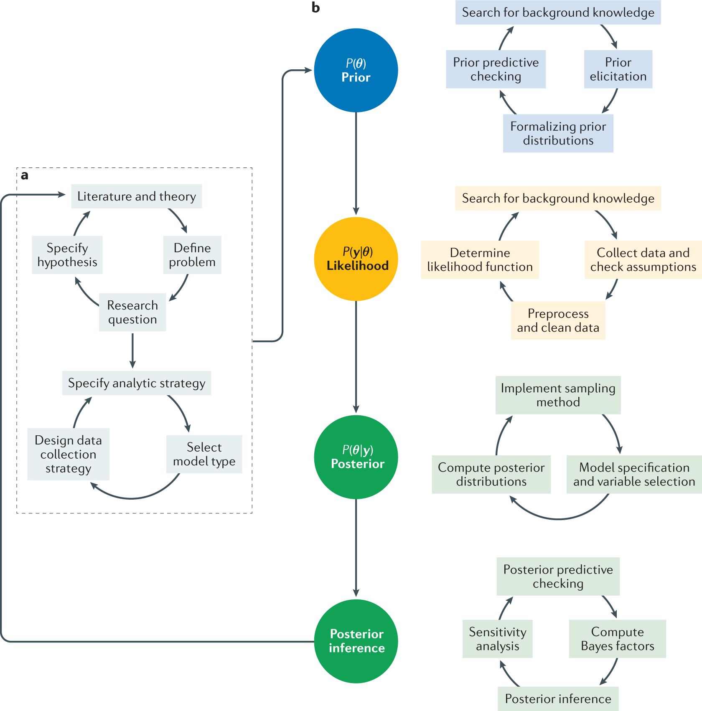
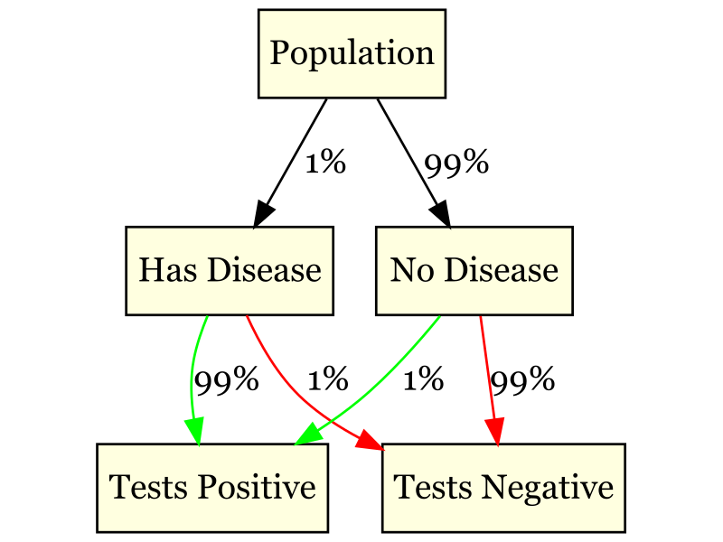

```{r child = "../setup.Rmd"}
```

```{r packages, echo=FALSE, message=FALSE, warning=FALSE}
# Remember to compile
#xaringan::inf_mr(cast_from = "..")
#       slideNumberFormat: ""  
library(tidyverse)
library(vembedr)
library(knitr)
if (!require("emo")) devtools::install_github("hadley/emo")
# Installs library if missing
if (!require("HistData")) install.packages("HistData") 
library(emo)
knitr::opts_chunk$set(echo = FALSE,out.width = "90%", fig.align = "center")
library(kableExtra)
```


class: middle

# Bayes' Theorem

---

#  Introduction to Bayes' Rule

- Bayes' Rule is a foundational concept in statistics that provides a framework for updating our beliefs based on new evidence.

- It is widely used in fields such as medicine, finance, and social sciences to help make decisions under uncertainty.

- The general formula for Bayes' Rule helps to calculate posterior probabilities by combining prior knowledge and new data.

---


## Bayes' Theorem Formula

- Bayes' Theorem allows us to "flip" conditional probabilities:

$$
P(A \mid B) = \frac{P(B \mid A) \times P(A)}{P(B)}
$$
.pull-left[
It relates:
- What we want to know: P(A|B)  
- What we know: P(B|A), P(A), and P(B)
]

--

.pull-right[
```{r echo=FALSE, out.width="50%"}
# Create a more intuitive diagram using Venn diagram
library(eulerr)
fit <- euler(c("A" = 0.4, "B" = 0.5, "A&B" = 0.2))
plot(fit, fills = c("#FFDDC1", "#C1DFF4"), labels = TRUE)
```
]

---

## Bayes' Theorem: Intuition

.pull-left-narrow[
- Starts with our initial belief about A: P(A)
- Updates that belief based on new evidence B
- Gives us a new, updated belief: P(A|B)


This mirrors the scientific process of updating hypotheses based on evidence!
]

.pull-right-wide[
```{r echo=FALSE, out.width="65%"}

```
]
.footnote[van de Schoot, R., Depaoli, S., King, R. et al. Bayesian statistics and modelling. Nat Rev Methods Primers 1, 1 (2021). https://doi.org/10.1038/s43586-020-00001-2]

---

class: middle

# Gardner's Boy or Girl Paradox

---

## The Paradox

Martin Gardner presented two seemingly similar problems in Scientific American (1959):

1. "Mr. Jones has two children. The older child is a girl. What is the probability that both children are girls?"

2. "Mr. Smith has two children. At least one of them is a boy. What is the probability that both children are boys?"

- Gardner gave the answers as 1/2 and 1/3 respectively, leading to much debate.

---

## Problem 1: The Older Child is a Girl

.pull-left[
"Mr. Jones has two children. The older child is a girl. What is the probability that both children are girls?"


- Only the outcomes where the older child is a girl are considered:
  - Girl, Girl (GG)
  - Girl, Boy (GB)

P(both girls | older is girl) = 1/2
]

.pull-right[

Sample space outcomes:

| Option 1 | Option 2 |
|----------|----------|
| Girl     | Girl     |
| Girl     | Boy      |

| Option 3 | Option 4 |
|----------|----------|
| Boy      | Girl     |
| Boy      | Boy      |


]

---

## Problem 2: At Least One Boy

.pull-left[
"Mr. Smith has two children. At least one of them is a boy. What is the probability that both children are boys?"

- Possible outcomes:
  - Boy, Boy (BB)
  - Boy, Girl (BG)
  - Girl, Boy (GB)

P(both boys | at least one boy) = 1/3
]

.pull-right[
```{r echo=FALSE}
matrix_boys <- matrix(c("Girl", "Girl", 
                        "Boy", "Girl", 
                        "Girl", "Boy", 
                        "Boy", "Boy"), ncol = 2, byrow = TRUE)

# Generate the table using kableExtra in the same way as Table 1
matrix_boys %>%
  kbl(col.names = c("Child 1", "Child 2"), format = "html", caption = "All Outcomes") %>%
  kable_styling(full_width = FALSE)
```
]

---

## The Paradox Explained

The key difference lies in the information given:

1. In the first problem, we know the order (older child is a girl), which eliminates two possibilities (BB and BG).

2. In the second problem, we don't know which child is a boy, so we only eliminate one possibility (GG).

This subtle difference in information leads to different sample spaces and thus different probabilities.

---

## Bayesian Perspective

We can also approach these problems using Bayes' Theorem:


For Problem 1:

$$P(GG \mid \text{older is G}) = \frac{P(\text{older is G} \mid GG) \cdot P(GG)}{P(\text{older is G})} = \frac{1 \times \frac{1}{4}}{\frac{1}{2}} = \frac{1}{2}$$


--

For Problem 2:

$$P(BB \mid \text{at least one B}) = \frac{P(\text{at least one B} \mid BB) \cdot P(BB)}{P(\text{at least one B})} = \frac{1 \times \frac{1}{4}}{\frac{3}{4}} = \frac{1}{3}$$


---

class: middle

# Applying Bayes' Theorem

---

## Example: Testing for a Rare Disease

Imagine a test for a disease that affects 1% of the population:
- 99% accurate for people who have the disease (sensitivity)
- 99% accurate for people who don't have the disease (specificity)

.question[
If someone tests positive, what's the probability they actually have the disease?
]

- We can use two approaches: a **tree diagram** to break down all possible outcomes and **Bayes' Theorem** mathematically.


---

## Setting Up the Problem

Let's define our events:
- D: Having the disease (Case of the Mondays)
- T: Testing positive

We want to know: P(D|T)

--

We know:
- P(D) = 0.01 (1% of population has the disease)
- P(T|D) = 0.99 (99% sensitivity)
- P(T|not D) = 0.01 (1 - 99% specificity)

---

## Applying Bayes' Theorem mathematically

.pull-left[
$$P(D \mid T) = \frac{P(T \mid D) \cdot P(D)}{P(T)}$$

$$P(T) = P(T \mid D) \cdot P(D) + P(T \mid \neg D) \cdot P(\neg D) = 0.99 \times 0.01 + 0.01 \times 0.99 = 0.0198$$

$$P(D \mid T) = \frac{0.99 \times 0.01}{0.0198} \approx 0.50 \text{ or 50\%}$$
]
--
.pull-right[

<br/>
<br/>
<br/>
<br/>
<br/>

<br/>


```{r echo=FALSE}
library(ggplot2)
# Calculate probabilities
p_d <- 0.01
p_t_given_d <- 0.99
p_t_given_not_d <- 0.01
p_not_d <- 1 - p_d

p_t <- p_t_given_d * p_d + p_t_given_not_d * p_not_d
p_d_given_t <- (p_t_given_d * p_d) / p_t

# Create data frame for plotting
df <- data.frame(
  Category = c("P(D)", "P(D|T)"),
  Probability = c(p_d, p_d_given_t)
)

# Create bar plot
ggplot(df, aes(x = Category, y = Probability, fill = Category)) +
  geom_bar(stat = "identity") +
  scale_y_continuous(labels = scales::percent) +
  labs(title = "Prior vs Posterior Probability",
       y = "Probability",
       x = "") +
  theme_minimal() +
  theme(legend.position = "none")
```

]
---

## Applying Tree Diagrams for Rare Disease Testing

.pull-left[
- A **tree diagram** is a graphical way to represent all possible outcomes of an event, making it easier to understand conditional probabilities.
- Let's define the population for simplicity:
  - **D**: Having the disease (1%)
  - **No D**: Not having the disease (99%)
- We will branch out from each state (having the disease or not) to show the possible test outcomes (Positive or Negative), which depend on sensitivity and specificity.
]

.pull-right[

```{r echo=FALSE}
# Load library for creating tree diagram
library(DiagrammeR)
library(rsvg)
library(DiagrammeRsvg)
graph <- grViz("digraph G {

  node [shape = box, style = filled, fillcolor = lightyellow];

  Population -> Disease [label = \"1%\"];
  Population -> No_Disease [label = \"99%\"];

  Disease -> Positive [label = \"99%\", color = green];
  Disease -> Negative [label = \"1%\", color = red];

  No_Disease -> Positive [label = \"1%\", color = green];
  No_Disease -> Negative [label = \"99%\", color = red];

  Population [label = \"Population\"];
  Disease [label = \"Has Disease\"];
  No_Disease [label = \"No Disease\"];
  Positive [label = \"Tests Positive\"];
  Negative [label = \"Tests Negative\"];
}")
# Export the graph to SVG format
svg_code <- export_svg(graph)

# Convert the SVG to PNG and save it
rsvg_png(charToRaw(svg_code), file = "tree_diagram.png", width = 800, height = 600)



```
]

---

## Interpretation Using the Tree Diagram

.pull-left[
The **tree diagram** helps us visualize all possible outcomes:

- **Path 1 (Disease -> Positive Test):** Probability is **0.01 * 0.99 = 0.0099**
- **Path 2 (Disease -> Negative Test):** Probability is **0.01 * 0.01 = 0.0001**
- **Path 3 (No Disease -> Positive Test):** Probability is **0.99 * 0.01 = 0.0099**
- **Path 4 (No Disease -> Negative Test):** Probability is **0.99 * 0.99 = 0.9801**
]

.pull-right[
Using Bayes' Theorem to find P(Disease | Positive Test):
$$P(D \mid T) = \frac{P(T \mid D) \cdot P(D)}{P(T)}$$

$$P(T) = P(T \mid D) \cdot P(D) + P(T \mid Not D) \cdot P(Not D) = 0.0099 + 0.0099 = 0.0198$$

$$P(D \mid T) = \frac{0.0099}{0.0198} \approx 0.50 \text{ or 50\%}$$
]

---

## Wrapping Up

- Both approaches—the tree diagram and Bayes' Theorem—help arrive at the same conclusion: there's a 50% chance that someone who tests positive actually has the disease.
- The tree diagram provides a visual breakdown, while Bayes' Theorem offers a mathematical perspective.
- This example demonstrates how rare diseases can lead to high rates of false positives, even when the test accuracy is high.

---

class: middle

# Bayesian Thinking in Psychology

---

## Fun Example: Updating a Belief

.pull-left[
- A pet owner initially thinks their cat is limping due to an injury (80% sure).
- After observing the cat immediately stop limping when the door opens, how should they update their belief?

$$P(\text{injury} \mid \text{cat stops limping when door opens}) = $$
$$\frac{P(\text{cat stops limping when door opens} \mid \text{injury}) \cdot P(\text{injury})}{P(\text{cat stops limping when door opens})}$$
]
--
.pull-right[
```{r, echo=FALSE}
"https://www.youtube.com/watch?v=OHwQedAx8jM" %>%
embed_url() %>%
  use_align("center")
```
]


---

## Research Example: P-hacking

- P-hacking: Trying multiple analyses until you get a "significant" p-value
- Bayesian perspective: This is like ignoring your prior probabilities and only focusing on P(data | hypothesis)
- Better approach: Consider P(hypothesis) and calculate P(hypothesis | data)

---

## Pros and Cons of Bayesian Approaches

.pull-left[
Pros:
- Allows incorporation of prior knowledge
- Provides direct probabilities of hypotheses
- Handles small samples and rare events well
]

.pull-right[
Cons:
- Selecting priors can be subjective
- Computationally intensive for complex problems
- Not as widely used (yet) in psychology
]


---

## Simulations

Simulations are used to understand probabilities in complex situations.

- **Blackjack**: Understanding dealer's odds.
  - [Dealer’s Odds in Blackjack](http://demonstrations.wolfram.com/DealersOddsInBlackjack/)
- **Rock Paper Scissors**: Using AI Player.
  - [Rock Paper Scissors with AI Player](http://demonstrations.wolfram.com/RockPaperScissorsWithAIPlayer/)
- **Texas Hold'em**: Exploring probabilities of winning.
  - [Probabilities of Winning in Texas Hold'em](http://demonstrations.wolfram.com/ProbabilitiesOfWinningInTexasHoldEm/)
- **Lottery (Adam Lamers)**: Running simulations to determine lottery odds.
  - [Lottery Simulator by Adam Lamers](http://adamlamers.com/lottery_simulator)
- **Lottery (Ian Neath)**: Another lottery simulation.
  - [Lottery Simulator by Ian Neath](https://memory.psych.mun.ca/models/lottery/index.shtml)

---

class: center, middle

# Wrapping Up...


