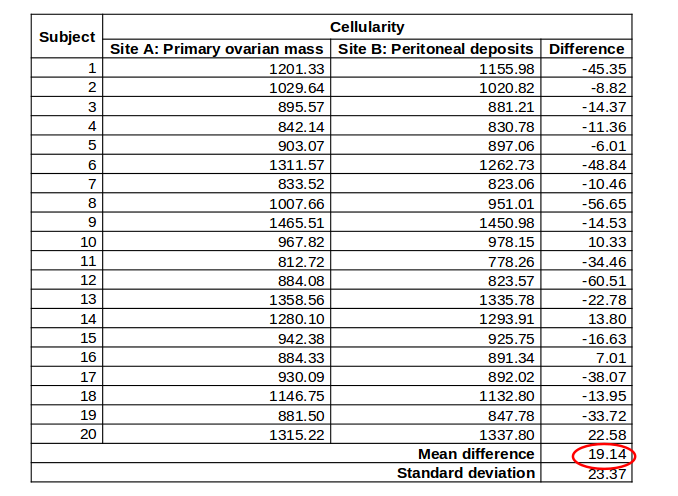
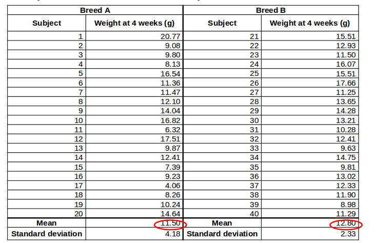

```{r child = "../setup.Rmd"}
```

```{r packages, echo=FALSE, message=FALSE, warning=FALSE}
# Remember to compile
#xaringan::inf_mr(cast_from = "..")
#       slideNumberFormat: ""  
library(tidyverse)
if (!require("emo")) devtools::install_github("hadley/emo")
# Installs library if missing
library(emo)
knitr::opts_chunk$set(echo = FALSE,out.width = "90%", fig.align = "center")
library(psych)
```

class: middle

# two sample t-tests

---

## Roadmap: This Week
.large[
- t-test logic
- one sample t-tests
- two sample t-tests
- Interrogating Null Effects
]

---

class: middle

# Recall: t-tests

---

## Three t-test Applications

- One sample t-test
  - Used when we want to know whether a sample we collected come from a particular population with unknown mean $\mu$. 
  - (similar to what we did with z-test so far)
--

- Matched pair t-test
  - Used when the two samples of data were related or provided by the same participants 
  - (*e.g.*, pre- and post-test)
--
  
- Independent sample t-test
  - test the difference between the means of two independent groups 
  - (*e.g.*, treatment and control group)

---

## General Procedure
.large[
1. Decide what type of test we want to use
2. Decide what the null and alternative hypothesis is.
3. List what we have
4. Compute t-statistic
5. finding critical value in t-table
6. Compare t-statistic to t* 
  - (we can also calculate p and compare to $\alpha$)
7. Make decision: reject null or not, and draw conclusion
]

---


## Two-sample t-tests

- Two types of two-sample t-test:
--

- Paired
  - e.g., same measures for siblings in a pair
  - e.g. a measurement of disease at two different parts of the body in the same patient / animal
  - e.g. measurements before and after treatment for the same individual
--

- Independent:
  - e.g. the weight of two different breeds of mice
  - e.g. superpowers after exposure to radiation

---

## Matched pair t-test

.pull-left[
- The paired (a.k.a. matched) t-test evaluates mean difference between pairs of measurements.
- Used when the two samples of data are:
  - related or 
  - provided by the same participants
  ]
  
--

.pull-right[
- The procedure for a matched pair t-test is same as the one-sample t-test.
- But, we the difference score to denote change.
- For the paired t-test, we have the sampling distribution of the difference score $^{a}$ 
  - ( $H_{0}: \mu_{\Delta} = 0$ )
]

.footnote[a: In one sample t-test, we have the sampling distribution of the mean.]
---

## Worked Example


.tiny.pull-left-narrow[
```{r results='as.is'}
library(knitr)
paired_df <- data.frame(
  id = 1:17,
  time1 = c(
    83.8,
    83.3,
    86,
    82.5,
    86.7,
    79.6,
    76.9,
    94.2,
    73.4,
    80.5,
    81.6,
    82.1,
    77.6,
    83.5,
    89.9,
    86,
    87.3
  ),
  time2 = c(
    95.2,
    94.3,
    91.5,
    91.9,
    100.3,
    76.7,
    76.8,
    101.6,
    94.9,
    75.2,
    77.8,
    95.5,
    90.7,
    92.5,
    93.8,
    91.7,
    98
  )
)
paired_df$difference= paired_df$time2-paired_df$time1
summary_df=describe(paired_df)
kable(paired_df)

```

]
.pull-right-wide[
- We want to see whether family therapy is an effective treatment for improving mood. 
- In this experiment, there are 17 participants, 
  - and they were scored on mood before and after treatment. 
- For contrived reasons, mood was scored with a proprietary ratio-level measure called MOOD. 
  - Before treatment, MOOD scores averaged `r round(summary_df$mean[2],digits=2)` (sd = `r round(summary_df$sd[2],digits=2)`)
  -  After treatment, MOOD scores averaged `r round(summary_df$mean[3],digits=2)` (sd = `r round(summary_df$sd[3],digits=2)`)
- .hand[Question]:
  - Did treatment improve mood?
]

---

## Worked Example

- A negative difference represents mood loss, and 
  - a positive difference represents a mood improvement 
- Even though we found that differences in MOOD scores were `r round(summary_df$mean[4],digits=2)` (sd = `r round(summary_df$sd[4],digits=2)`) on average.
- We still need to test to see whether this difference is likely to represent a
  - true difference in population means, or 
  - a chance difference. 


---

## Workflow

- `1`. Decide what type of test we want to use
  - We don't know population sd 
      - ∴  t-test
  - We have one sample, and we want to know whether it is from a particular population.
      - ∴  one sample t-test
- `2`. Decide what the null and alternative hypothesis is.
  - Null: students are guessing. $H_{0}: \mu=20$  $(\mu_0)$
  - Alternative: students are not guessing. $H_{1}: \mu\ne20$  $(\mu_1)$

---

## Workflow

- `3`. List what we have
  - $\bar{x}= 46.21$
  - $\mu=20$
  - $N=28$
  - $s=6.73$
- `4.`  Compute t-statistic
  - $t = \frac{M- \mu_{0} }{s/\sqrt{n}}$ = 
  - (46.21−20)/(6.73/ $\sqrt{28}$)= 20.61
  
---

## Workflow
  
- `5`. finding critical value in t-table
  - Df = n-1 = 27
  - Because we specified the test as two-tailed, 
     - a 95% CI will have a upper tail probability of 0.05/2= 0.025
  - t*=2.051
- `6`. Compare t-statistic to t* (we can also calculate p and compare to $\alpha$)
  - 20.61 > 2.051
- `7`. Make decision: reject null or not, and draw conclusion
   - We reject null hypothesis based on the results, the group of students are not guessing. 

---


## Worked Example

- We're testing a new drug, Procardia, that's meant to reduce hypertension:
- We find 100 individuals with a high systolic blood pressure (x=  145; mmHg, SD=9 mmHg),
- We give them Procardia for a month, and then measure their blood pressure again.
- We find that the mean systolic blood pressure has decreased to 142mmHg with standard deviation 8mmHg.

---
  
.pull-left-narrow[
- Classic $R$  syntax
  - t.test(y1, y2, paired=TRUE).
  - where y1 and y2 are the paired variable of interest, and 
  - paired is set equal to true.
]

.pull-right-wide[
```{r paired, results="hide", echo=TRUE}
set.seed(282011)

preTreat <- c(rnorm(100, mean = 145, sd = 9))
postTreat <- c(rnorm(100, mean = 142, sd = 8))

t.test(preTreat, postTreat, paired = TRUE)

```

]

.center.footnote[Source Code: https://datascienceplus.com/t-tests/]

---

## Output

```{r ref.label = "paired", echo = FALSE, warning = FALSE}
```


---

## Paired two-sample t-test: Does the mean difference = 0?

- e.g. Research question: 
- 20 patients with ovarian cancer were studied using MRI imaging. 
  - Cellularity was measured for each patient at two sites of disease. 
- Does the cellularity differ between two different sites of disease? 

---

## Paired two-sample t-test: Does the mean difference = 0?

- Null hypothesis, $H_0$:
    + Cellularity at site A = Cellularity at site B
- Alternative hypothesis, $H_1$
    + Cellularity at site A $\ne$ Cellularity at site B
- Tails: two-tailed
- Either ***reject*** or ***do not reject*** the null hypothesis 

---

## Paired two-sample t-test; null hypothesis

- $H_0$; Cellularity at site A = Cellularity at site B
    + ***or***
- $H_0$: Cellularity at site A - Cellularity at site B = 0

---

## Paired two-sample t-test; the data



---

## Paired two-sample t-test; key assumptions

.pull-left[
- Observations are independent
- The ***paired differences*** are normally-distributed
]

.pull-right[
```{r}
data <- read.csv("../dat/pairedtwo-samplet-test.csv")
data$diff <- data$A - data$B
ggplot(data, aes(x=diff)) + geom_histogram(fill="steelblue")
test <- t.test(data$diff)
stat <- round(test$statistic,2)
degfree <- round(test$parameter,2)
pval <- round(test$p.value,3)
critvals <- c(qt(0.05, degfree),qt(0.95,degfree))
rect1 <- data.frame(xmin = -4,xmax = critvals[1], ymin=-Inf,ymax=Inf)
rect2 <- data.frame(xmin = critvals[2],xmax = 4, ymin=-Inf,ymax=Inf)
```
]

---

## Paired two-sample t-test; results

.pull-left[
$t_{n-1} = t_{19} = \frac{\bar{X}_{A-B}}{s.e.(\bar{X}_{A-B})} =$ `r stat`

df = `r degfree`

P-value: `r pval`


<br>
***Reject*** $H_0$

(evidence that cellularity at Site A $\ne$ site B)
]
.pull-right[
```{r}
ggplot(data.frame(x=c(-4,4)),aes(x)) + stat_function(fun=dt, args=list(df=degfree)) +
geom_rect(data=rect1,aes(xmin=xmin, xmax=xmax, ymin=ymin, ymax=ymax),fill="steelblue", alpha=0.5, inherit.aes = FALSE) + geom_rect(data=rect2,aes(xmin=xmin, xmax=xmax, ymin=ymin, ymax=ymax),fill="steelblue", alpha=0.5, inherit.aes = FALSE) + geom_vline(xintercept = stat,lty=2,col="red")
```

]


---

## Paired two-sample t-test; results

- The difference in cellularity between the two sites is 19.14 (95% CI: 8.20, 30.08).
- There is evidence of a difference in cellularity between the two sites. 
- t=`r stat`, df=`r degfree`, p=`r pval`.


--- 

# Another example


```{r onesample, results="hide", echo=TRUE}
set.seed(0)
treeVolume_t1 <- c(rnorm(75, 
                      mean = 5, 
                      sd = 5))

treeVolume_t2 = treeVolume_t1+ c(rnorm(75, 
                      mean = 0, 
                      sd = 1))

t.test(treeVolume_t1,treeVolume_t2 ) # Ho: mu = 39000

```

]

.center.footnote[Source Code: https://datascienceplus.com/t-tests/]

---

class: middle

# wrapping up...


---

class: middle

# Independent two-sample t-tests


---

## Independent two-sample t-test: Does the mean of group A = mean of group B?


- e.g. research question: 40 male mice (20 of breed A and 20 of breed B) were weighed at 4 weeks old
- Does the weight of 4-week old male mice depend on breed?

---

## Independent two-sample t-test: Does the mean of group A = mean of group B?

- Null hypothesis, $H_0$
    + mean weight of breed A = mean weight of breed B
- Alternative hypothesis, $H_1$
    + mean weight of breed B $\ne$ mean weight of breed B
- Tails: two-tailed 
    + the tails on the distribution - not on the mice!!!
- Either ***reject*** or ***do not reject*** the null hypothesis

---

## Independent two-sample t-test: the data


---

## Independent two-sample t-test: key assumptions
.pull-left[
- Observations are independent
- Observations are normally-distributed
]
.pull-right[
```{r}
mice <- read.csv("../dat/independenttwo-samplet-test.csv")
par(mfrow=c(1,2))
ggplot(mice, aes(x = Weight)) + geom_histogram(fill="steelblue",col="grey") + facet_wrap(~Breed)
```
]
---

## Independent two-sample t-test: *More* key assumptions

.pull-left[
- Equal variance in the two comparison groups
    + Use "Welch's correction" if variances are different
    + alters the t-statistic and degrees of freedom
]
.pull-right[
```{r}
ggplot(mice, aes(x=Breed,y=Weight)) + geom_boxplot(fill="steelblue") + coord_flip()
test <- t.test(Weight~Breed,data=mice,var.equal = FALSE)
tsat <-round(test$statistic,2)
degfree <- round(test$parameter,2)
pval <- round(test$p.value,2)
critvals <- c(qt(0.05, degfree),qt(0.95,degfree))
rect1 <- data.frame(xmin = -4,xmax = critvals[1], ymin=-Inf,ymax=Inf)
rect2 <- data.frame(xmin = critvals[2],xmax = 4, ymin=-Inf,ymax=Inf)
```

]
---

## Independent two-sample t-test: result

.pull-left[
- $t_{df} = \frac{\bar{X_A} - \bar{X_B}}{s.e.(\bar{X_A} - \bar{X_B})}$ = `r tsat`
- df = `r degfree` (with Welch's correction)
]

.pull-right[
```{r}
ggplot(data.frame(x=c(-4,4)),aes(x)) + stat_function(fun=dt, args=list(df=degfree)) +
geom_rect(data=rect1,aes(xmin=xmin, xmax=xmax, ymin=ymin, ymax=ymax),fill="steelblue", alpha=0.5, inherit.aes = FALSE) + geom_rect(data=rect2,aes(xmin=xmin, xmax=xmax, ymin=ymin, ymax=ymax),fill="steelblue", alpha=0.5, inherit.aes = FALSE) + geom_vline(xintercept = tsat,lty=2,col="red")
```
]

P-value: `r round(test$p.value,2)`

***Do not reject*** $H_0$

(No evidence that mean weight of breed A $\ne$ mean weight of breed B)

---


## Independent two-sample t-test: result

- The difference in mean weight between the two breeds is -1.30 (95% CI: -3.48, 0.89) 
    + [NB as this is negative, breed B mice tend to be bigger than breed A].
- There is no evidence of a difference in weights between breed A and breed B. 
- t=`r tsat`, df= `r degfree` (Welch’s correction), p=`r pval`


## What if normality is not reasonable?

- Transform your data, e.g. log transformation
- Non-parametric tests....

---


## Summary - continuous variables

- One-sample t-test 
    + Use when we have one group.
- Paired two-sample t-test 
    + Use when we have two non-independent groups. 
- Independent two-sample t-test 
    + Use when we have two independent groups. A Welch correction may be needed if the two groups have different spread.
- Non-parametric tests or transformations
    + Use when we cannot assume normality. 

---

    
## Summary - t-test

- Turn scientific question to null and alternative hypothesis
- Think about test assumptions
- Calculate summary statistics
- Carry out t-test if appropriate


---

class: middle

# wrapping up...


---


class: middle

# Robustness of t-test...


---

## Robustness of t-test

- A confidence interval or significance test is called robust if the confidence level or p-value does not change very much when the conditions for use of the procedure are violated.
--
- Rule of thumb
--
- For one sample t-test or matched pair t-test
  - For n < 15, use t only if the data appear close to Normal or roughly symmetric. 
    - If the data are clearly skewed or if outliers are present, do not use t.
- For n> 40: The t procedures can be used, 
  - even for clearly skewed distribution
  
---
## For two independent t-test

- More robust than the one-sample t methods, particularly when the distributions are not symmetric.
- When n_{1}=n_{2} and the two population have same shape, t is robust for even very small sample. e.g., $n_{1}=n_{2}=5$. 
-Rule of thumb: adapt the guidelines for one-sample t procedures to two-sample procedures by replacing “sample size” with the “sum of the sample sizes,” $n_{1}+n_{2}$.


---

# Wrapping Up...

- source code: https://ggplot2tutor.com/tutorials/sampling_distributions
- source code: https://github.com/bioinformatics-core-shared-training/IntroductionToStats

# References
