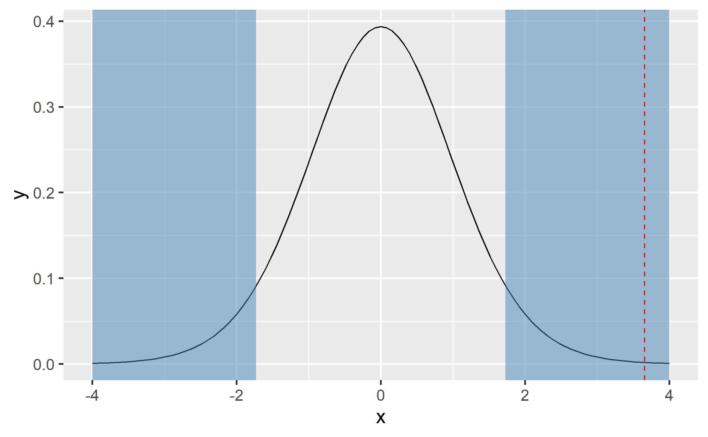
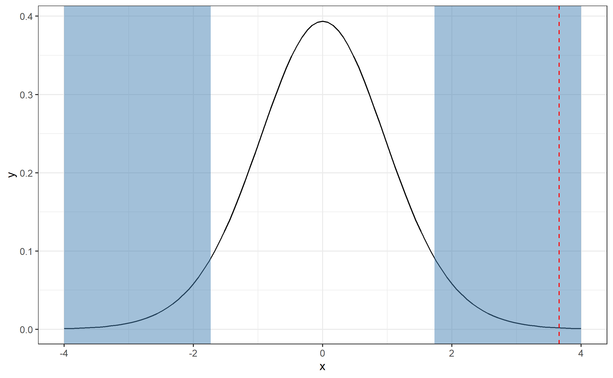
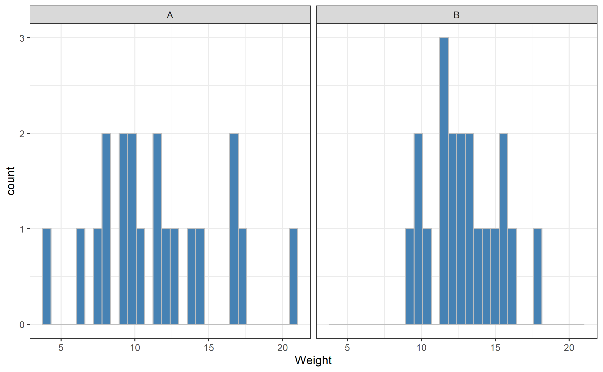
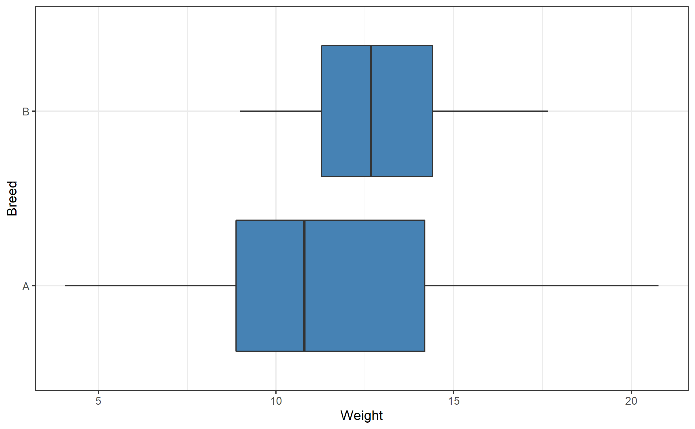
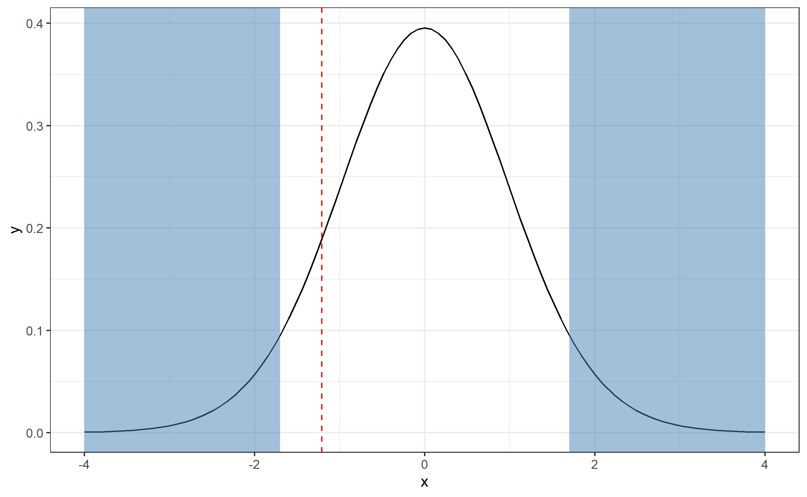

layout: true
  
<div class="my-footer">
<span>
<a href="https://psychmethods.github.io/coursenotes/" target="_blank">Methods in Psychological Research</a>
</span>
</div> 

---


class: middle

# two sample t-tests

---

## Roadmap: This Week
.large[
- t-test logic
- one sample t-tests
- two sample t-tests
- robustness of t-tests
]

---

class: middle

# Recall: t-tests

---

## Three t-test Applications

- One sample t-test
  - Used when we want to know whether a sample we collected come from a particular population with unknown mean $\mu$. 
  - (similar to what we did with z-test so far)
--

- Matched pair t-test
  - Used when the two samples of data were related or provided by the same participants 
  - (*e.g.*, pre- and post-test)
--
  
- Independent sample t-test
  - test the difference between the means of two independent groups 
  - (*e.g.*, treatment and control group)

---

## General Procedure
.large[
1. Decide what type of test we want to use
2. Decide what the null and alternative hypothesis is.
3. List what we have
4. Compute t-statistic
5. finding critical value in t-table
6. Compare t-statistic to t* 
  - (we can also calculate p and compare to $\alpha$)
7. Make decision: reject null or not, and draw conclusion
]

---


## Two-sample t-tests

- Two types of two-sample t-test:
--

- Paired
  - e.g., same measures for siblings in a pair
  - e.g. a measurement of disease at two different parts of the body in the same patient / animal
  - e.g. measurements before and after treatment for the same individual
--

- Independent:
  - e.g. the weight of two different breeds of mice
  - e.g. superpowers after exposure to radiation

---

## Matched pair t-test

.pull-left[
- The paired (a.k.a. matched) t-test evaluates mean difference between pairs of measurements.
- Used when the two samples of data are:
  - related or 
  - provided by the same participants
  ]
  
--

.pull-right[
- The procedure for a matched pair t-test is same as the one-sample t-test.
- But, we the difference score to denote change.
- For the paired t-test, we have the sampling distribution of the difference score $^{a}$ 
  - ( $H_{0}: \mu_{\Delta} = 0$ )
]

.footnote[a: In one sample t-test, we have the sampling distribution of the mean.]
---

## Worked Example


.tiny.pull-left-narrow[

| id| time1| time2| difference|
|--:|-----:|-----:|----------:|
|  1|  83.8|  95.2|       11.4|
|  2|  83.3|  94.3|       11.0|
|  3|  86.0|  91.5|        5.5|
|  4|  82.5|  91.9|        9.4|
|  5|  86.7| 100.3|       13.6|
|  6|  79.6|  76.7|       -2.9|
|  7|  76.9|  76.8|       -0.1|
|  8|  94.2| 101.6|        7.4|
|  9|  73.4|  94.9|       21.5|
| 10|  80.5|  75.2|       -5.3|
| 11|  81.6|  77.8|       -3.8|
| 12|  82.1|  95.5|       13.4|
| 13|  77.6|  90.7|       13.1|
| 14|  83.5|  92.5|        9.0|
| 15|  89.9|  93.8|        3.9|
| 16|  86.0|  91.7|        5.7|
| 17|  87.3|  98.0|       10.7|

]
.pull-right-wide[
- We want to see whether family therapy is an effective treatment for improving mood. 
- In this experiment, there are 17 participants, 
  - and they were scored on mood before and after treatment. 
- For contrived reasons, mood was scored with a proprietary ratio-level measure called MOOD. 
  - Before treatment, MOOD scores averaged 83.23 (sd = 5.02)
  -  After treatment, MOOD scores averaged 90.49 (sd = 8.48)
- .hand[Question]:
  - Did treatment improve mood?
]

---

## Worked Example

- A negative difference represents mood loss, and 
  - a positive difference represents a mood improvement 
- Even though we found that differences in MOOD scores were 7.26 (sd = 7.16) on average.
- We still need to test to see whether this difference is likely to represent a
  - true difference in population means, or 
  - a chance difference. 


---

## Workflow

- `1`. Decide what type of test we want to use
  - We don't know population sd 
      - ∴  t-test
  - We have one sample but two related scores for each participants, and 
      - we want to know whether the difference is significant
      - ∴  matched pair t-test
- `2`. Decide what the null and alternative hypothesis is.
  - Null: No treatment effect. $H_{0}: \mu_{\Delta} = \mu_{post}- \mu_{pre} =0$
  - Alternative: The treatment improves MOOD. $H_{1}:\mu_{\Delta}\gt 0$  $(\mu_1)$

---

## Workflow

- `3`. List what we have
  - $\bar{\Delta}=$  7.26
  - $\mu_{\Delta}=0$
  - $N=17$
  - $s_{\Delta}=$ 7.16
- `4.`  Compute t-statistic
  - $t = \frac{\bar{\Delta}- \mu_{\Delta} }{s/\sqrt{n}}$ = 
  - (7.26−0)/(7.16/ $\sqrt{17}$)= 4.18
  
---

## Workflow

.pull-left[  
- `5`. finding critical value in t-table
  - Df = n-1 = 16
  - Because we specified the test as one-tailed, 
     - A one-tailed test at 0.05 level: t.05(16)=
  - t*= 1.746
- `6`. Compare t-statistic to t* (we can also calculate p and compare to $\alpha$)
  - 4.18 > 1.746
]
--

.pull-right[
- `7`. Make decision: reject null or not, and draw conclusion
   - We reject null hypothesis based on the results t value, 
   - the difference scores were unlikely to be sampled from a population of 
      - difference scores where $\mu_{\Delta}= 0$, 
   - which means that the therapy has an effect. 
]

---


## Testing the Power of Lyric Therapy

- We're testing a new intervention: Sabrina Carpenter’s music as therapy for fans with high systolic blood pressure.:
- We find 100 individuals with a high systolic blood pressure 
  - (x=  145; mmHg, SD=9 mmHg),
- These individuals listen to Carpenter’s soothing tracks, curated specifically from her Short n' Sweet album, for one month. 

- After a month, we measure their blood pressure again and find that the mean systolic blood pressure has decreased  to 142mmHg 
  - with standard deviation 8mmHg.

---
  
.pull-left-narrow[
- Classic $R$  syntax
  - t.test(y1, y2, paired=TRUE).
  - where y1 and y2 are the paired variable of interest, and 
  - paired is set equal to true.
]

.pull-right-wide[

``` r
set.seed(282011)

preTreat <- c(rnorm(100, mean = 145, sd = 9))
postTreat <- c(rnorm(100, mean = 142, sd = 8))

t.test(preTreat, postTreat, paired = TRUE)
```

]

.center.footnote[Source Code: https://datascienceplus.com/t-tests/]

---

## Output


```
## 
## 	Paired t-test
## 
## data:  preTreat and postTreat
## t = 1.3623, df = 99, p-value = 0.1762
## alternative hypothesis: true mean difference is not equal to 0
## 95 percent confidence interval:
##  -0.7362123  3.9619064
## sample estimates:
## mean difference 
##        1.612847
```


---

## Paired two-sample t-test: Does the mean difference = 0?

- e.g. Research question
  - As part of Taylor Swift’s new philanthropic endeavor, she has launched a medical research initiative focused on using advanced imaging techniques to improve personalized cancer care.
- Study design:
  - Twenty patients with ovarian cancer were recruited, and MRI imaging was used to measure cellularity at two distinct sites of disease for each patient.
 
- *Goal*: Taylor's research team wants to determine whether the cellularity differs between these two sites, which could inform future strategies for targeted treatment and personalized care.

---

## Paired two-sample t-test: Does the mean difference = 0?

- Null hypothesis, $H_0$:
    + Cellularity at site A = Cellularity at site B
- Alternative hypothesis, $H_1$
    + Cellularity at site A $\ne$ Cellularity at site B
- Tails: two-tailed
- Either ***reject*** or ***do not reject*** the null hypothesis 

---

## Paired two-sample t-test; null hypothesis

- $H_0$: Cellularity at site A = Cellularity at site B
    + ***or***
- $H_0$: Cellularity at site A $-$ Cellularity at site B = 0

---

## Paired two-sample t-test; the data


---

## Paired two-sample t-test; key assumptions

.pull-left-narrow[
- Observations are independent
- The ***paired differences*** are normally-distributed
]

.pull-right-wide[

]

---

## Paired two-sample t-test; results

.pull-left[
$t_{n-1} = t_{19} = \frac{\bar{X}_{A-B}}{s.e.(\bar{X}_{A-B})} =$ 3.66

<br>

df = 19

<br>

P-value: 0.002


<br>
***Reject*** $H_0$

<br>
(evidence that cellularity at Site A $\ne$ site B)
]
.pull-right[


]


---

## Paired two-sample t-test; results

- The difference in cellularity between the two sites is 19.14 
  - (95% CI: 8.20, 30.08).
- There is evidence of a difference in cellularity between the two sites. 
- t=3.66, df=19, p=0.002.


## Paired two-sample t-test; Impications

- Taylor Swift’s research initiative shows that cellularity differs between two sites of ovarian cancer within patients. 
- This finding suggests that different sites of disease may respond differently to treatments. 
- The results will inform personalized therapy strategies, ensuring each patient receives the most effective care. 
- Taylor’s philanthropic work is not only transforming music but also advancing personalized cancer treatment.

---

# Another example

.pull-left-narrow[
  
]  

.pull-right-wide[
- Research question
  - A forestry company is interested in the growth of trees in two different locations.
  


``` r
set.seed(0)
treeVolume_t1 <- c(rnorm(75, 
                      mean = 5, 
                      sd = 5))

treeVolume_t2 = treeVolume_t1 + 
                    c(rnorm(75, 
                      mean = 0, 
                      sd = 1))

t.test(treeVolume_t1,treeVolume_t2,paired=TRUE ) # Ho: mu1 = mu2
```


.center.footnote[Source Code: https://datascienceplus.com/t-tests/]
]


---

## Output


```
## 
## 	Paired t-test
## 
## data:  treeVolume_t1 and treeVolume_t2
## t = 0.81297, df = 74, p-value = 0.4188
## alternative hypothesis: true mean difference is not equal to 0
## 95 percent confidence interval:
##  -0.1220457  0.2902740
## sample estimates:
## mean difference 
##      0.08411418
```
---


class: middle

# Wrapping up...


---

class: middle

# Independent two-sample t-tests


---

## Independent two-sample t-test: 
## Does the mean of group A = mean of group B?

.center[

]
- e.g. research question: 
  - 40 male mice (20 of breed A and 20 of breed B) were weighed at 4 weeks old
- Does the weight of 4-week-old male mice depend on breed?

---

## Independent two-sample t-test: 
## Does the mean of group A = mean of group B?

- Null hypothesis, $H_0$
    + mean weight of breed A = mean weight of breed B
- Alternative hypothesis, $H_1$
    + mean weight of breed A $\ne$ mean weight of breed B
- Tails: two-tailed
--

  - the tails on the distribution - not on the mice!!!
- Either ***reject*** or ***do not reject*** the null hypothesis

---

## Independent two-sample t-test: the data


---

## Independent two-sample t-test: key assumptions
.pull-left-narrow[
- Observations are independent
- Observations are normally-distributed
]
.pull-right-wide[

]
---

## Independent two-sample t-test: *More* key assumptions

.pull-left-narrow[
- Equal variance in the two comparison groups
    + Use "Welch's correction" if variances are different
    + alters the t-statistic and degrees of freedom
]
.pull-right-wide[


]
---

## Independent two-sample t-test: result

.pull-left[
- $t_{df} = \frac{\bar{X_A} - \bar{X_B}}{s.e.(\bar{X_A} - \bar{X_B})}$ = -1.21
- df = 29.78 (with Welch's correction)
]

.pull-right[

]

- P-value: 0.24
- ***Do not reject*** $H_0$
- (No evidence that mean weight of breed A $\ne$ mean weight of breed B)

---


## Independent two-sample t-test: result

- The difference in mean weight between the two breeds 
  - is -1.30 (95% CI: -3.48, 0.89) 
    + [NB as this is negative, breed B mice tend to be bigger than breed A].
- There is no evidence of a difference in weights between breed A and breed B. 
- t =-1.21,
- df = 29.78 (Welch's correction),
- p=0.24


---

## What if normality is not reasonable?

- Transform your data, e.g. log transformation
- Non-parametric tests....

---


## Summary

- One-sample t-test 
    + Use when we have one group.
- Paired two-sample t-test 
    + Use when we have two non-independent groups. 
- Independent two-sample t-test 
    + Use when we have two independent groups. 
      - .small[A Welch correction may be needed if the two groups have different spread.]
- Non-parametric tests or transformations
    + Use when we cannot assume normality. 

---

    
## Summary

- Turn scientific question to null and alternative hypothesis
- Think about test assumptions
- Calculate summary statistics
- Carry out t-test if appropriate


---

class: middle

# wrapping up...


---


class: middle

# Robustness of t-test...


---

## Robustness of t-test

- A confidence interval or significance test is called robust if the confidence level or p-value does not change very much when the conditions for use of the procedure are violated.
--

- Rule of thumb
--

- For one sample t-test or matched pair t-test
  - For n < 15, use t only if the data appear close to Normal or roughly symmetric. 
    - If the data are clearly skewed or if outliers are present, do not use t.
- For n > 40: The t procedures can be used, 
  - even for clearly skewed distribution
  
---
## For two independent t-test

- More robust than the one-sample t methods, particularly when the distributions are not symmetric.
- When $n_{1}=n_{2}$ and the two population have same shape, 
  - t is robust for even very small sample. 
  - e.g., $n_{1}=n_{2}=5$. 
- Rule of thumb: 
  - adapt the guidelines for one-sample t procedures to two-sample procedures by replacing “sample size” with the “sum of the sample sizes,” $n_{1}+n_{2}$.


---

# Wrapping Up...

- source code: https://ggplot2tutor.com/tutorials/sampling_distributions
- source code: https://github.com/bioinformatics-core-shared-training/IntroductionToStats

# References
