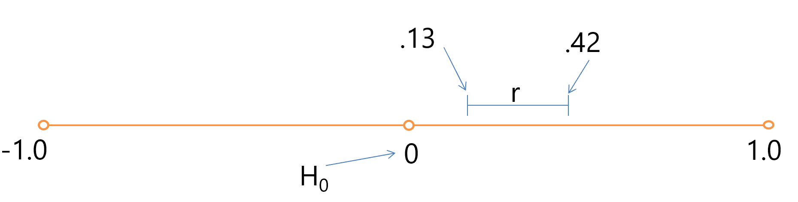
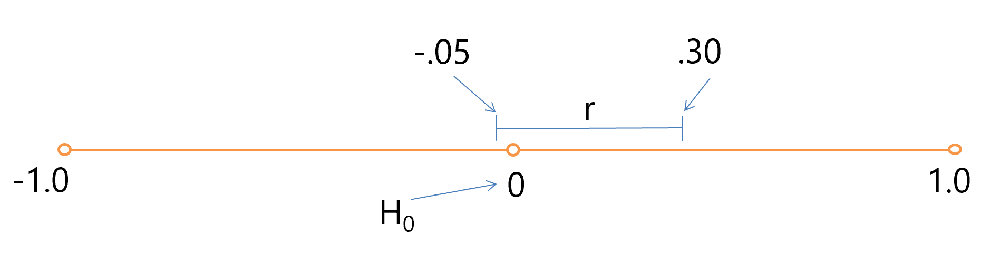

```{r child = "../setup.Rmd"}
```

```{r packages, echo=FALSE, message=FALSE, warning=FALSE}
# Remember to compile
#xaringan::inf_mr(cast_from = "..")
#       slideNumberFormat: ""  
library(tidyverse)
if (!require("emo")) devtools::install_github("hadley/emo")
# Installs library if missing
library(emo)
knitr::opts_chunk$set(echo = FALSE,out.width = "90%", fig.align = "center")
library(psych)
```

class: middle

# Confidence Intervals

---

# Confidence Intervals (CI)

.pull-left[
- Sample statistics estimate population parameters
- How confident are we in these estimations?
]
--

.pull-right[
- Confidence interval
  - range around sample statistic in which the corresponding population parameter is estimated to be.
]

---

# Confidence Intervals (CI)

.pull-left[
- Sample statistics typically deviate from actual population parameters
- Wake students, n = 100; MIQ = 136
- Is mean Wake IQ really 136?
]
--

.pull-right[
- Confidence interval: 
  - Given sample size and statistic,
  - we're X% confident that the population parameter is within this range
]
---

# Confidence Intervals (CI)

- CIs are computed with specific percentages
- Most common: 95% confidence interval


> “…sample mean of 5.5, 95% CI[4.2, 6.8]…”

--

<br>

> “If the study were repeated with different samples, the population mean would fall within the interval 95% of the time.”


---

# Demo
.center[
<iframe style="overflow: hidden;" src="https://wise1.cgu.edu/vis/ci_creation/" width="750" height="600" frameborder="0"</iframe>  
]

.footnote[source: https://wise.cgu.edu/portfolio2/demo-confidence-interval-creation/]

---
class: middle

# Wrapping Up...

---

class: middle

# Practicalities

---

# What's needed to compute CIs?

- Standard error of the mean (SE)
  - How much will this statistic vary from sample to sample, on average? 
- As N increases $\rightarrow$ SE decreases $\rightarrow$ CI narrows
--

- Confidence % (you set this)
  - 95%, then look at ± 1.96 SEs
  - 99%, then look at ± 2.58 SEs


---

## Interpreting CIs

- In results, will generally report lower and upper CIs:

> “Mean IQ score was 136, 95% CI [130, 142].”

---

```{r echo=FALSE, out.width="75%", fig.align = "center"}

```

--

- There's an important link between CIs and statistical significance
--

- $H_{0}$: r = 0
--

- Sig test: How unusual this observed r is
  - assuming r = 0?
--

- If p $\lt$ .05, 
  - reject $H_{0}$
---

```{r echo=FALSE, out.width="75%", fig.align = "center"}

```


- There's an important link between CIs and statistical significance
- $H_{0}$: r = 0
--

- CI: Are we 95%+ confident that r is not 0?
--

- If 95% CI does not include 0
  - reject $H_{0}$


---

```{r echo=FALSE, out.width="75%", fig.align = "center"}

```


- There's an important link between CIs and statistical significance
--

- We can say:
> “…the 95% CI does not contain zero, and so X and Y were positively correlated.”

---


```{r echo=FALSE, out.width="75%", fig.align = "center"}

```

- There's an important link between CIs and statistical significance
--

- We can say:
> “…the 95% CI contains zero and so the correlation was not statistically significant…”

---

## Circling back

.pull-left[
- Wake students, n = 100; MIQ = 136
- American population, MIQ = 98
- Are Wake students different than the American pop.? 
]
--
.pull-right[
- How unusual would 136 IQ in the sample,
  - assuming MWFU-IQ = MUSA-IQ?
- Is p < .05?

.hand-pink[OR?]

- What is the 95% CI for MWFU-IQ?
  - Does it include 98?
]

---


# Wrapping Up...
