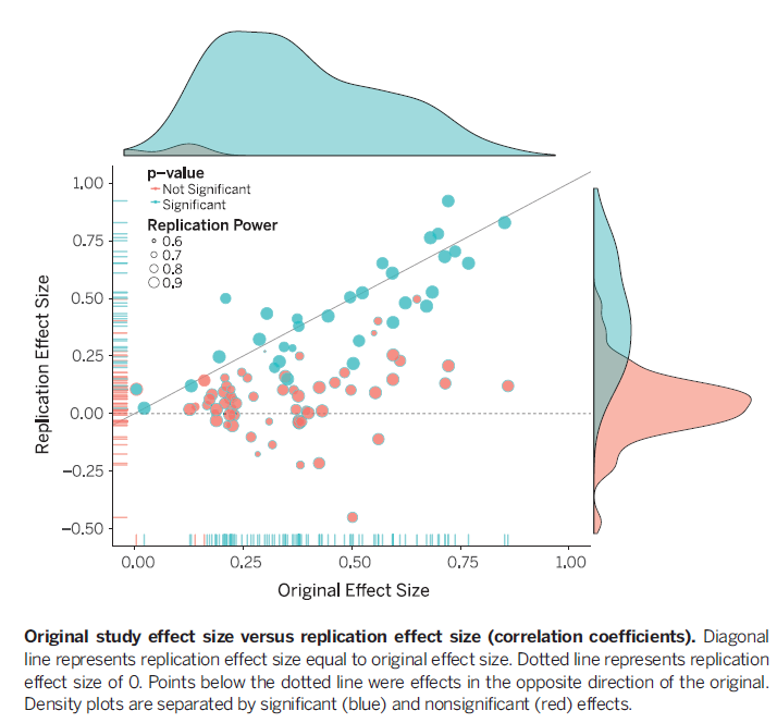

```{r child = "../setup.Rmd"}
```

```{r packages, echo=FALSE, message=FALSE, warning=FALSE}
# Remember to compile
#xaringan::inf_mr(cast_from = "..")
#       slideNumberFormat: ""  
library(tidyverse)
if (!require("emo")) devtools::install_github("hadley/emo")
# Installs library if missing
if (!require("HistData")) install.packages("HistData") 
library(emo)
knitr::opts_chunk$set(echo = FALSE,out.width = "90%", fig.align = "center")

```

class: middle

# f-tests and their applications

---

## Roadmap: Last Week 
.large[
- t-tests
- t-tests
- t-tests
]

---

## Roadmap: This Week
.large[
- multiple comparisons
- f-test logic
- analysis of variance
- regression
]

---

class: middle

# Context


---

# So far...

- We have learned how to test hypotheses using the $z$- and $t$-distributions
  - With 1 or 2 tails
--
  - With 1 or 2 groups
--
  - With 1, 2, or Paired Samples

--
- But what about more than two groups?


---

## analysis of variance (ANOVA)

- Is method for comparing any number of groups.
- It can be thought of as an extended multi-group t-test 
  - OR as a regression with grouping variables
- Is an efficient alternative to running n t-tests to compare n-groups


---

## Why can't we Just Run a Bunch of t-tests?

- For example, in a three group design, we could just run 3 t-tests?
--

- Problems: 
  - Many t-tests with lots of groups
  - Alpha-control
    - Increase type-1 error rate (because we're testing multiple times)
    - Multiplication of type 1 errors
    - e.g, If we test 20 times, we'll find 1 significant result by chance (if \alpha = .05)

    - http://shinyapps.org/apps/p-hacker/
    - ANOVA controls alpha =.05 across all tests (as does regression)


---

## Consequences of Inflated Type 1 Errors

- False Positives (Failure to Replicate)
- Remember that a p-value indicates the probability that the result occurred under the null hypothesis.
--
- 'Replication Crisis'


---

## Replication Crisis

- Scientists have found that the results of many scientific studies are 
  - difficult or impossible to replicate on subsequent investigation, 
  - either by independent researchers or 
  - by the original researchers themselves.
- In the early 2010s, as part of a growing awareness of the problem, phenomenon was deemed a "crisis"

---

## Attempt to Replicate Psychology

- A report by the Open Science Collaboration in August 2015 
estimated the reproducibility of 100 studies in psychological science from three high-ranking psychology journals.
- Overall, 36% of the replications yielded significant findings (p-value below .05) 
  - compared to 97% of the original studies that had significant effects. 
- The mean effect size in the replications was approximately half the magnitude of the effects reported in the original studies.

---


---

## Attempt to Replicate Psychology

- Studies in the field of cognitive psychology had a higher replication rate (50%) than studies in the field of social psychology (25%).
- By Journal -- study replication rates were... 
  - 23% for Journal of Personality and Social Psychology, 
  - 38% for Journal of Experimental Psychology: Learning, Memory, and Cognition; and 
  - 38% for Psychological Science.


---

## Issue is broader than psychology

- 2016 poll of 1,500 scientists reported in Nature, 
  - 70% of them had failed to replicate at least one other scientist's experiment (50% had failed to replicate one of their own experiments). 
- Results differed by field
  - chemistry: 90% (60%),
  - biology: 80% (60%),
  - physics and engineering: 70% (50%),
  - medicine: 70% (60%),
  - earth and environment science: 60% (40%).


---

class: middle

# Wrapping up...


---


class: middle

# Back to ANOVA...


---
## Because multiple group tests Can be Conceptualized Multiple WAYS…
- I'm going to show you both approaches (regression & ANOVA).
- I was taught it using regression, so I am biased. 
- But the majority of psychologists are taught using the traditional method
  - So you'll be expected to be familiar with that approach


---

## Recall: Distribution Theory

- Three Sampling Distributions we have already learned
  - z distribution
    - Two parameters (μ, σ)
    - Sampling Distribution of xbar
  - t distribution 
    - One Parameter (degrees of freedom)
  - binomial
    - Two Parameters (p, n)
    - Proportions

---

## F-Distribution

.pull-right[- Looks like a skewed normal for many combinations of parameters
Has two parameters
Degrees of freedom in the numerator
Degrees of Freedom in the denominator
Critical Value is in the tail
All ANOVAs are one-tailed tests
In the Upper Tail
]

---

class: middle

# Wrapping Up...
---

class: middle

# Three t-test Applications

---

## Three t-test Applications

- One sample t-test
  - Used when we want to know whether a sample we collected come from a particular population with unknown mean $\mu$. 
  - (similar to what we did with z-test so far)
--

- Matched pair t-test
  - Used when the two samples of data were related or provided by the same participants 
  - (*e.g.*, pre- and post-test)
--
  
- Independent sample t-test
  - test the difference between the means of two independent groups 
  - (*e.g.*, treatment and control group)

---

## General Procedure
.large[
1. Decide what type of test we want to use
2. Decide what the null and alternative hypothesis is.
3. List what we have
4. Compute t-statistic
5. finding critical value in t-table
6. Compare t-statistic to t* 
  - (we can also calculate p and compare to $\alpha$)
7. Make decision: reject null or not, and draw conclusion
]
---

## One Sample t-test

- Used when we want to know whether a sample we collected come from a particular population with unknown mean $\mu$. 
--

- Example:
- We had a group of 28 students taking a reading quiz, but had not seen the passage on which the questions were based (sample mean: 46.21, sample sd: 6.73). 
- If the students had really guessed blindly, without even looking at the possible answers, 
  - we would expect that they would get 20 items correct (OUT OF 100) by chance.
--

- Question:
  - Did the students guess by chance?

---

## Workflow

- `1`. Decide what type of test we want to use
  - We don't know population sd 
      - ∴  t-test
  - We only have one sample, and we want to know whether it is from a particular population.
      - ∴  one sample t-test
- `2`. Decide what the null and alternative hypothesis is.
  - Null: students are guessing. $H_{0}: \mu=20$  $(\mu_0)$
  - Alternative: students are not guessing. $H_{1}: \mu\ne20$  $(\mu_1)$

---

## Workflow

- `3`. List what we have
  - $\bar{x}= 46.21$
  - $\mu=20$
  - $N=28$
  - $s=6.73$
- `4.`  Compute t-statistic
  - $t = \frac{M- \mu_{0} }{s/\sqrt{n}}$ = 
  - (46.21−20)/(6.73/ $\sqrt{28}$)= 20.61
  
---

## Workflow
  
- `5`. finding critical value in t-table
  - Df = n-1 = 27
  - Because we specified the test as two-tailed, 
     - a 95% CI will have a upper tail probability of 0.05/2= 0.025
  - t*=2.051
- `6`. Compare t-statistic to t* (we can also calculate p and compare to $\alpha$)
  - 20.61 > 2.051
- `7`. Make decision: reject null or not, and draw conclusion
   - We reject null hypothesis based on the results, the group of students are not guessing. 


---

## One-sample t-test: does mean = X?

- e.g. Question: Published data suggests that the microarray failure rate for a particular supplier is 2.1%
- **Genomics Core want to know if this holds true in their own lab?**

---


## One-sample t-test: does mean = X?

- Null hypothesis, $H_0$:
    + Mean monthly failure rate = 2.1%
- Alternative hypothesis: $H_1$:
    + Mean monthly failure rate $\ne$ 2.1%
- Tails: *two-tailed*
- Either *reject* or *do not reject* the null hypothesis 
<!-- - ***Never accept the alternative hypothesis*** -->

---

## One sample t-test; the data
.small.pull-left[
```{r results='as.is'}
library(knitr)
failure <- data.frame(Month = month.name, "Monthly failure rate" = c(2.9,2.99,2.48,1.48,2.71,4.17,3.74,3.04,1.23,2.72,3.23,3.4))
kable(failure)
me <- round(mean(failure$Monthly.failure.rate),3)
sd <- round(sd(failure$Monthly.failure.rate),3)
```
]
.pull-right[

- mean = $(2.9 + \dots + 3.40) / 12$ = `r me`
- Standard deviation = `r sd`
- Hypothesized Mean = 2.1
]

---

## One-sample t-test; key assumptions

.pull-left-narrow[
- Observations are independent
- Observations are normally distributed
]
.pull-right-wide[
```{r}
hist(failure$Monthly.failure.rate,col="steelblue",xlab="Monthly Failure Rate",main="")
```
]


```{r}
test <- t.test(failure$Monthly.failure.rate,mu=2.1)
stat <- round(test$statistic,3)
pval <- round(test$p.value,3)
degfree <- test$parameter
critvals <- c(qt(0.05, degfree),qt(0.95,degfree))
rect1 <- data.frame(xmin = -4,xmax = critvals[1], ymin=-Inf,ymax=Inf)
rect2 <- data.frame(xmin = critvals[2],xmax = 4, ymin=-Inf,ymax=Inf)
```

---


## One-sample t-test; results
.pull-left[
- Test statistic:

$t_{n-1} = t_{11} = \frac{\bar{x} - \mu_0}{s.d. / \sqrt{n}}$


$= \frac{2.84 - 2.10}{s.e.(M)} =$ `r stat`

]
.pull-right[

```{r}
ggplot(data.frame(x=c(-4,4)),aes(x)) + stat_function(fun=dt, args=list(df=11)) +
geom_rect(data=rect1,aes(xmin=xmin, xmax=xmax, ymin=ymin, ymax=ymax),fill="steelblue", alpha=0.5, inherit.aes = FALSE) + geom_rect(data=rect2,aes(xmin=xmin, xmax=xmax, ymin=ymin, ymax=ymax),fill="steelblue", alpha=0.5, inherit.aes = FALSE)+theme_bw()
```
]

---


## One-sample t-test; results

```{r,out.width = "70%"}
ggplot(data.frame(x=c(-4,4)),aes(x)) + stat_function(fun=dt, args=list(df=11)) +
geom_rect(data=rect1,aes(xmin=xmin, xmax=xmax, ymin=ymin, ymax=ymax),fill="steelblue", alpha=0.5, inherit.aes = FALSE) + geom_rect(data=rect2,aes(xmin=xmin, xmax=xmax, ymin=ymin, ymax=ymax),fill="steelblue", alpha=0.5, inherit.aes = FALSE) + geom_vline(xintercept = stat,lty=2,col="red")+theme_bw()
```

---


## One-sample t-test; results

- Test statistic: $t_{n-1} = t_{11} = \frac{\bar{x} - \mu_0} {s.d. / \sqrt{n}} = \frac{2.84 - 2.10}{s.e.(\bar{x})} =$ `r stat`
- df = 11
- P = 0.01
- ***Reject*** $H_0$
- Evidence that mean monthly failure rate $\ne$ 2.1%

---

## One-sample t-test; results

- The mean monthly failure rate of microarrays in the Genomics core is 2.84 (95% CI: 2.30, 3.37).
- It is not equal to the hypothesized mean proposed by the company of 2.1.
- t=3.07, df=11, p=0.01

---

## 3rd Example

- We wanted to test whether the volume of a shipment of lumber is less than usual:
  - $\mu_{0} = 39000$ cubic feet
  
.pull-left-narrow[
- Classic $R$  syntax
  - t.test(y, mu = 0)
  - where x is the name of our variable of interest, and 
  - mu is set equal to the mean specified by the null hypothesis.
]

.pull-right-wide[
```{r onesample, results="hide", echo=TRUE}
set.seed(0)
treeVolume <- c(rnorm(75, 
                      mean = 36500, 
                      sd = 2000))
t.test(treeVolume, mu = 39000) # Ho: mu = 39000

```

]

.center.footnote[Source Code: https://datascienceplus.com/t-tests/]

---

## Output

```{r ref.label = "onesample", echo = FALSE, warning = FALSE}
```

---

class: middle


# Wrapping Up...
<!--
- source code: https://ggplot2tutor.com/tutorials/sampling_distributions
- source code: https://github.com/bioinformatics-core-shared-training/IntroductionToStats

# References

-->
