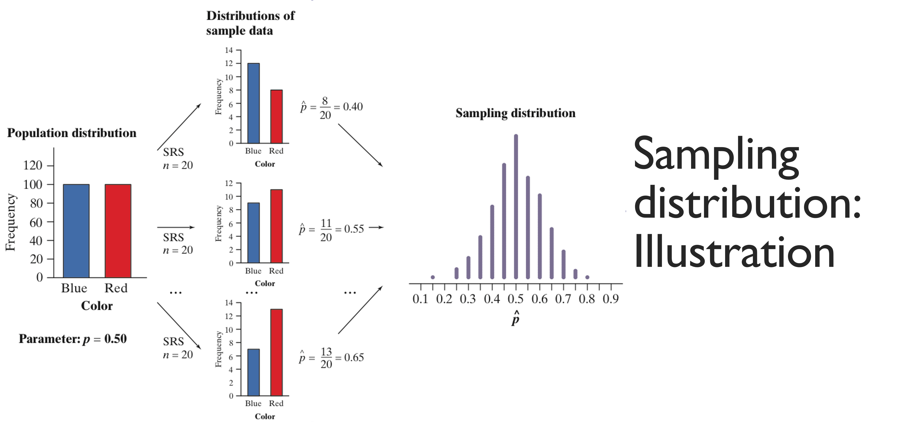

```{r child = "../setup.Rmd"}
```

```{r packages, echo=FALSE, message=FALSE, warning=FALSE}
# Remember to compile
#xaringan::inf_mr(cast_from = "..")
#       slideNumberFormat: ""  
library(tidyverse)
library(vembedr)
library(knitr)
if (!require("emo")) devtools::install_github("hadley/emo")
# Installs library if missing
if (!require("HistData")) install.packages("HistData") 
library(emo)
knitr::opts_chunk$set(echo = FALSE,out.width = "90%", fig.align = "center")
library(kableExtra)
```


class: middle

# Sampling Distributions

---

class: middle

# Road Map

- Sampling distributions: what and why
- The sampling distribution of the mean
- Laws that describe distribution shape
  - Law of Large Numbers
  - Central Limit Theorem
- Using sampling distributions for inference

---


# Sampling Distribution

- Simple Idea:
  - Distribution of a statistic
  - Compare to the distribution of a given variable
--

- Formal Definition: 
  - Sampling distribution is the distribution of values taken by a statistic across all possible samples of a given size, drawn from a particular population


---

## All statistics have a sampling distribution

- Mean, mode, third quartile, upper extreme, etc
  - Each statistic has its own sampling distribution
- Terminology:
    - $\mu_{x}$, $\sigma_{x}$ = raw score distribution
    - $\mu_{\bar{x}}$, $\sigma_{\bar{x}}$ = Parameters of the sampling distribution of that particular statistic


---


## Population Distributions are different

- Be careful: The population distribution describes the individuals that make up the population. 
- A sampling distribution describes how a statistic varies in many samples from the population.

---

## Sampling distribution: Illustration


```{r studentt, echo=FALSE, out.width="65%"}

```


---

# Example: Sampling Distribution of the Mean

- SAT Scores at WFU
  - $\mu_{x}$ Population mean = 1500
  - $\sigma{x}$ Population standard deviation = 100
<br>
- Sampling Distribution of 25 WFU Student Scores
  - $\mu_{x} =\mu_{\bar{x}}$ = 1500
  - $\sigma_{\bar{x}} = \frac{\sigma_{x}}{\sqrt{n}} = \frac{100}{\sqrt{25}} = 20$

---

# General Equation

.pull-left-narrow[
- $\mu_{\bar{x}} =\mu_{x}$
- $\sigma_{\bar{x}} = \frac{\sigma_{x}}{\sqrt{n}}$
- $\sigma^2_{\bar{x}} = \frac{\sigma^2_{x}}{n}$
]
.pull-right-wide[
- Because the mean of the statistic $\bar{x}$ is always equal to the mean $\mu$ of the population
  - (that is, the sampling distribution of the mean is centered at $\mu$)
  - we say the statistic $\bar{x}$ is an unbiased estimator of the parameter $\mu$
  - Note: on any particular sample, $\bar{x}$ may not may fall above or below $\mu$
]

---

# Example: Sampling Distribution of the Mean

```{r, echo=FALSE}
set.seed(202406)
mu <- 25
sigma <- 10
n <- 10
```

.pull-left[
- Population mean $\mu$ = `r mu`
- Population standard deviation $\sigma$ = `r sigma`
- 
- 

```{r echo=FALSE,message=FALSE, warning=FALSE}
library(ggplot2)
ggplot(data.frame(x = c(mu - 3*sigma, mu + 3*sigma)), aes(x)) +
  stat_function(fun = dnorm, args = list(mean = mu, sd = sigma), linewidth = 1) +
  labs(title = "Population Distribution", y = "Density") +
  theme_minimal() +
  theme(plot.title = element_text(hjust = 0.5)) +
  xlim(mu - 4*sigma, mu + 4*sigma)
```
]

.pull-right[
- SRS of size 10: $\bar{x}$ = `r round(rnorm(1,mu,sigma/sqrt(n)),2)`
- SRS of size 10: $\bar{x}$ = `r round(rnorm(1,mu,sigma/sqrt(n)),2)`
- SRS of size 10: $\bar{x}$ = `r round(rnorm(1,mu,sigma/sqrt(n)),2)`
- SRS of size 10: $\bar{x}$ = `r round(rnorm(1,mu,sigma/sqrt(n)),2)`

```{r, echo=FALSE,message=FALSE, warning=FALSE}
# sampling distribution of x
sampling_dist <- replicate(1000, mean(rnorm(n, mu, sigma)))
ggplot(data.frame(x = sampling_dist), aes(x)) +
  geom_histogram(aes(y = after_stat(density)), bins = 30, fill = "lightblue", color = "black") +
  stat_function(fun = dnorm, args = list(mean = mu, sd = sigma/sqrt(n)), color = "red", linewidth = 1) +
  labs(title = "Sampling Distribution of the Mean (n=10)", y = "Density") +
  theme_minimal() +
  theme(plot.title = element_text(hjust = 0.5)) +
  xlim(mu - 4*sigma, mu + 4*sigma)

```
]

---

# Standard Deviation of the Sampling Distribution


- Because the standard deviation of the sampling distribution of $\bar{x}$ is

$$\sigma_{\bar{x}} = \frac{\sigma_{x}}{\sqrt{n}}$$
  - the averages are less variable than individual observations, and 
  - averages are less variable than the results of small samples.
---

# Standard Deviation of the Sampling Distribution

- Not only is the standard deviation of the distribution of $\bar{x}$ smaller than the standard deviation of individual observations,
  - it gets smaller as we take larger samples.
- The results of large samples are less variable than the results of small samples.
- Although the standard deviation of the distribution of $\bar{x}$ gets smaller, 
  - it does so at the rate of $\sqrt{n}$, not $n$. 
- To cut the sampling distribution’s standard deviation in half, for instance, 
  - you must take a sample four times as large, not just twice as large.
---

# Wrapping Up...

---

# This Time... 

- Laws that describe the shape of distributions

---

# Laws that describe the shape of distributions

- Law of Large Numbers
- Central Limit Theorem

---

# Law of Large Numbers

- Although a single statistic, like $\bar{x}$ is rarely identical to the population mean, we can still use it as a reasonable estimate of the population mean.
- Why?
--

- If we keep taking larger and larger samples, the statistic $\bar{x}$ is guaranteed to get closer and closer to the parameter $\mu$

---
# Law of Large Numbers

- As the size of the sample increases, the sample mean gets closer to the population mean
- The sample mean is an unbiased estimator of the population mean
- The larger the sample size, the more likely the sample mean is to be close to the
  population mean
  - Example: Rolling a die
  - The average of a large number of independent observations from the same population is likely to be close to the population mean
  - The average of a small number of independent observations from the same population is not likely to be close to the population mean
  - Note: This is a probabilistic statement, not a deterministic one
---

# Central Limit Theorem

- Similarly, the Central Limit Theorem describes the shape of a sampling distribution.
- Draw an SRS of size $n$ from any population with mean $\mu$ and finite standard deviation $\sigma$. 
  - The central limit theorem says that when n is large, the sampling distribution of the sample mean $\bar{x}$ is approximately Normal:
  - $\bar{x}$ is approximately N $\mu$,  $\frac{\sigma}{\sqrt{n}}$)

---

# Central Limit Theorem

- No matter what the shape of the raw score distribution.
- The central limit theorem allows us to use normal probability calculations to answer questions about sample means from many observations, 
  - even when the population distribution is not normal (e.g, skewed, uniform, bimodal)
  
---

# Reiterate

- With a simple random sample,
- A sampling distribution of the mean is normal if:
  - The raw score distribution is normal; OR
  - The sample size is “large”
	  - N = 30, is usually large enough
	  - The central limit theorem does not apply under small sample size

---

# Example: CLT

- The distribution of household income in the U.S. is strongly right-skewed, with a mean of about $54,000 and a standard deviation of about $65,000.
- .question[ If we take a random sample of 45 households, what is the probability that the mean household income for the sample is more than $60,000?]
--

- Because the sample size is large, we can use the central limit theorem to answer this question.
--

.pull-left[
- The sampling distribution of the mean is approximately normal with:
  - Mean = $54,000
  - Standard deviation = $\frac{65000}{\sqrt{45}}$ $\approx$ `r round(65000/sqrt(45),2)`
]
--
.pull-right[
- We want to find $P(\bar{x} > 60000)$

]

---
.pull-left-wide[
- We want to find $P(\bar{x} > 60000)$
- $Z = \frac{\bar{x} - \mu}{\sigma_{\bar{x}}} = \frac{60000 - 54000}{65000/\sqrt{45}} \approx$ `r round((60000 - 54000)/(65000/sqrt(45)),2)`
.medi[
```{r, echo=TRUE}
round((60000 - 54000)/(65000/sqrt(45)),4)
```
]]
.pull-right-narrow.small[
> Btw... AI guessed: $\approx 0.41$

]
---
.pull-left-wide[
- $P(\bar{x} > 60000) = P(Z >$ `r round((60000 - 54000)/(65000/sqrt(45)),2)`) =
- $1 - P(Z <$ `r round((60000 - 54000)/(65000/sqrt(45)),2)`) = 
.medi[
```{r, echo=TRUE}
round(pnorm((60000 - 54000)/(65000/sqrt(45))),4)
```
]
- 1 - `r round(pnorm((60000 - 54000)/(65000/sqrt(45))),4)` = `r round(1-pnorm((60000 - 54000)/(65000/sqrt(45))),4)`
.medi[
```{r, echo=TRUE}
round(1-pnorm((60000 - 54000)/(65000/sqrt(45))),4)
```
]
]
.pull-right-narrow.small[
> AI guessed: 0.3409
]

---

# Example: CLT

.pull-left-narrow[
```{r,echo=FALSE}
set.seed(2025)
# strongly right-skewed and whose most likely outcomes are close to 0
x <- rexp(1000, rate = 1) # Exponential distribution
hist(x, breaks = 30, main = "Population Distribution (Exponential)", xlab = "Hours", col = "lightblue")
```
]

.pull-right-wide[
- Based on service records from the past year, the time (in hours) that a technician requires to complete preventative maintenance on an air conditioner follows the distribution that is strongly right-skewed and whose most likely outcomes are close to 0. The mean time is $\mu = 1$ hour and the standard deviation is $\sigma$ = 1 hours.
]
- .question[Your company will service an SRS of 70 air conditioners. You have budgeted 1.1 hours per unit. Will this be enough?]
--

The central limit theorem states that the sampling distribution of the mean time spent working on the 70 units has:
- Mean = 1 hour
- Standard deviation = $\frac{\sigma_{\bar{x}}}{\sqrt{n}} = \frac{1}{\sqrt{70}} \approx$ `r round(1/sqrt(70),3)`
- and is approximately normal because the sample size is large.

---

# Will this be enough?

.pull-left-wide[
- We want to find $P(\bar{x} > 1.1)$
- The sampling distribution of the mean time spent working is approximately ( N(1, 0.12) ) since ( n = 70 $\ge$ 30 ).
]

.pull-right-narrow[
```{r clt_schematic, fig.align='left', out.width='95%'}
library(ggplot2)

set.seed(2025)
mu <- 1
sigma <- 1
n <- 70
xbar_budget <- 1.1
sigma_xbar <- sigma/sqrt(n)
z_val <- (xbar_budget - mu)/sigma_xbar
p_over_norm <- 1 - pnorm(z_val)

# Simulate the sampling distribution of xbar from a right-skewed population
# Use Exponential(mean = 1, sd = 1) which matches mu = 1, sigma = 1
B <- 200000
means <- replicate(B, mean(rexp(n, rate = 1)))
p_over_sim <- mean(means > xbar_budget)
dens <- density(means, n = 2048)
df_exact <- data.frame(x = dens$x, y = dens$y)

y_at_exact <- function(x0) approx(df_exact$x, df_exact$y, xout = x0, rule = 2)$y
y_at_norm  <- function(x0) dnorm(x0, mean = mu, sd = sigma_xbar)

# Data for the Normal approximation to the sampling distribution
xx <- seq(mu - 4*sigma_xbar, mu + 4*sigma_xbar, length.out = 2000)
df_norm <- data.frame(x = xx, y = dnorm(xx, mean = mu, sd = sigma_xbar))
df_shade <- subset(df_norm, x >= xbar_budget)

# Build the plot
ggplot() +
  # Exact (by simulation) density for xbar
  geom_density(aes(x = means), adjust = 1.0, linewidth = 1, linetype = "dashed") +
  # CLT Normal curve
  geom_line(data = df_norm, aes(x, y), linewidth = 1, color = "purple") +
  # Shade Normal tail beyond 1.1
  geom_area(data = df_shade, aes(x, y), alpha = 0.25) +
  # Reference lines
  geom_vline(xintercept = mu, linewidth = 0.5) +
  geom_vline(xintercept = xbar_budget, linewidth = 0.5) +
  # Text annotations
  annotate("text", x = mu, y = max(df_norm$y), label = "mean = 1", vjust = -0.5, hjust = 0.5) +
  annotate("text", x = xbar_budget, y = max(df_norm$y)*0.90,
           label = paste0("z = ", sprintf("%.2f", z_val),
                          "\nP(X̄ > 1.1) ≈ ", sprintf("%.4f", p_over_norm),
                          "\n(sim ≈ ", sprintf("%.4f", p_over_sim), ")"),
           hjust = -0.05) +
  labs(
    title = "Central limit theorem: example",
    subtitle = "Exact sampling distribution (dashed) vs Normal CLT curve (solid)\nShaded area is P(X̄ > 1.1)",
    x = "Sample mean time (hours)",
    y = "Density"
  ) +
  theme_minimal() +
  theme(plot.title = element_text(hjust = 0.5),
        plot.subtitle = element_text(hjust = 0.5)) +
  annotate("text", x = mu - 0.47, y = max(df_norm$y)*0.36, 
           label = "Exact density\ncurve for X\u0304", hjust = 0) +
  annotate("segment", x = mu - 0.45, y = max(df_norm$y)*0.34,
           xend = mu - 0.05, yend = y_at_exact(mu - 0.05),
           arrow = arrow(length = unit(6, "pt"))) +
  annotate("text", x = mu + 0.42, y = max(df_norm$y)*0.42, 
           label = "Normal curve from the\ncentral limit theorem", hjust = 0) +
  annotate("segment", x = mu + 0.42, y = max(df_norm$y)*0.40,
           xend = mu + 0.18, yend = y_at_norm(mu + 0.18),
           arrow = arrow(length = unit(6, "pt")),color = "purple")

```
]
--

$$
Z = \frac{\bar{x} - \mu}{\sigma_{\bar{x}}} = \frac{1.1 - 1}{\frac{1}{\sqrt{70}}} \approx
$$

```{r, echo=TRUE}
round((1.1 - 1)/(1/sqrt(70)),4)
```

---

$$
p(\bar{x} > 1.1) = P(Z > `r round((1.1 - 1)/(1/sqrt(70)),4)`)
$$
$$
= 1 - P(Z < `r round((1.1 - 1)/(1/sqrt(70)),4)`) = 
$$

```{r, echo=TRUE}

round(1-pnorm((1.1 - 1)/(1/sqrt(70))),4)
```


If you budget 1.1 hours per unit, there is a 20% chance the technicians will not complete the work within the budgeted time.

---

# Wrapping Up...

---

# Sampling distributions & statistical significance

---

# Statistical significance

.pull-left[
- We have looked carefully at the sampling distribution of a sample mean. 
- However, any statistic we can calculate from a sample will have a sampling distribution.
- The sampling distribution of a statistic allows us to determine how likely a particular value of the statistic is.
- For example, here is the sampling distribution of the sample standard deviation and variance for samples of size 5 from a normal population with mean 0 and standard deviation 1.
]
.pull-right[

```{r, echo=FALSE, warning=FALSE, message=FALSE, out.height = "20%"}
set.seed(202406)
n <- 5
B <- 1000
sds <- replicate(B, sd(rnorm(n, 0, 1)))
ggplot(data.frame(x = sds), aes(x)) +
  geom_histogram(aes(y = after_stat(density)), bins = 30, fill = "lightblue", color = "black") +
  labs(title = "Sampling Distribution of the Sample Standard Deviation (n=5)", y = "Density") +
  theme_minimal() +
  theme(plot.title = element_text(hjust = 0.5)) +
  xlim(0, 5)
```

```{r, echo=FALSE, warning=FALSE, message=FALSE, out.height = "20%"}
set.seed(202406)
n <- 5
B <- 1000
vars <- replicate(B, var(rnorm(n, 0, 1)))
ggplot(data.frame(x = vars), aes(x)) +
  geom_histogram(aes(y = after_stat(density)), bins = 30, fill
 = "lightblue", color = "black") +
  labs(title = "Sampling Distribution of the Sample Variance (n=5)", y = "Density") +
  theme_minimal() +
  theme(plot.title = element_text(hjust = 0.5)) +
  xlim(0, 10)
```
]
---

# The sampling distribution of a sample statistic is determined by:

- the particular sample statistic we are interested in, 
- the distribution of the population of individual values from which the sample statistic is computed, and 
- the method by which samples are selected from the population.

---

# Wrapping Up...
