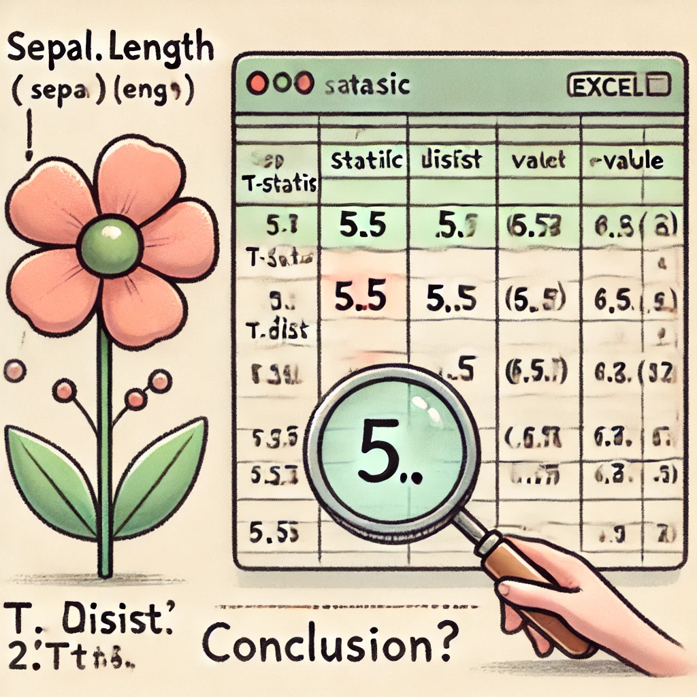

```{r child = "../setup.Rmd"}
```

```{r packages, echo=FALSE, message=FALSE, warning=FALSE}
library(tidyverse)
library(openxlsx)
library(magick)  # For image annotations
knitr::opts_chunk$set(echo = FALSE, out.width = "90%", fig.align = "center")
```

class: middle

# Excel Lab 
## One Sample, Two-Sample, and ANOVA with the Iris Dataset

---

# Lab Overview and Dataset Features

.pull-left[
## Overview
- In this lab, you will use Excel to perform **One-Sample**, **Two-Sample**, and **ANOVA** analyses with the famous Iris dataset.
- Recall that the Iris dataset, introduced by statistician Ronald A. Fisher in 1936, is a classic dataset in statistics and machine learning.
]

--
.pull-right[
## Recall: Key Features:
- 150 observations of iris flowers.
- It includes four numeric features:
  - Sepal.Length
  - Sepal.Width
  - Petal.Length
  - Petal.Width
- The flowers belong to three species:
  - Setosa
  - Versicolor
  - Virginica
]


---

class: middle, inverse

# Task 1
## Conducting a One-Sample T-Test in Excel

---

# Task 1: Overview

.pull-left[
In this task, you will:
- Test if the average `Sepal.Length` in the dataset is equal to 5.5.
- Use core Excel functions to:
  - Calculate the t-statistic for a one-sample t-test.
  - Obtain the p-value using `T.DIST.2T()`.
  - Draw conclusions based on the significance of the result. 
]

.pull-right[
```{r, echo=FALSE, out.width="90%", warning = FALSE}

```
]
---

## Step -1: Download the Iris Dataset

.pull-left-wide[
```{r, echo=TRUE}

# Save the dataset as an Excel file
write.xlsx(iris, "IrisData.xlsx")
```

[Download the Excel file here](https://github.com/psychmethods/slides/raw/refs/heads/main/t12_anovalab/IrisData.xlsx)
]
.pull-right-narrow[
.center[
```{r, echo=FALSE, out.width="100%", warning = FALSE}
library(qrcode)

share_link <- "https://github.com/psychmethods/slides/raw/refs/heads/main/t12_anovalab/IrisData.xlsx"
code <- qr_code(share_link)

plot(code)
```
]]

.footnote[or here https://github.com/psychmethods/slides/raw/refs/heads/main/t12_anovalab/IrisData.xlsx]


---

## Step 0: Set up hypotheses


- **Null Hypothesis (H₀)**: The mean `Sepal.Length` is equal to 5.5.
- **Alternative Hypothesis (H₁)**: The mean `Sepal.Length` is not equal to 5.5.


---

# Step 1: Calculate the Mean

.pull-left[
1. Open the Excel file `IrisData.xlsx`.

2. Select the cell where you want to calculate the mean (e.g., cell B152).

3. Click the cell and check the Formula Bar at the top of the screen.

4. In the Formula Bar, enter the formula to calculate the mean:

   - `=AVERAGE(A2:A151)`
   
5. Press Enter to execute the formula, and the mean value will appear in the selected cell.

]
--

.pull-right[
```{r, echo=FALSE, out.width="90%", fig.align='center'}
image_path <- "../img/excel_lab/excel screenshot_1.png"
img <- image_read(image_path) %>%
  image_annotate("=AVERAGE(A2:A151)", size = 30, color = "red", location = "+550+475")
img
```

**Explanation**:
- **Formula Bar**: This is where you can enter or edit formulas for the selected cell.
- **Formula Entry**: You can type any valid Excel formula here. In this case, `=AVERAGE()` calculates the sample mean.

]
---

# Step 2: Calculate the Standard Deviation

.pull-left[
1. **Select a new cell** (e.g., B153) to store the standard deviation result.
   - Click on the cell and use the **Formula Bar** to enter the formula.

2. **In the Formula Bar**, type the following formula to calculate the standard deviation of `Sepal.Length`:
   - `=STDEV.S(A2:A151)`

3. Press **Enter**, and Excel will compute the standard deviation in the selected cell.
]
--
.pull-right[
```{r, echo=FALSE, out.width="90%", fig.align='center'}
image_path <- "../img/excel_lab/excel screenshot_zoom.png"
img <- image_read(image_path) %>%
  image_annotate("=STDEV.S(A2:A151)", size = 30, color = "blue", location = "+550+475")
img
```
]

---


# Step 3: Calculate the sample size
.pull-left[
   - Select another empty cell (e.g., B154) to store the sample size.
   - In the **Formula Bar**, type `=COUNT(A2:A151)`.
   - Press **Enter** to display the sample size in the selected cell.
]
--
.pull-right[
```{r, echo=FALSE, out.width="90%", fig.align='center'}
image_path <- "../img/excel_lab/excel screenshot_zoom.png"
img <- image_read(image_path) %>%
  image_annotate("=COUNT(A2:A151)", size = 30, color = "darkgreen", location = "+550+475")

img
```
]

---

# Step 4: Calculate T-Statistic

.pull-left[
0. Use the formula for a one-sample t-test:  
   \[
   t = \frac{\bar{x} - \mu}{s / \sqrt{n}}
   \]
   
1. **Select cell B155** to enter the formula.

2. In the **Formula Bar**, enter the T-score formula:
   - `=(B152 - 5.5) / (B153 / SQRT(B154))`.
   - Ensure you are referencing the correct cells:
     - `[Mean Cell]` (e.g., B152) is where the mean was calculated.
     - `[Standard Deviation Cell]` (e.g., B153) is where the standard deviation was calculated.
     - `[Sample Size Cell]` (e.g., B154) contains the sample size.

3. **Press Enter** to calculate the T-statistic, which will appear in cell B155.

]

--

.pull-right[
```{r, echo=FALSE, out.width="90%", fig.align='center'}
image_path <- "../img/excel_lab/excel screenshot_zoom.png"
img <- image_read(image_path) %>%
  image_annotate("=(B152 - 5.5) / (B153 / SQRT(B154))", size = 30, color = "darkgreen", location = "+550+475")
img

```
]

---

# Step 5: Calculate the P-Value and Interpret Results

.pull-left[
1. **Select cell B156** to display the p-value.

2. **Calculate the Two-Tailed P-Value**:
   - Go to the **Formula Bar** and type `=T.DIST.2T(ABS(B155), B154 - 1)`.
   - This formula uses the calculated T-statistic and degrees of freedom to return the p-value.
   - Press **Enter** to see the p-value in cell B156.

**Explanation**:
- The **p-value** represents the probability of observing a test statistic as extreme as ours if the null hypothesis is true.
- In this case, a lower p-value (typically < 0.05) would indicate a statistically significant difference from the hypothesized mean of 5.5.

3. **Interpretation**:
   - Compare the p-value to the significance level (usually 0.05):
      - **If p < 0.05**: Reject the null hypothesis, suggesting that the mean `Sepal.Length` differs significantly from 5.5.
      - **If p ≥ 0.05**: Do not reject the null hypothesis, indicating no significant difference.
]

--

.pull-right[
```{r, echo=FALSE, out.width="90%", fig.align='center'}
image_path <- "../img/excel_lab/excel screenshot_zoom.png"
img <- image_read(image_path) %>%
  image_annotate("=T.DIST.2T(ABS(T), df)", size = 30, color = "purple", location = "+550+475")
img
```
]


# Step 5: Calculate the P-Value and Interpret Results

.pull-left[

.medi[
**Explanation**:

- **T.DIST.2T()**: This function calculates the two-tailed p-value using the T-statistic and degrees of freedom.
- **Degrees of Freedom (df)**: Calculated as \( n - 1 \), where \( n \) is the sample size.

]


3. **Interpretation**:
   - Compare the p-value to the significance level (usually 0.05):
      - **If p < 0.05**: Reject the null hypothesis, suggesting that the mean `Sepal.Length` differs significantly from 5.5.
      - **If p ≥ 0.05**: Do not reject the null hypothesis, indicating no significant difference.
]

--

.pull-right[
```{r, echo=FALSE, out.width="90%", fig.align='center'}
image_path <- "../img/excel_lab/excel screenshot_zoom.png"
img <- image_read(image_path) %>%
  image_annotate("=T.DIST.2T(ABS(T), df)", size = 30, color = "purple", location = "+550+475")
img
```
]


.medi[
**Explanation**:

- **T.DIST.2T()**: This function calculates the two-tailed p-value using the T-statistic and degrees of freedom.
- **Degrees of Freedom (df)**: Calculated as \( n - 1 \), where \( n \) is the sample size.

]


---

# Task 1 Recap: One-Sample T-Test in Excel

In this task, you:
- Set up hypotheses for a one-sample t-test.
- Calculated the **mean**, **standard deviation**, and **sample size** of `Sepal.Length`.
- Computed the **T-statistic** and **two-tailed p-value** using Excel functions.
- Interpreted results to determine if the mean `Sepal.Length` differs from 5.5.

---


class: center, middle, inverse

# Task 2
## Conducting a Two-Sample T-Test in Excel


---

# Task 2: Overview

.pull-left[
In this task, you will:
- Compare the means of `Sepal.Length` between two species, `Virginica` and `Versicolor`.
- Use Excel functions to:
  - Set up data for two groups.
  - Calculate the two-sample t-statistic
  - Obtain the p-value and interpret the result to determine if the means significantly differ.
]


---

## Step 0: Download a Reshaped Iris Dataset

.pull-left[

We'll continue to work with two columns from the **Iris dataset**:
- **Sepal.Length** (the length of the sepal).
- **Petal.Length** (the length of the petal).

```{r}
# Prepare dataset for Two-Sample T-Test

two_sample_data <- iris %>%
  filter(Species %in% c("virginica", "versicolor")) %>%
  select(Sepal.Length, Species) %>%
  arrange(Species) # Sort by species for Excel clarity

write.xlsx(two_sample_data, "Iris_TwoSample_TTest.xlsx")
```

[Download the Excel file here](https://github.com/psychmethods/slides/raw/refs/heads/main/t12_anovalab/Iris_TwoSample_TTest.xlsx)
```{r, echo=FALSE, out.width="50%", warning = FALSE}
library(qrcode)

share_link <- "https://github.com/psychmethods/slides/raw/refs/heads/main/t12_anovalab/Iris_TwoSample_TTest.xlsx"
code <- qr_code(share_link)

plot(code)
```

]

.pull-right[
.center[


```{r, echo=FALSE, out.width="70%", warning = FALSE,align = "right"}
knitr::include_graphics("../img/DALLE_Fisher_looking_at_flowers.png")
```

]]


.footnote[This way you can revisit the lab later if needed.]

---


# Step 1: Calculate Means for Each Group

.pull-left.medi[
2. **Select the data** for the scatter plot:
   - Click and drag to highlight both the `Sepal.Length` and `Petal.Length` columns (A1:B151).

3. **Insert a Scatter Plot**:
   - Go to the **Insert** tab in Excel.
   - In the **Charts** section, click on **Scatter Plot** and select the option for a **simple scatter plot**.
   
4. **Format the Scatter Plot**:
   - Add axis labels:  
     - **X-axis**: Sepal Length  
     - **Y-axis**: Petal Length
   - Title the chart: "Scatter Plot: Sepal Length vs. Petal Length."

]
--
.pull-right[
```{r, echo=FALSE, out.width="90%", fig.align='center'}
library(ggplot2)
library(ggthemes)
#i'm making a scatter plot for Sepal Length vs. Petal Length
# can we make it excel colors
ggplot(iris, aes(x = Sepal.Length, y = Petal.Length, color=Species)) +
  geom_point(size=2) +
  labs(title = "Scatter Plot: Sepal Length vs. Petal Length", x = "Sepal Length", y = "Petal Length") +
  theme_excel_new(base_size = 12, base_family = "") + scale_fill_excel_new()+ scale_color_excel_new() +
  xlim(0, 8) + ylim(0, 8) + theme(legend.position = "none") 
```
]

---

# Step 2: Calculate the Correlation Coefficient

.pull-left[
1. **Select a new cell** (e.g., `B152`) where you want to display the correlation coefficient.

2. **Use the `CORREL()` function** to calculate the correlation:
   - In the **Formula Bar**, enter the following formula:
     - `=CORREL(A2:A151, B2:B151)`

3. Press **Enter** to calculate the correlation coefficient between `Sepal.Length` and `Petal.Length`.

] .pull-right[    
```{r, echo=FALSE, out.width="90%", fig.align='center'}
image_path <- "../img/excel_lab/excel screenshot_zoom.png"
img <- image_read(image_path ) %>%
  image_annotate(" =CORREL(A2:A151, B2:B151)", size = 30, color = "darkgreen",  location = "+550+475")
img
```
]
---

# Task 2 Recap: Scatter Plot and Correlation Coefficient

- In this section, you:
  - Created a **scatter plot** to visualize the relationship between Sepal Length and Petal Length in the Iris dataset.
  - Calculated the **correlation coefficient** to quantify the strength and direction of the linear relationship between these two variables.

.reminder[Be sure to save your Excel file with the scatter plot and correlation results for future reference.]

---

class: middle, inverse

# Task 3
## Perform Regression Analysis in Excel

---

# Task 3: Overview

- In this task, we will:
  - **Fit a linear regression model** to the data.
  - **Interpret the slope and intercept** of the regression line.
  - **Use the regression equation** to predict new values based on the relationship between Sepal Length and Petal Length.

---

# Step 0: Redownload the Iris Dataset

- You will continue to work with the Iris dataset for the regression analysis. 
- This time, you’ll use `Sepal.Length` as the independent variable (X) and `Petal.Length` as the dependent variable (Y).

```{r}
# Load Iris dataset and select Sepal.Length and Petal.Length
iris_data <- iris %>% select(Sepal.Length, Petal.Length)

# Save the dataset as an Excel file
write.xlsx(iris_data, "IrisData_Regression.xlsx")
```

[Download the Excel file here](https://github.com/psychmethods/slides/raw/refs/heads/main/t12_anovalab/IrisData_Regression.xlsx)

---

# Step 1: Calculate the Slope

.pull-left[
1. **Open the dataset** `IrisData_Regression.xlsx` in Excel.

2. **Select a new cell** (e.g., C152) to calculate the slope.

3. **In the Formula Bar**, enter the following formula to calculate the slope:
   - `=SLOPE(B2:B151, A2:A151)`  
   This calculates the slope of the regression line, where `Sepal.Length` (A2:A151) is the independent variable and `Petal.Length` (B2:B151) is the dependent variable.
]
--
.pull-right[
```{r, echo=FALSE, out.width="50%", fig.align='center'}
image_path <- "../img/excel_lab/excel screenshot_zoom.png"
img <- image_read(image_path) %>%
  image_annotate("=SLOPE(B2:B151, A2:A151)", size = 30, color = "blue", location = "+550+475")
img
```

**Explanation**:
- The **slope** tells us how much `Petal.Length` is expected to change for each unit increase in `Sepal.Length`.

]
---

# Step 2: Calculate the Intercept

.pull-left[
1. **Select a new cell** (e.g., C153) to calculate the intercept.

2. **In the Formula Bar**, enter the following formula:
   - `=INTERCEPT(B2:B151, A2:A151)`

3. Press **Enter** to calculate the intercept.
]
--
.pull-right[
```{r, echo=FALSE, out.width="50%", fig.align='center'}
image_path <- "../img/excel_lab/excel screenshot_1.png"
img <- image_read(image_path) %>%
  image_annotate("=INTERCEPT(B2:B151, A2:A151)", size = 30, color = "green", location = "+550+475")
img
```

**Explanation**:
- The **intercept** represents the predicted value of `Petal.Length` when `Sepal.Length` is zero.

]
---

# Step 3: Calculate the R-squared Value


.pull-left[
1. **Select a new cell** (e.g., C154) to calculate the R-squared value.

2. **In the Formula Bar**, enter the following formula:
   - `=RSQ(B2:B151, A2:A151)`

3. Press **Enter** to calculate the R-squared value.
]
--
.pull-right[
```{r, echo=FALSE, out.width="90%", fig.align='center'}
image_path <- "../img/excel_lab/excel screenshot_1.png"
img <- image_read(image_path) %>%
  image_annotate("=RSQ(B2:B151, A2:A151)", size = 30, color = "red", location = "+550+475")
img
```

**Explanation**:
- The **R-squared value** tells us how well the regression line fits the data. Values closer to 1 indicate more variance explained
]
---

# Step 4: Use `LINEST()` for Multiple Outputs

.pull-left[
1. **Select a new cell** (e.g., C155) to calculate multiple regression outputs at once.

2. **In the Formula Bar**, enter the following formula to calculate the slope, intercept, and R-squared together:
   - `=LINEST(B2:B151, A2:A151, TRUE, TRUE)`

3. Press **Enter**, and Excel will return the slope, intercept, and additional statistical information, including the R-squared value.
]

--
.pull-right[
```{r, echo=FALSE, out.width="90%", fig.align='center'}
image_path <- "../img/excel_lab/excel screenshot_1.png"
img <- image_read(image_path) %>%
  image_annotate("=LINEST(B2:B151, A2:A151, TRUE, TRUE)", size = 30, color = "purple", location = "+550+475")
img
```

**Explanation**:
- The **`LINEST()` function** allows you to calculate multiple regression statistics in one step, including slope, intercept, and R-squared.

]

---

# Step 5: Apply the Regression Equation to Predict Values


```{r, echo=FALSE}
iris_data <- iris %>% select(Sepal.Length, Petal.Length)
lm_fit <- lm(Petal.Length ~ Sepal.Length, data = iris_data)

sepal_int <- round(lm_fit$coefficient[1],digits=2)
sepal_slope <- round(lm_fit$coefficient[2],digits=2)
```

.pull-left[
1. **Use the regression equation** you generated from the slope and intercept to predict values of `Petal.Length` for new values of `Sepal.Length`.

2. **Example**: 
   - If your equation is \( Y = `r sepal_slope`X + `r sepal_int` \), and you want to predict `Petal.Length` for a `Sepal.Length` of 7, substitute \( X = 7 \) into the equation:
     \[
     Y = `r sepal_slope`(7) + `r sepal_int` = `r sepal_slope*7` + `r sepal_int` = `r  sepal_slope*7+sepal_int`
     \]
   - The predicted `Petal.Length` for a `Sepal.Length` of 7 is `r  sepal_slope*7+sepal_int`.
]
--
.pull-right[
```{r, echo=FALSE, out.width="90%", fig.align='center'}
image_path <- "../img/excel_lab/excel screenshot_zoom.png"
img <- image_read(image_path) %>%
  image_annotate(" = 0.5X + `r sepal_int`", size = 30, color = "darkgreen", location = "+550+475")
img
```

**Practical Task**:
- Try predicting the `Petal.Length` for a `Sepal.Length` of 3.5 using your own regression equation from the Excel output.

]
---

# Task 3 Recap: Regression Analysis and Prediction

- In this section, you:
  - Performed linear regression using Excel’s **SLOPE()**, **INTERCEPT()**, **RSQ()**, and optionally **LINEST()** functions.
  - Interpreted the **slope** and **intercept** of the regression equation.
  - Used the regression equation to **predict new values** for `Petal.Length`.

.reminder[Save your Excel file with the regression output and predictions for future reference.]


---

class: center, middle, inverse

# Recap of Recaps

- In this lab, you explored various statistical concepts using Excel:
  - **Z-scores**, **percentiles**, and **inverse normal values**.
  - **Scatter plots** and **correlation coefficients**.
  - **Linear regression analysis** and **prediction**.
  
