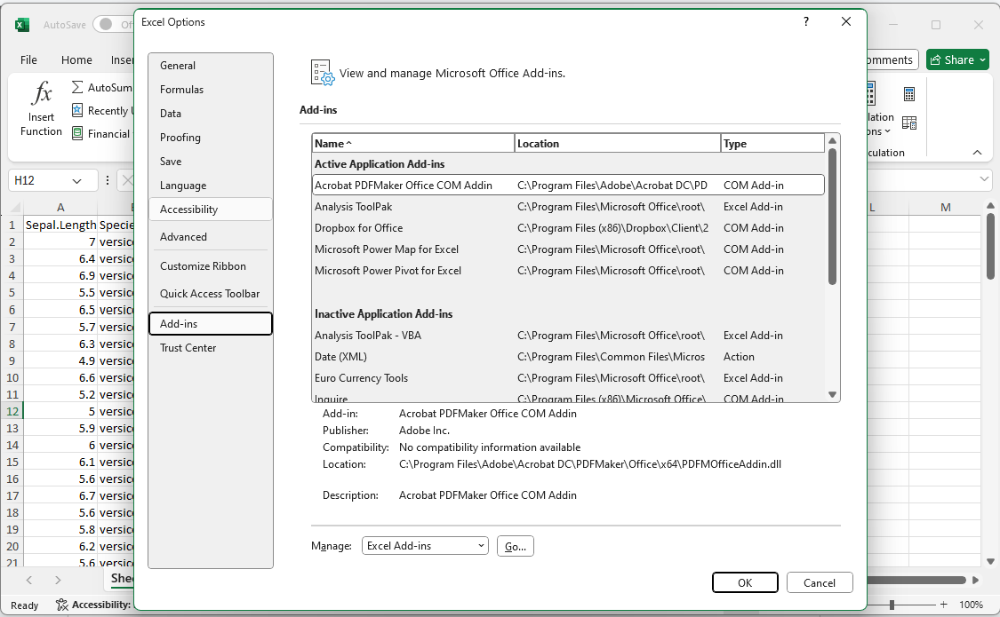

```{r child = "../setup.Rmd"}
```

```{r packages, echo=FALSE, message=FALSE, warning=FALSE}
library(tidyverse)
library(openxlsx)
library(magick)  # For image annotations
knitr::opts_chunk$set(echo = FALSE, out.width = "90%", fig.align = "center")
```

class: middle

# Excel Lab 
## One Sample, Two-Sample, and ANOVA with the Iris Dataset

---

# Lab Overview and Dataset Features

.pull-left[
## Overview
- In this lab, you will use Excel to perform **One-Sample**, **Two-Sample**, and **ANOVA** analyses with the famous Iris dataset.
- Recall that the Iris dataset, introduced by statistician Ronald A. Fisher in 1936, is a classic dataset in statistics and machine learning.
]

--
.pull-right[
## Recall: Key Features:
- 150 observations of iris flowers.
- It includes four numeric features:
  - Sepal.Length
  - Sepal.Width
  - Petal.Length
  - Petal.Width
- The flowers belong to three species:
  - Setosa
  - Versicolor
  - Virginica
]


---

class: middle, inverse

# Task 1
## Conducting a One-Sample T-Test in Excel

---

# Task 1: Overview

.pull-left[
In this task, you will:
- Test if the average `Sepal.Length` in the dataset is equal to 5.5.
- Use core Excel functions to:
  - Calculate the t-statistic for a one-sample t-test.
  - Obtain the p-value using `T.DIST.2T()`.
  - Draw conclusions based on the significance of the result. 
]

.pull-right[
```{r, echo=FALSE, out.width="90%", fig.align='center'}
image_path <- "../img/playful data.png"
img <- image_read(image_path)
img
```

]
---

## Step -1: Download the Iris Dataset

.pull-left-wide[
```{r, echo=TRUE}

# Save the dataset as an Excel file
write.xlsx(iris, "IrisData.xlsx")
```

[Download the Excel file here](https://github.com/psychmethods/slides/raw/refs/heads/main/t12_anovalab/IrisData.xlsx)
]
.pull-right-narrow[
.center[
```{r, echo=FALSE, out.width="100%", warning = FALSE}
library(qrcode)

share_link <- "https://github.com/psychmethods/slides/raw/refs/heads/main/t12_anovalab/IrisData.xlsx"
code <- qr_code(share_link)

plot(code)
```
]]

.footnote[or here https://github.com/psychmethods/slides/raw/refs/heads/main/t12_anovalab/IrisData.xlsx]


---

## Step 0: Set up hypotheses


- **Null Hypothesis (H₀)**: The mean `Sepal.Length` is equal to 5.5.
- **Alternative Hypothesis (H₁)**: The mean `Sepal.Length` is not equal to 5.5.


---

# Step 1: Calculate the Mean

.pull-left[
1. Open the Excel file `IrisData.xlsx`.

2. Select the cell where you want to calculate the mean (e.g., cell B152).

3. Click the cell and check the Formula Bar at the top of the screen.

4. In the Formula Bar, enter the formula to calculate the mean:

   - `=AVERAGE(A2:A151)`
   
5. Press Enter to execute the formula, and the mean value will appear in the selected cell.

]
--

.pull-right[
```{r, echo=FALSE, out.width="90%", fig.align='center'}
image_path <- "../img/excel_lab/excel screenshot_1.png"
img <- image_read(image_path) %>%
  image_annotate("=AVERAGE(A2:A151)", size = 30, color = "red", location = "+550+475")
img
```

**Explanation**:
- **Formula Bar**: This is where you can enter or edit formulas for the selected cell.
- **Formula Entry**: You can type any valid Excel formula here. In this case, `=AVERAGE()` calculates the sample mean.

]
---

# Step 2: Calculate the Standard Deviation

.pull-left[
1. **Select a new cell** (e.g., B153) to store the standard deviation result.
   - Click on the cell and use the **Formula Bar** to enter the formula.

2. **In the Formula Bar**, type the following formula to calculate the standard deviation of `Sepal.Length`:
   - `=STDEV.S(A2:A151)`

3. Press **Enter**, and Excel will compute the standard deviation in the selected cell.
]
--
.pull-right[
```{r, echo=FALSE, out.width="90%", fig.align='center'}
image_path <- "../img/excel_lab/excel screenshot_zoom.png"
img <- image_read(image_path) %>%
  image_annotate("=STDEV.S(A2:A151)", size = 30, color = "blue", location = "+550+475")
img
```
]

---


# Step 3: Calculate the sample size
.pull-left[
   - Select another empty cell (e.g., B154) to store the sample size.
   - In the **Formula Bar**, type `=COUNT(A2:A151)`.
   - Press **Enter** to display the sample size in the selected cell.
]
--
.pull-right[
```{r, echo=FALSE, out.width="90%", fig.align='center'}
image_path <- "../img/excel_lab/excel screenshot_zoom.png"
img <- image_read(image_path) %>%
  image_annotate("=COUNT(A2:A151)", size = 30, color = "darkgreen", location = "+550+475")

img
```
]

---

# Step 4: Calculate T-Statistic

.pull-left.midi[
0. Use the formula for a one-sample t-test:  
   $$
   t = \frac{\bar{x} - \mu}{s / \sqrt{n}}
   $$
1. **Select cell B155** to enter the formula.

2. In the **Formula Bar**, enter the T-score formula:
   - `=(B152 - 5.5) / (B153 / SQRT(B154))`.
   - Ensure you are referencing the correct cells:
     - `[Mean Cell]` (e.g., B152) is where the mean was calculated.
     - `[Standard Deviation Cell]` (e.g., B153) is where the standard deviation was calculated.
     - `[Sample Size Cell]` (e.g., B154) contains the sample size.

3. **Press Enter** to calculate the T-statistic, which will appear in cell B155.

]
--

.pull-right[
```{r, echo=FALSE, out.width="90%", fig.align='center'}
image_path <- "../img/excel_lab/excel screenshot_zoom.png"
img <- image_read(image_path) %>%
  image_annotate("=(B152 - 5.5) / (B153 / SQRT(B154))", size = 30, color = "darkgreen", location = "+550+475")
img

```
]

---

# Step 5: Calculate the P-Value

.pull-left[
1. **Select cell B156** to display the p-value.

2. **Calculate the Two-Tailed P-Value**:
   - Go to the **Formula Bar** and type `=T.DIST.2T(ABS(B155), B154-1)`
   - This formula uses the calculated T-statistic and degrees of freedom to return the p-value.
   - Press **Enter** to see the p-value in cell B156.
.midi[
**Explanation**:
- The **p-value** represents the probability of observing a test statistic as extreme as ours if the null hypothesis is true.
- In this case, a lower p-value (typically < 0.05) would indicate a statistically significant difference from the hypothesized mean of 5.5.
]]

--

.pull-right[
```{r, echo=FALSE, out.width="90%", fig.align='center'}
image_path <- "../img/excel_lab/excel screenshot_zoom.png"
img <- image_read(image_path) %>%
  image_annotate("=T.DIST.2T(ABS(T), df)", size = 30, color = "purple", location = "+550+475")
img
```
]

---

# Step 6: Interpret Results

.pull-left[

.medi[
**Explanation**:

- **T.DIST.2T()**: This function calculates the two-tailed p-value using the T-statistic and degrees of freedom.
- **Degrees of Freedom (df)**: Calculated as \( n - 1 \), where \( n \) is the sample size.


3. **Interpretation**:
   - Compare the p-value to the significance level (usually 0.05):
      - **If p < 0.05**: Reject the null hypothesis, suggesting that the mean `Sepal.Length` differs significantly from 5.5.
      - **If p ≥ 0.05**: Do not reject the null hypothesis, indicating no significant difference.
]]

--

.pull-right[
```{r, echo=FALSE, out.width="90%", fig.align='center'}
image_path <- "../img/excel_lab/excel screenshot_zoom.png"
img <- image_read(image_path) %>%
  image_annotate("=T.DIST.2T(ABS(T), df)", size = 30, color = "purple", location = "+550+475")
img
```
]


---

# Task 1 Recap: One-Sample T-Test in Excel

In this task, you:
- Set up hypotheses for a one-sample t-test.
- Calculated the **mean**, **standard deviation**, and **sample size** of `Sepal.Length`.
- Computed the **T-statistic** and **two-tailed p-value** using Excel functions.
- Interpreted results to determine if the mean `Sepal.Length` differs from 5.5.

---


class: center, middle, inverse

# Task 2
## Conducting a Two-Sample T-Test in Excel


---

# Task 2: Overview

.pull-left[
In this task, you will:
- Compare the means of `Sepal.Length` between two species, `Virginica` and `Versicolor`.
- Use Excel functions to:
  - Calculate the means and standard deviations for each group.
  - Compute the two-sample t-statistic.
  - Calculate the degrees of freedom.
  - Obtain the two-tailed p-value.
  - Interpret results to determine if the means significantly differ.
]


---

## Step -1: Download a Reshaped Iris Dataset

.pull-left[

To perform a two-sample t-test, download the dataset filtered to only include `Sepal.Length` for `Virginica` and `Versicolor`.


```{r}
# Prepare dataset for Two-Sample T-Test

two_sample_data <- iris %>%
  filter(Species %in% c("virginica", "versicolor")) %>%
  select(Sepal.Length, Species) %>%
  arrange(Species) # Sort by species for Excel clarity

write.xlsx(two_sample_data, "Iris_TwoSample_TTest.xlsx")
```

[Download the Excel file here](https://github.com/psychmethods/slides/raw/refs/heads/main/t12_anovalab/Iris_TwoSample_TTest.xlsx)

```{r, echo=FALSE, out.width="50%", warning = FALSE}
library(qrcode)

share_link <- "https://github.com/psychmethods/slides/raw/refs/heads/main/t12_anovalab/Iris_TwoSample_TTest.xlsx"
code <- qr_code(share_link)

plot(code)
```

]

.pull-right[
.center[


```{r, echo=FALSE, out.width="70%", warning = FALSE,align = "right"}
knitr::include_graphics("../img/DALLE_Fisher_looking_at_flowers.png")
```

]]


.footnote[This way you can revisit the lab later if needed.]

---

## Step 0: Set Up Hypotheses

.pull-left[
1. **Define Hypotheses**:

   - **Null Hypothesis (H₀)**: The mean `Sepal.Length` of `Virginica` and `Versicolor` species are equal.
   - **Alternative Hypothesis (H₁)**: The mean `Sepal.Length` of `Virginica` and `Versicolor` species are not equal.
]

.pull-right[
```{r, echo=FALSE, out.width="80%", warning = FALSE}

```
]

---

# Step 1: Calculate Means for Each Group


.pull-left[
1. **Open the Excel file** `Iris_TwoSample_TTest.xlsx`.
2. **Calculate the mean for each group**:

   - **Virginica**: Select an empty cell (e.g., B152) and type:
     - `=AVERAGE(A2:A75)`
   - **Versicolor**: Select another cell (e.g., B153) and type:
     - `=AVERAGE(A76:A150)`

3. **Press Enter** to calculate the means, which will appear in cells B152 and B153.
]
--
.pull-right[
```{r, echo=FALSE, out.width="90%", fig.align='center'}
image_path <- "../img/excel_lab/excel screenshot_zoom.png"
img <- image_read(image_path) %>%
  image_annotate("=AVERAGE(A2:A75)", size = 30, color = "blue", location = "+550+475")
img
```
]


---

# Step 2: Calculate the Standard Deviations for Each Group

.pull-left[
1. **Select a new cell** (e.g., B154) to calculate the standard deviation for **Virginica**.
   - In the **Formula Bar**, type: `=STDEV.S(A2:A75)`
   - Press **Enter** to display the standard deviation.

2. **Select another cell** (e.g., B155) to calculate the standard deviation for **Versicolor**.
   - Type: `=STDEV.S(A76:A150)`

3. **Press Enter** to compute the standard deviation for each group.
]
--
.pull-right[    
```{r, echo=FALSE, out.width="90%", fig.align='center'}
image_path <- "../img/excel_lab/excel screenshot_zoom.png"
img <- image_read(image_path ) %>%
  image_annotate("=STDEV.S(A2:A75)", size = 30, color = "red", location = "+550+475")

img
```
]
---

# Step 3: Calculate Sample Sizes for Each Group

.pull-left[
1. **Select a cell** (e.g., B156) to calculate the sample size of **Virginica**:
   - In the **Formula Bar**, type `=COUNT(A2:A75)`.
   - Press **Enter** to display the sample size for `Virginica`.

2. **Select another cell** (e.g., B157) for the **Versicolor** sample size:
   - Type `=COUNT(A76:A150)`.
   - Press **Enter** to display the sample size for `Versicolor`.

]

.pull-right[    
```{r, echo=FALSE, out.width="90%", fig.align='center'}
image_path <- "../img/excel_lab/excel screenshot_zoom.png"
img <- image_read(image_path ) %>%
  image_annotate("=COUNT(A2:A75)", size = 30, color = "darkgreen", location = "+550+475")

img
```
]

---


# Step 4: Calculate the Two-Sample T-Statistic

.pull-left[
To calculate the t-statistic, use the formula for a two-sample t-test:

$$
t = \frac{(\bar{X}_1 - \bar{X}_2)}{\sqrt{\frac{\text{SD}_1^2}{n_1} + \frac{\text{SD}_2^2}{n_2}}}
$$

1. **Select cell B158** to enter the formula for the t-statistic.
2. In the **Formula Bar**, type:
   - `=(B152 - B153) / SQRT((B154^2 / B156) + (B155^2 / B157))`
3. **Press Enter** to display the calculated t-statistic in cell B158.

]


.pull-right[   

.midi[**Explanation**:
- The formula calculates the t-statistic based on the difference between the two group means, adjusting for the standard deviations and sample sizes.
]
```{r, echo=FALSE, out.width="90%", fig.align='center'}
image_path <- "../img/excel_lab/excel screenshot_zoom.png"
img <- image_read(image_path ) %>%
  image_annotate("=(B152 - B153) / SQRT((B154^2 / B156) + (B155^2 / B157))", size = 30, color = "purple", location = "+550+475")

img
```
]

---

# Step 5: Calculate Degrees of Freedom

.pull-left[
Degrees of freedom \( df \) for a two-sample t-test can be calculated as:

$$
df = \frac{\left(\frac{\text{SD}_1^2}{n_1} + \frac{\text{SD}_2^2}{n_2}\right)^2}{\frac{\left(\frac{\text{SD}_1^2}{n_1}\right)^2}{n_1 - 1} + \frac{\left(\frac{\text{SD}_2^2}{n_2}\right)^2}{n_2 - 1}}
$$

1. **Select cell B159** and enter the formula for df:
   - `=(((B154^2 / B156) + (B155^2 / B157))^2) / (((B154^2 / B156)^2 / (B156 - 1)) + ((B155^2 / B157)^2 / (B157 - 1)))`
2. **Press Enter** to calculate the degrees of freedom in cell B159.

]
--

.pull-right[
.midi[
**Explanation**:
- This formula determines degrees of freedom based on group variance and sample sizes.
]
```{r, echo=FALSE, out.width="90%", fig.align='center'}
image_path <- "../img/excel_lab/excel screenshot_zoom.png"
img <- image_read(image_path ) %>%
  image_annotate("=(((B154^2 / B156) + (B155^2 / B157))^2) / ...", size = 30, color = "purple", location = "+550+475")

img
```
]


---

# Step 6: Calculate the Two-Tailed P-Value

.pull-left[
1. **Select cell B160** to display the p-value.
2. **Calculate the two-tailed p-value** using the t-statistic and degrees of freedom:
   - In the **Formula Bar**, type:
     - `=T.DIST.2T(ABS(B158), B159)`
   - Press **Enter** to display the p-value.
]
--
.pull-right[    
```{r, echo=FALSE, out.width="90%", fig.align='center'}
image_path <- "../img/excel_lab/excel screenshot_zoom.png"
img <- image_read(image_path ) %>%
  image_annotate("=T.DIST.2T(ABS(B158), B159)", size = 30, color = "red", location = "+550+475")


img
```
]

---

# Step 7: Interpret Results

.pull-left[
**Explanation**:
- `T.DIST.2T()` calculates the probability of observing a t-value as extreme as ours under the null hypothesis.

**Interpretation**:
- **If p < 0.05**: Reject the null hypothesis, indicating a significant difference in means.
- **If p ≥ 0.05**: Do not reject the null hypothesis.
]
--
.pull-right[    
```{r, echo=FALSE, out.width="90%", fig.align='center'}
image_path <- "../img/excel_lab/excel screenshot_zoom.png"
img <- image_read(image_path ) %>%
  image_annotate("=T.DIST.2T(ABS(B158), B159)", size = 30, color = "red", location = "+550+475")


img
```
]

---


# Task 2 Recap: Two-Sample T-Test in Excel

In this task, you:

- Set up hypotheses for comparing `Sepal.Length` means between `Virginica` and `Versicolor`.
- Calculated the **means**, **standard deviations**, and **sample sizes** for each group using Excel functions.
- Computed the **t-statistic** using the formula for a two-sample t-test.
- Calculated the **degrees of freedom** for the test.
- Used the `T.DIST.2T()` function to obtain the **two-tailed p-value**.
- Interpreted results to determine if there was a statistically significant difference between the `Sepal.Length` of the two species.

.reminder[Be sure to save your Excel file with all steps and calculations for future reference and any follow-up analysis.]

---


class: middle, inverse


# Task 3
## Conducting a One-Way ANOVA in Excel

---

# Task 3: Overview

.pull-left[
In this task, you will:

- Perform a one-way ANOVA to determine if there is a significant difference in `Sepal.Length` across the three species in the Iris dataset (`Setosa`, `Versicolor`, and `Virginica`).
- Use Excel’s built-in **Data Analysis Toolpak** to conduct the ANOVA test.
]

---

## Step -1: Download a Full Iris Dataset

1. Ensure you have the complete Iris dataset with all three species.

```{r}
write.xlsx(iris, "Iris_ANOVA.xlsx")
```

2. **Download the file here**: [Download Link](https://github.com/psychmethods/slides/raw/refs/heads/main/t12_anovalab/Iris_ANOVA.xlsx).

.pull-right[
```{r, echo=FALSE, out.width="50%", warning = FALSE}
library(qrcode)

share_link <- "https://github.com/psychmethods/slides/raw/refs/heads/main/t12_anovalab/Iris_ANOVA.xlsx"
code <- qr_code(share_link)

plot(code)
```
]

---

## Step 0: Organize the Data by Species in Excel

.pull-left[
To use the ANOVA tool effectively, arrange the data with `Sepal.Length` values grouped by species in separate columns.

1. **Open the file** `Iris_ANOVA.xlsx`.
2. Create three columns for `Sepal.Length` values, one for each species:
   - **Column A**: `Setosa`
   - **Column B**: `Versicolor`
   - **Column C**: `Virginica`
3. Copy the `Sepal.Length` values for each species into the respective columns.
]

.pull-right[
```{r, echo=FALSE, out.width="90%", fig.align='center'}

```
]

---

# Step 1: Open the Data Analysis Toolpak

.pull-left[
1. Go to the **Data** tab in Excel.
2. Select **Data Analysis** (if you don’t see this option, enable the Data Analysis Toolpak by going to **File > Options > Add-Ins > Analysis Toolpak**).
3. From the list of analysis tools, select **ANOVA: Single Factor** and click **OK**.

**Explanation**:
- The **ANOVA: Single Factor** tool in Excel performs a one-way ANOVA, testing for differences between the means of three or more independent groups.
]

.pull-right[
```{r, echo=FALSE, out.width="90%", fig.align='center'}

```
]

---

# Step 2: Set Up the ANOVA Parameters

.pull-left.med[
1. In the **Input Range** box, select the cells containing the data for the three groups, including headers (e.g., `A1:C51`).
2. Choose **Columns** for the **Group By** option.
3. Check the **Labels in First Row** box if you included headers in your data selection.
4. Set the **Alpha** value to 0.05 (for a 5% significance level).
5. Select an **Output Range** where you want the ANOVA results to appear (e.g., `E1`).
6. Click **OK** to run the ANOVA test.
]

.pull-right[
**Explanation**:
- The **Input Range** defines the data for the three groups.
- **Alpha** is the significance level for the test, typically set to 0.05.

```{r, echo=FALSE, out.width="90%", fig.align='center'}
#knitr::include_graphics("../img/excel_lab/anova_input.png")
```
]

---

# Step 3: Interpret the ANOVA Output

.pull-left.medi[
After running the ANOVA, Excel will display the results, including the **F-value** and **p-value**.

1. **ANOVA Table**:
   - **Between Groups**: Shows variation due to differences between species.
   - **Within Groups**: Shows variation within each species group.
   
2. **Key Values**:
   - **F-value**: Test statistic for ANOVA.
   - **p-value**: Probability of observing the F-value if the null hypothesis is true.
]

.pull-right[


**Interpretation**:
- **If p < 0.05**: Reject the null hypothesis, indicating a statistically significant difference in `Sepal.Length` between species.
- **If p ≥ 0.05**: Do not reject the null hypothesis, indicating no significant difference.


```{r, echo=FALSE, out.width="90%", fig.align='center'}
#knitr::include_graphics("../img/excel_lab/anova_output.png")
```
]

---

# Task 3 Recap: One-Way ANOVA in Excel

In this task, you:

- Arranged the `Sepal.Length` data for each species in separate columns.
- Used Excel’s **Data Analysis Toolpak** to conduct a one-way ANOVA.
- Interpreted the **F-value** and **p-value** from the output to determine if there is a significant difference in `Sepal.Length` across the three species.

.reminder[Save your Excel file with the ANOVA output for future reference or further analysis.]

---


class: middle, inverse

# Recap of Recaps

- In this lab, you explored various statistical concepts using Excel:
  - **One-Sample T-Test**: Testing the mean `Sepal.Length` against a hypothesized value.
  - **Two-Sample T-Test**: Comparing the means of `Sepal.Length` between `Virginica` and `Versicolor`.
  - **One-Way ANOVA**: Testing for differences in `Sepal.Length` across the three species (`Setosa`, `Versicolor`, `Virginica`).
  
- You used Excel functions and the Data Analysis Toolpak to perform these analyses and interpret the results.
