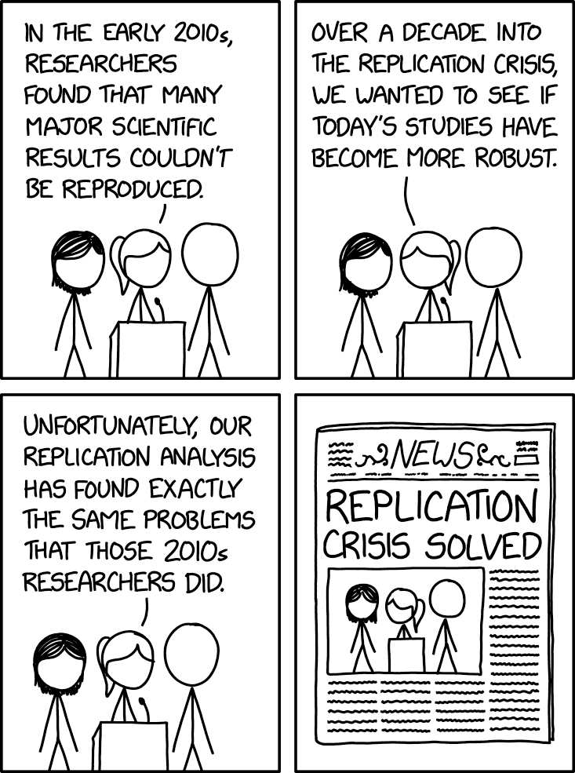
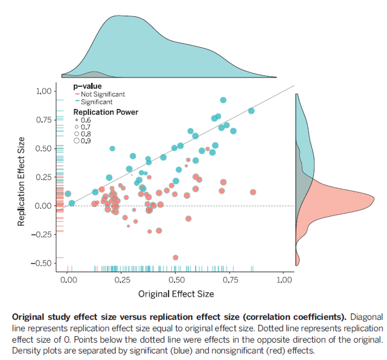
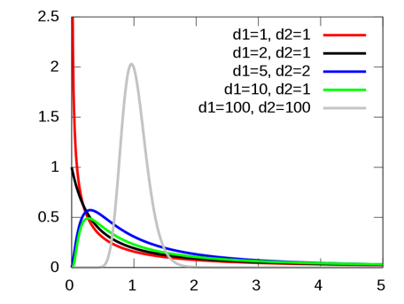
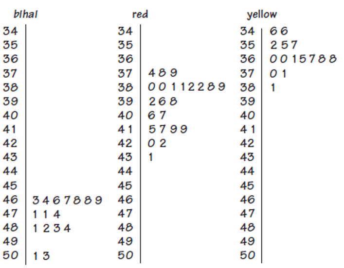
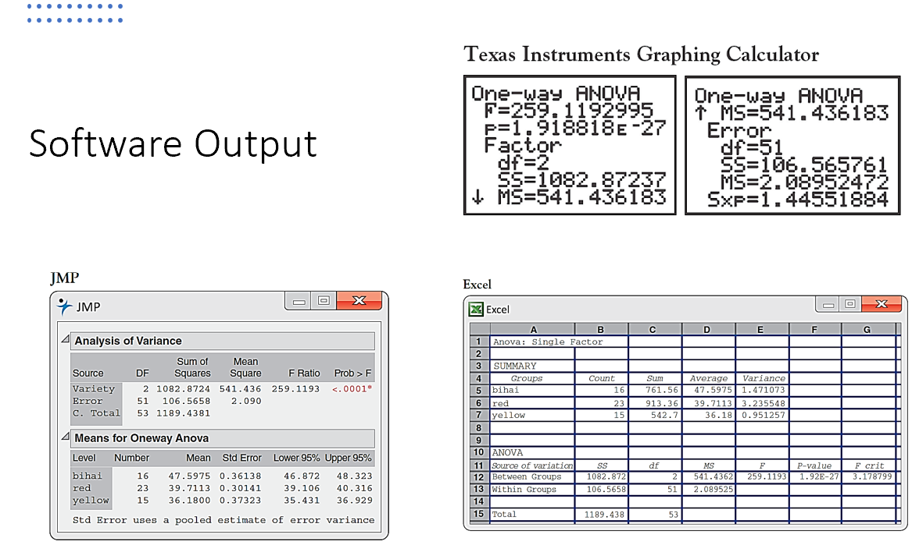

```{r child = "../setup.Rmd"}
```

```{r packages, echo=FALSE, message=FALSE, warning=FALSE}
# Remember to compile
#xaringan::inf_mr(cast_from = "..")
#       slideNumberFormat: ""  
library(tidyverse)
if (!require("emo")) devtools::install_github("hadley/emo")
# Installs library if missing
if (!require("HistData")) install.packages("HistData") 
library(emo)
knitr::opts_chunk$set(echo = FALSE,out.width = "90%", fig.align = "center")
library(gt)
```

class: middle

# f-tests and their applications

---

## Roadmap: Last Week 
.large[
- t-tests
- t-tests
- t-tests
- confidence intervals
]

---

## Roadmap: This Week
.large[
- multiple comparisons
- f-test logic
  - analysis of variance
  - regression
]

---

class: middle

# Context


---

# So far...

- We have learned how to test hypotheses using the $z$- and $t$-distributions
  - With 1 or 2 tails
  
--
  - With 1 or 2 groups
  
--
  - With 1, 2, or Paired Samples

--
- But what about more than two groups?


---

## analysis of variance (ANOVA)

- Is method for comparing any number of groups.
- It can be thought of as an extended multi-group t-test 
  - OR as a regression with grouping variables
- Is an efficient alternative to running n t-tests to compare n-groups


---

## Why can't we just run a bunch of t-tests?

- For example, in a three group design, we could just run 3 t-tests?
--

- Problems: 
  - Many t-tests with lots of groups
  - Alpha-control
  
---

## Alpha-control

- Increase type-1 error rate (because we're testing multiple times)
- Multiplication of type 1 errors
  - e.g, If we test 20 times, we'll find 1 significant result by chance (if $\alpha$ = .05)
- http://shinyapps.org/apps/p-hacker/
- ANOVA controls alpha =.05 across all tests (as does regression)


---

## Consequences of Inflated Type 1 Errors

- False Positives (Failure to Replicate)
- Remember that a p-value indicates the probability that the result occurred under the null hypothesis.

--
- If we run many tests, some will be significant by chance alone.

--
- 'Replication Crisis' in Psychology and other sciences


---

## Replication Crisis

.pull-left[
- Scientists have found that the results of many scientific studies are 
  - difficult or impossible to replicate on subsequent investigation, 
  - either by independent researchers or 
  - by the original researchers themselves.
- In the early 2010s, as part of a growing awareness of the problem, phenomenon was deemed a "crisis"
- Particularly in social psychology and medicine.
]
--
.pull-right[
```{r, echo=FALSE, out.width="75%"}

```
.footnote[Source: https://xkcd.com/3117/]
]

---

## Attempt to Replicate Psychology

- A report by the Open Science Collaboration in August 2015 
  - estimated the reproducibility of 100 studies in psychological science from three high-ranking psychology journals.
- Overall, 36% of the replications yielded significant findings (p-value below .05) 
  - compared to 97% of the original studies that had significant effects.
- The mean effect size in the replications was approximately half the magnitude of the effects reported in the original studies.

---
<!-- https://www.science.org/doi/epdf/10.1126/science.aac4716 -->
```{r, echo=FALSE, out.width="55%"}

```

---

## Attempt to Replicate Psychology

- Replication rates varied by subfield and journal
- Studies in the field of cognitive psychology had a higher replication rate (50%) than studies in the field of social psychology (25%).
- By Journal -- study replication rates were... 
  - 23% for Journal of Personality and Social Psychology, 
  - 38% for Journal of Experimental Psychology: Learning, Memory, and Cognition; and 
  - 38% for Psychological Science.


---

## Issue is broader than psychology

- At the time, a 2016 poll of 1,500 scientists reported in Nature, 
  - 70% of them had failed to replicate at least one other scientist's experiment (50% had failed to replicate one of their own experiments). 
- Results differed by field
  - chemistry: 90% (60%),
  - biology: 80% (60%),
  - physics and engineering: 70% (50%),
  - medicine: 70% (60%),
  - earth and environment science: 60% (40%).


---

class: middle

# Wrapping up...


---


class: middle

# Back to ANOVA...


---

## Multi-group tests can be conducted multiple ways
- I'm going to show you two popular approaches (regression & ANOVA).
- I was taught it using regression, so I am biased. 
- But the majority of psychologists are taught using the traditional method of ANOVA.
  - Regardless, it is useful to be familiar with that approach.


---

class: middle

# Traditional Approach
## Analysis of Variance (ANOVA)

---

## ANOVA Logic

- Analysis of Variance (ANOVA)
  - is a statistical method used to test differences between two or more means.
- Why call it "Analysis of Variance" rather than "Analysis of Means"? 
  - The inferences about means are made by analyzing variance.
  - Technically, compares variance between groups to variance within groups
- ANOVA is used to test general rather than specific differences among means. 
  - e.g., Are there any differences among the group means?
---

## Goals of ANOVA

- Conceptually, the goal of ANOVA is to 
  - determine the amount of variability in groups of data, and 
  - to see if the variability is greater between groups than within groups.
--

- ANOVA is a more general version of the t-test
  - Both tests use sample data to test hypotheses about population means.
--

- ANOVA can test hypotheses about two or more population means. 
  - The T-Test can only test hypotheses about two population means.
  - T-Test can only be used with one independent (classification) variable, whereas 
  - ANOVA can be used with more any number of independent (classification) variables.
---

## Variability in ANOVA
- In ANOVA, we analyze two types of variability:
  - Variability **between groups**: Differences due to the interaction between the groups (treatments)
  - Variability **within groups**: Differences due to random chance (error)

---

## F-Ratio
- The F-Ratio is the ratio of the variance between groups to the variance within groups.
- If the null hypothesis is true (all group means are equal),
  - the variance between groups should be similar to the variance within groups,
  - and the F-Ratio should be close to 1.
--

- If the null hypothesis is false (at least one group mean is different),
  - the variance between groups should be larger than the variance within groups,
  - and the F-Ratio should be greater than 1.

---

## F-Distribution

.pull-left[
```{r echo=FALSE, out.width="95%", out.height="95%",include=TRUE}


```
```{r echo=FALSE, fig.height=5, fig.width=5, out.width="75%", out.height="75%",include=FALSE}
# F Distribution
## d1=1,d2=1
## d1=2,d2=1
## d1=5,d2=2
## d10=5,d2=1
## d1=100, d2=100

x <- seq(0, 5, length=1000)
plot(x, df(x,1,1), type="l", lty=2, xlab="x value",
		 ylab="Density", main="F Distributions with Different Degrees of Freedom",xlim=c(0, 5))
df_combos <- list(c(2,1), c(5,2), c(10,5), c(100,100))
colors <- c("red", "blue","green", "purple", "black")
for (i in 1:length(df_combos)){
	lines(x, df(x,df_combos[[i]][1],df_combos[[i]][2]), lwd=1, col=colors[i])
}
legend("topright", inset=.05, title="Distributions",
  c("d1=1,d2=1","d1=2,d2=1","d1=5,d2=2","d10=5,d2=1","d1=100, d2=100"), lwd=2, lty=c(1, 1, 1, 1, 2), col=colors)

```
]

.pull-right[
- Looks like a skewed normal for many combinations of parameters
- Has two parameters
  - Degrees of freedom in the numerator
  - Degrees of Freedom in the denominator
  - Critical Value is in the tail
      - All ANOVAs are one-tailed tests
      - In the Upper Tail
]
---


## F-Ratio Formula

- The F-Ratio is calculated using the following formula:
$$F = \frac{MS_{between}}{MS_{within}}$$
- Where:
  - $MS_{between}$ is the mean square between groups (variance between groups)
  - $MS_{within}$ is the mean square within groups (variance within groups)
---

## Degrees of Freedom
- The degrees of freedom for the F-Ratio are determined by:
  - Numerator degrees of freedom ($df_{between}$): Number of groups - 1
  - Denominator degrees of freedom ($df_{within}$): Total number of observations - Number of groups

--
- These degrees of freedom are used to determine the critical value of F from the F-distribution
  - to assess the statistical significance of the F-Ratio.
---

class: middle

# Wrapping Up...

---

# Implementing an F-test

---

## Recall: General Procedure

.large[
1. Decide what type of test we want to use
2. Decide what the null and alternative hypothesis is.
3. List what we have
4. Compute test statistic (F-statistic)
5. finding critical value
6. Compare test statistic to critical value
  - (we can also calculate p and compare to $\alpha$)
7. Make decision: reject null or not, and draw conclusion
]

---

# Example: Comparing tropical flowers

- On the island of Dominica, we’re going to examine the relationship between 
  - varieties of the tropical flower Heliconia and the 
  - different species of hummingbirds that fertilize them. 
- Researchers wondered if
  - the lengths of the flowers and 
  - the forms of the hummingbirds' beaks have evolved to match each other. 
---

# Example: Comparing tropical flowers
.pull-left[
- They measured the flower lengths (in mm) of three different species of Heliconia flowers.
- The table gives length measurements (in millimeters) for samples of three varieties of Heliconia, each fertilized by a different species of hummingbird. 
- Do the three varieties display distinct distributions of length? 
- Are the mean lengths of their flowers different?
]
```{r, echo=FALSE, message=FALSE, warning=FALSE}
bihai_mm <- c(
47.12, 46.75, 46.81, 47.12, 46.67, 47.43, 46.44, 46.64,
48.07, 48.34, 48.15, 50.26, 50.12, 46.34, 46.94, 48.36
)

caribaea_red_mm <- c(
41.90, 42.01, 41.93, 43.09, 41.47, 41.69, 39.78, 40.57,
39.63, 42.18, 40.66, 37.87, 39.16, 37.40, 38.20, 38.07,
38.10, 37.97, 38.79, 38.23, 38.87, 37.78, 38.01
)

caribaea_yellow_mm <- c(
36.78, 37.02, 36.52, 36.11, 36.03, 35.45, 38.13, 37.10,
35.17, 36.82, 36.66, 35.68, 36.03, 34.57, 34.63
)

heliconia <- tibble(
variety = factor(
c(rep("H. bihai", 16),
rep("H. caribaea red", 23),
rep("H. caribaea yellow", 15)),
levels = c("H. bihai","H. caribaea red","H. caribaea yellow")
),
length_mm = c(bihai_mm, caribaea_red_mm, caribaea_yellow_mm)
)
```

.pull-right[
```{r, echo=FALSE, message=FALSE, warning=FALSE, results='asis'}

library(dplyr)
#knitr::kable(
#heliconia,
#caption = "Heliconia flower lengths",
#align = c("l","r","r")
#, format = "html", digits = 2)

slide_tbl <- heliconia %>%
group_by(variety) %>%
mutate(idx = row_number(),
row = ceiling(idx / 8),
col = paste0("c", ((idx - 1) %% 8) + 1)) %>%
select(variety, row, col, value = length_mm) %>%
pivot_wider(names_from = col, values_from = value) %>%
arrange(variety, row) %>%
ungroup()

gt(slide_tbl, groupname_col = "variety") %>%
fmt_number(columns = starts_with("c"), decimals = 2) %>%
cols_label(.list = setNames(rep(" ", 8), paste0("c", 1:8))) %>%
tab_header(
title = md("Flower lengths for three Heliconia varieties"),
subtitle = md("Units: millimeters")
) %>%
tab_style(
style = cell_text(align = "center"),
locations = cells_body(columns = starts_with("c"))
) %>%
tab_options(
table.font.size = px(12),
data_row.padding = px(2)
)
```
]
---

# Example: Comparing tropical flowers

.pull-left[
- Use graphs and numerical descriptions to describe and compare the three distributions of flower length. 
- Finally, ask whether the differences among the mean lengths of the three varieties are statistically significant.

]

.pull-right[
```{r, echo=FALSE, message=FALSE, warning=FALSE, results='asis'}
summary_stats <- heliconia %>%
  group_by(variety) %>%
  summarise(
    sample_size = n(),
    mean = mean(length_mm),
    median = median(length_mm),
    sd = sd(length_mm),
    IQR = IQR(length_mm)
  )
knitr::kable(summary_stats, digits=2,
             caption="Summary statistics for Heliconia lengths")
```
]
---

## What do the distributions look like?
.pull-left[
```{r echo=FALSE, out.width="95%", out.height="95%",include=TRUE}

```
]

.pull-right[
- The three varieties differ so much in flower length that there is little overlap among them. 
- In particular, the flowers of bihai are longer than either red or yellow. 
- The mean lengths are 
  - 47.6 mm for H. bihai, 
  - 39.7 mm for H. caribaea red, and 
  - 36.2 mm for H. caribaea yellow.
.question[
- Are these observed differences in sample means statistically significant? 
- We must develop a test for comparing more than two population means.
]
]


---

# T-test?: Comparing tropical flowers

- We might consider performing multiple t-tests to compare the three means.
- (Sample) means:
  - bihai: 47.60
  - red: 39.71
  - yellow: 36.18
- Null hypothesis: The true means (for length) are the same for all groups (the three flower types).
- We could look at separate t tests to compare each pair of means to see if they are different:
  - bihai vs. red
  - bihai vs. yellow
  - red vs. yellow
- However, this gives rise to the problem of multiple comparisons....

---

# Multiple Comparisons Problem

- Statistical methods for dealing with multiple comparisons usually have two steps:
  - An overall test to see 
    - if there is good evidence of any differences among the parameters that we want to compare.
  - A detailed follow-up analysis
    - to decide which of the parameters differ and
    - to estimate how large the differences are.
---

# Multiple comparisons

- The overall test, though more complex than the tests we have met to this point, 
  - is reasonably straightforward. 
- Formal follow-up analysis can be quite elaborate. 
- We will concentrate on the overall test and 
  - use data analysis to describe in detail the nature of the differences.

---

# The analysis of variance F test

- We want to test the null hypothesis of no differences among the population means 
- H_0: 𝜇_1=𝜇_2=...=𝜇_k
- The basic conditions for inference are 
  - that we have random samples from the three populations, and 
- that flower lengths (in our example) are normally distributed in each population.

---
# The analysis of variance F test
- The alternative hypothesis is that there is some difference. 
- That is, not all means are equal. 
  - H_a:  "not all of"𝜇_1, 𝜇_2, ..., 𝜇_k  "are equal"
- This alternative hypothesis is not one-sided or two-sided. It is “many-sided.”
This test is called the analysis of variance (ANOVA) F test.

---
# The analysis of variance F test
- It is based on the comparison of two estimates of the common population variance 𝜎
- one estimate derived from the variability within the samples,
- the other from the variability between the sample means.

---

# Return to our example

---


## Step 1: Type of test
.pull-left[
- We have more than two groups (3 varieties of Heliconia)
- We want to compare means across groups
- We will use a one-way ANOVA (one independent variable with multiple levels)
]

.pull-right[
```{r, echo=FALSE, fig.width=6, fig.height=4, out.width="75%"}
ggplot(heliconia, 
       aes(x=variety, y=length_mm, fill=variety)) +
  geom_violin() + 
  labs(
    title="Heliconia Flower Lengths by Variety",
    x="Variety",
    y="Flower Length (mm)"
  ) +
  theme_minimal() +
  theme(legend.position="none")
```
]
---

## Step 2: Hypotheses
.large[
- Null Hypothesis ($H_0$): The mean flower lengths are equal across all three varieties.
  - $H_0$: $\mu_{bihai} = \mu_{caribaea\_red} = \mu_{caribaea\_yellow}$
--
- Alternative Hypothesis ($H_1$): At least one variety has a different mean flower length.
  - $H_1$: At least one $\mu$ is different
]

---

## Step 3: What we have
.large[
- Sample data: Flower lengths for three varieties of Heliconia
- Significance level ($\alpha$): 0.05
- Test type: One-way ANOVA
]

---


## Step 4: Compute F-statistic
.large[
- Calculate the F-statistic using the formula:
$$F = \frac{MS_{between}}{MS_{within}}$$
- Where:
  - $MS_{between}$ is the mean square between groups (variance between groups)
  - $MS_{within}$ is the mean square within groups (variance within groups)
]
```{r, echo=TRUE, message=FALSE, warning=FALSE}
anova_result <- aov(length_mm ~ variety, data = heliconia)
summary(anova_result)
```
- From the ANOVA table, we find:
  - $MS_{between}$ = 541.4
  - $MS_{within}$ = 2.1
- F-statistic = 541.4 / 2.1 = 259.1
---

## Step 5: Find critical value
.large[
- Degrees of freedom:
  - Numerator ($df_{between}$): Number of groups - 1 = 3 - 1 = 2
  - Denominator ($df_{within}$): Total number of observations - Number of groups = 54 - 3 = 51
- Using an F-distribution table or software, we find the critical value of F at $\alpha$ = 0.05 with df1 = 2 and df2 = 51.
- Critical value of F ≈ ``r qf(0.95, df1=2, df2=51)``

`qf(0.95, df1=2, df2=51)`
]

---

## Step 6: Compare test statistic to critical value

.large[
- F-statistic = 259.1
- Critical value ≈ ``r qf(0.95, df1=2, df2=51)``
- Since 259.1 > 3ish, we reject the null hypothesis.
]
---
## Step 6: Alternatively, calculate p-value
- Alternatively, we can calculate the p-value from the F-statistic.
```{r, echo=TRUE, message=FALSE, warning=FALSE}
p_value <- pf(259.1, df1=2, df2=51, lower.tail=FALSE)
p_value
```

- There is strong evidence that the three varieties of flowers do not have the same mean length. 
- It appears from our preliminary data analysis that bihai flowers are distinctly longer than either red or yellow. 
- Red and yellow are closer together, but the red flowers tend to be longer.

---

# Example Software Output


```{r, echo=FALSE, out.width="55%"}

```
---


# Wrapping Up...
