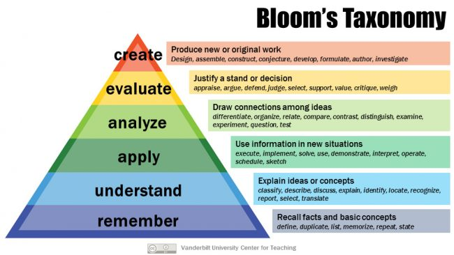

```{r child = "../setup.Rmd"}
```

```{r packages, echo=FALSE, message=FALSE, warning=FALSE}
# Remember to compile
#xaringan::inf_mr(cast_from = "..")
#       slideNumberFormat: ""  
library(tidyverse)
if (!require("emo")) devtools::install_github("hadley/emo")
library(emo)


```

class: middle

# Hello world!

---

## .large[What is this class?]

--
<br><br>

.center.huge[Methods in Psychological Research]

---

## .large[What is this class?]

- 310 is an introduction to methods in psychological research, 
- with an emphasis on 
  - statistical thinking and 
  - best practices.

---

class: middle

# Before I get too far ahead of myself ...


---


# Learning Outcomes

All lectures will start with a few learning outcomes, including today:
- Define and differentiate *variables* and *cases*
- Explain why you are taking statistics as part of a psychology degree
- Apply the concept of variation to examples of cases and variables
- Evaluate ways to be a successful learner in this class

---

## Learning Outcomes: How to Think About Them

- Ways for teachers to define what we want students to be able to do.
- Used in assessments (e.g., quizzes and projects)
- I will be asking you to demonstrate that you have achieved these outcomes.
- You can also try to evaluate whether you've achieved the learning outcomes.
- Practice making questions that will test your understanding, share them with others, and try each other's questions.

---

## Learning Outcomes: How to Think About Them
<br>
.pull-left-narrow[
- Note the **verb**! 
- The depth of understanding I expect is articulated in the depth of the verb, and 
  - is based on Bloom's Taxonomy.
- Your skills in an area should be moving up the taxonomy.
]

.center.pull-right-wide[<br>]

---

## Learning Outcomes: Course Level

.pull-left[
```{r child = "content/lg_amanda.md"}
```
]
.pull-right[
```{r child = "content/lg_eranda.md"}
```
]


---


class: middle

## Introductions


---

# Introductions

- Instructor: Prof. S. Mason Garrison
- Office:	Greene 438
- E-mail:	garrissm@wfu.edu
- Office Hours: Bookable via Calendly 
<br>
.large.center[[calendly.com/smasongarrison/](https://calendly.com/smasongarrison/)]

---
# Introductions

- Call Me... Prof. Mason (preferred) .tiny[Prof. Garrison, Dr. Mason, or Dr. Garrison are also ok]
.tiny[- Not Sarah, Mason, Mrs. Garrison, Ms. Garrison etc]

- About me:
  - Born in Upstate New York, Undergrad in St. Louis, Grad School in Nashville, and Professoring in Winston-Salem
  - Quantitative Psychology and Behavior Genetics: Applied to Understanding the Relationship between Health, Wealth, and Individual Differences.
  - I love stats and cats


---

class: middle

# Logistics!


---


## Where is this course?

<br><br><br><br><br><br><br>


.large.center[
[Canvas](https://wakeforest.instructure.com/courses/40646)]

<br>and<br>

.large.center[
[psychmethods.github.io/coursenotes/](https://psychmethods.github.io/coursenotes/)]


---

class: middle

# Course structure and policies

---

## Class meetings

- Lectures: Monday \& Wednesday
- R Tutorials: Friday

---

## Diversity & Inclusiveness:

.midi[
**Intent:** Students from all diverse backgrounds and perspectives be well-served by this course, that students' learning needs be addressed both in and out of class, and that the diversity that the students bring to this class be viewed as a resource, strength and benefit. It is my intent to present materials and activities that are respectful of diversity: gender identity, sexuality, disability, age, socioeconomic status, ethnicity, race, nationality, religion, and culture. Let me know ways to improve the effectiveness of the course for you personally, or for other students or student groups.
]

--

.midi[
- If you have a name and/or set of pronouns that differ from those that appear in your official records, please let me know.
- If you feel your performance is being impacted by your experiences outside of class, please don't hesitate to come and talk with me. If you prefer to speak with someone outside of the course, your advisor is an excellent resource. 
- I (like many people) am still in the process of learning about diverse perspectives/identities. If something was said in class (by anyone) that made you feel uncomfortable, please talk to me about it.
]

---

## How to get help

- Course content, logistics, etc. discussion on the course discussion forum.
    - Please post on the FAQ instead of direct messaging.
    - Use proper formatting: When asking questions involving code, please make sure to use inline code formatting for short bits of code or code snippets for longer, multi-line chunks.
- Often it's a lot more pleasant an experience to get your questions answered in person. Make use of my office hours, I'm here to help!

---

## Tips for asking questions

- First search existing discussion for answers. If the question has already been answered, you're done! If it has already been asked but you're not satisfied with the answer, add to the thread. 
- Give your question context from course concepts not course assignments.
    - Good context: "I have a question on filtering"
    - Bad context: "I have a question on HW 1 question 4"
- Be precise in your description:
    - Good description: "I am getting the following error and I'm not sure how to resolve it - `Error: could not find function "ggplot"`"
    - Bad description: "R giving errors, help me! Aaaarrrrrgh!” 
    
---

## More Tips for asking questions

- You can edit a question after posting it.
- Format your questions nicely using markdown and code formatting.
- Where appropriate, provide links to specific files, or even lines.
    - Sharing code will help others understand your question.
    


---

class: middle

# Wrapping Up...
