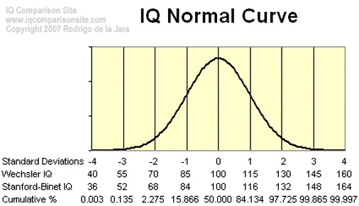
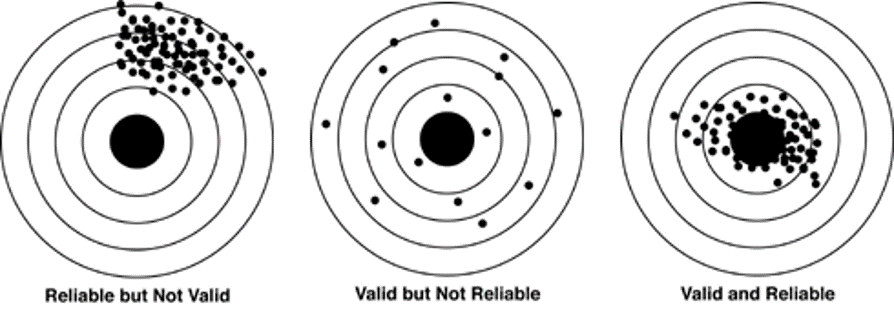

```{r child = "../setup.Rmd"}
```

```{r packages, echo=FALSE, message=FALSE, warning=FALSE}
# Remember to compile
#xaringan::inf_mr(cast_from = "..")
#       slideNumberFormat: ""  
library(tidyverse)
if (!require("emo")) devtools::install_github("hadley/emo")
library(emo)
knitr::opts_chunk$set(echo = FALSE,out.width = "90%", fig.align = "center")

```

class: middle

# Measurement

---

## Measurement

- 4th step in the research process
  - Def: assignment of numbers to characteristics of people or objects

--

- Examples: measurement scales
    - Speed $\rightarrow$ miles-per-hour
    - Temperature (kelvin)
    - Order of finishers
    - Numbers on the back of basketball jerseys
    
--

- Variables contain the outcome of measurement processes
  - Qualitative: number represent qualities (not quantities)
  - Quantitative: numbers mean something in relation quantities in the real world
  
---

## Characterize each level of measurement   

- Levels of Measurement [@Stevens1946]
    - Nominal, ordinal, interval, ratio
--
    - Properties :
        - Have absolute zero
            - 0 indicated absence (origin means zero)
        - Equal intervals
            - An interval means the same value at any point on measurement scales
        - Order
            - Number means order
        - Identity
            - Different numbers mean different measurement outcomes (1 $\neq$ 2 )

---

class: middle

# Levels of Measurement


---

# Ratio (quantitative) 
    - All four features
    - Multiplication is a permissible transformation
    
```{r, echo=TRUE,warning=FALSE}

## Installs library if missing
if (!require("HistData")) install.packages("HistData") 
library(HistData)   # loads the HistData package
data("Galton")			# loads the Galton dataset
```

---

# Example 

```{r, echo=TRUE,warning=FALSE}
# attaches the dataset
attach(Galton)
# First 3n rows of data
head(Galton, n=3)
```

---

# Example 

```{r, echo=TRUE,warning=FALSE}
# Histogram		hist(Galton$child)  is the same, use if you do not want to attach the data file
hist(child)	
plot(density(child))		# Density Plot
detach(Galton)			# Remember to detach you dataset!
```


---


# Bandwidth Aside

[Bandwidth: Smoothing Method](https://stat.ethz.ch/R-manual/R-devel/library/stats/html/density.html)

```{r, echo=TRUE,warning=FALSE}
args(density.default)

#?density # Gives you documentation

knitr::include_graphics("img/density.png")

set.seed(201010)
x <- rnorm(1000, 10, 2)
par(mfrow = c(2,2))
plot(density(x))  #A bit bumpy
plot(density(x,adjust = 10)) #Very sooth
plot(density(x,adjust = .1)) #Very bumpy
```

---

# Interval
- Interval (quantitative)
    - Temperature in Fahrenheit is an example
    - Addition is a permissible transformation
    -	Has three features (all but absolute zero)
    
```{r, echo=TRUE}
# Interval Example
library(datasets)
data("nottem")
nottem[1:10] 			# First ten rows of data
hist(nottem) 			# Histogram
plot(density(nottem)) 	# Density Plot
```
---
# Ordinal
- Ordinal (qualitative)
    -	Has order and identity
    - Monotonic transformations are permissible
    - These maintain the order of the values

```{r, echo=TRUE}
# Ordinal Example
library(ggplot2movies)
data(movies)
variable<-movies$rating
head(movies[!is.na(movies$budget),], n=10) 		# First ten rows of data, with a non-missing budget
hist(variable) 			# Histogram
plot(density(variable)) 	# Density Plot
```
---
# Nominal 

- Nominal
    - Only has identity
    - Any identity preserving transformation is permissible

```{r, echo=TRUE}
# Nominal Example
library(vcd)
data(Arthritis)
Arthritis[1:10, ]  		# First ten rows of data

variable<-Arthritis$Treatment
#hist(variable) 				# Histogram error

barplot_fix<-prop.table(table(variable))

barplot(barplot_fix)	# Sometimes, R is silly
```
---

# More complex measurement level taxomony
- Missing (considered nominal under the Stevens taxonomy)
- Binary (considered nominal under the Stevens taxonomy)
- Nominal (considered nominal under the Stevens taxonomy)
- Partially ordered (considered ordinal under Stevens)
- Fully ordered (considered ordinal under Stevens)
- Interval
- Ratio
- Absolute measurement (has no permissible transformation)
    - $6.02 x 10^{23}$
    - $\pi$
    
---

# Could measurement level be itself on a continuum?


<div style="float: left; width: 45%;">
- Example: IQ
    - Falls between interval and ratio?
    - Or falls between ordinal and interval?
    
{}
</div>

<div style="float: right; width: 55%;">
 {} 
</div>

---

# Goals of Measurement
- Reliable
    - “…the degree to which a test or measure produces the same scores when applied in the same circumstances…” [@Thomas1996]
    - In other words, if you take the measure again, will you get the same result?

- Valid
    - “Degree to which a test or instrument measures what it purports to measure”  [@Thomas1996]
    - In other words, does your measure measure what is it supposed to measure?

---
# Illustration

{}
class: middle

# Wrapping Up...
